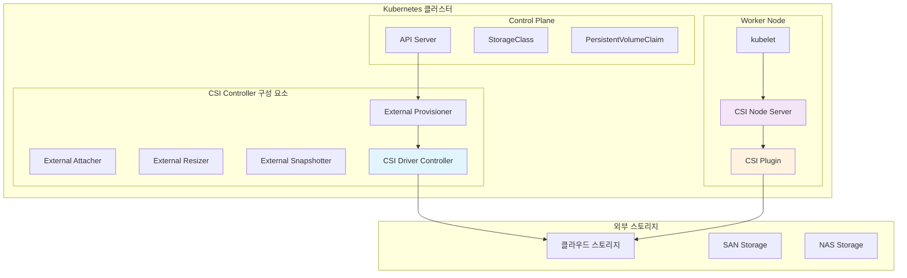

---
tags:
  - Kubernetes
  - CSI
  - Storage
  - Driver
  - Cloud Native
---

# CSI 드라이버 구현과 생태계

## 🎯 개요

2018년, Kubernetes 커뮤니티는 **스토리지 플러그인의 혼란**에 직면했습니다. 각 클라우드 프로바이더와 스토리지 벤더들이 자체적인 in-tree 드라이버를 개발하면서, Kubernetes 코어에 수백 개의 스토리지 관련 코드가 섞여있었습니다. **새로운 스토리지 지원을 위해서는 Kubernetes 자체를 수정해야 했고**, 이는 혁신의 속도를 크게 저해했습니다.

그때 등장한 것이 **CSI(Container Storage Interface)**입니다. 이는 **컨테이너 오케스트레이터와 스토리지 시스템 간의 표준 인터페이스**로, 마치 USB 표준이 다양한 디바이스들을 통합한 것처럼, 스토리지 생태계를 통합했습니다.

Netflix는 CSI 도입 이후 **자체 분산 스토리지 시스템을 3주 만에 Kubernetes와 통합**할 수 있었습니다. 기존에는 몇 달이 걸리던 작업이 표준 인터페이스 덕분에 극적으로 단축된 것입니다.

## 📖 CSI 아키텍처 이해

### CSI 스펙과 구성 요소



### CSI 서비스 인터페이스

```python
class CSIInterface:
    def __init__(self):
        self.services = ["Identity", "Controller", "Node"]
        self.grpc_endpoints = {
            "identity": "unix:///var/lib/csi/sockets/pluginproxy/csi.sock",
            "controller": "unix:///var/lib/csi/sockets/pluginproxy/csi.sock", 
            "node": "unix:///csi/csi.sock"
        }
        
    def identity_service(self):
        """Identity 서비스 - 플러그인 정보 제공"""
        return {
            "methods": {
                "GetPluginInfo": {
                    "description": "플러그인 이름과 버전 반환",
                    "response": {
                        "name": "ebs.csi.aws.com",
                        "vendor_version": "v1.15.0",
                        "manifest": {"key": "value"}
                    }
                },
                "GetPluginCapabilities": {
                    "description": "플러그인이 지원하는 기능 목록",
                    "capabilities": [
                        "CONTROLLER_SERVICE",
                        "VOLUME_ACCESSIBILITY_CONSTRAINTS", 
                        "CLONE_VOLUME",
                        "EXPAND_VOLUME"
                    ]
                },
                "Probe": {
                    "description": "플러그인 헬스체크",
                    "usage": "readiness probe로 사용"
                }
            }
        }
    
    def controller_service(self):
        """Controller 서비스 - 볼륨 생명주기 관리"""
        return {
            "volume_operations": {
                "CreateVolume": {
                    "description": "새 볼륨 생성",
                    "parameters": {
                        "name": "volume-1234567890",
                        "capacity_range": {"required_bytes": 10737418240},
                        "volume_capabilities": ["MOUNT", "BLOCK"],
                        "parameters": {"type": "gp3", "encrypted": "true"},
                        "accessibility_requirements": {
                            "requisite": [{"segments": {"zone": "us-west-2a"}}]
                        }
                    }
                },
                "DeleteVolume": {
                    "description": "볼륨 삭제",
                    "idempotent": True,
                    "error_handling": "이미 삭제된 볼륨은 성공 반환"
                },
                "ControllerPublishVolume": {
                    "description": "볼륨을 노드에 연결",
                    "attach_operation": "디스크를 VM에 연결",
                    "node_id": "i-1234567890abcdef0"
                },
                "ControllerUnpublishVolume": {
                    "description": "볼륨을 노드에서 분리",
                    "detach_operation": "디스크를 VM에서 분리"
                }
            },
            "capability_operations": {
                "ValidateVolumeCapabilities": {
                    "description": "볼륨 능력 검증",
                    "validation_types": ["mount_type", "access_mode", "fs_type"]
                },
                "ListVolumes": {
                    "description": "볼륨 목록 조회",
                    "pagination": "max_entries와 starting_token 지원"
                },
                "GetCapacity": {
                    "description": "스토리지 풀 용량 조회",
                    "accessibility_requirements": "특정 토폴로지의 용량"
                }
            }
        }
    
    def node_service(self):
        """Node 서비스 - 노드에서의 볼륨 관리"""
        return {
            "publish_operations": {
                "NodeStageVolume": {
                    "description": "볼륨을 스테이징 영역에 마운트",
                    "purpose": "글로벌 마운트 포인트 생성",
                    "example": "mount /dev/xvdf /var/lib/kubelet/plugins/.../globalmount"
                },
                "NodeUnstageVolume": {
                    "description": "스테이징 영역에서 볼륨 언마운트",
                    "cleanup": "글로벌 마운트 포인트 정리"
                },
                "NodePublishVolume": {
                    "description": "볼륨을 Pod 디렉토리에 바인드 마운트",
                    "purpose": "Pod별 마운트 포인트 생성", 
                    "example": "mount --bind /var/lib/kubelet/plugins/.../globalmount /var/lib/kubelet/pods/.../volumes"
                },
                "NodeUnpublishVolume": {
                    "description": "Pod 디렉토리에서 볼륨 언마운트",
                    "cleanup": "Pod별 마운트 포인트 정리"
                }
            },
            "info_operations": {
                "NodeGetInfo": {
                    "description": "노드 정보 반환",
                    "node_info": {
                        "node_id": "i-1234567890abcdef0",
                        "max_volumes_per_node": 39,
                        "accessible_topology": {
                            "segments": {
                                "topology.kubernetes.io/zone": "us-west-2a",
                                "node.kubernetes.io/instance-type": "m5.large"
                            }
                        }
                    }
                },
                "NodeGetCapabilities": {
                    "description": "노드 서비스 능력",
                    "capabilities": [
                        "STAGE_UNSTAGE_VOLUME",
                        "GET_VOLUME_STATS",
                        "EXPAND_VOLUME"
                    ]
                }
            }
        }
```

## 🔧 CSI 사이드카 컨테이너

### External Provisioner

```python
class ExternalProvisioner:
    def __init__(self):
        self.watch_resources = ["PersistentVolumeClaim"]
        self.responsibilities = ["dynamic_provisioning", "volume_deletion"]
        
    def provisioning_workflow(self):
        """프로비저닝 워크플로우"""
        return {
            "trigger": "새 PVC 생성 (StorageClass 지정)",
            "steps": [
                {
                    "step": "1. PVC 검증",
                    "action": "StorageClass 존재 및 프로비저너 일치 확인",
                    "validation": [
                        "provisioner 필드 매칭",
                        "volumeBindingMode 확인",
                        "allowedTopologies 검증"
                    ]
                },
                {
                    "step": "2. CreateVolume 호출", 
                    "action": "CSI Controller에 볼륨 생성 요청",
                    "parameters": {
                        "name": "pvc-<uuid>",
                        "capacity": "PVC 요청 용량",
                        "parameters": "StorageClass parameters",
                        "secrets": "provisioner-secret-name/namespace"
                    }
                },
                {
                    "step": "3. PV 생성",
                    "action": "성공 시 PersistentVolume 오브젝트 생성",
                    "pv_spec": {
                        "capacity": "실제 할당된 용량",
                        "accessModes": "지원되는 액세스 모드",
                        "csi": {
                            "driver": "ebs.csi.aws.com",
                            "volumeHandle": "vol-1234567890abcdef0",
                            "fsType": "ext4"
                        }
                    }
                }
            ],
            "error_handling": {
                "timeout": "PVC 상태를 Pending으로 유지",
                "retry_policy": "지수 백오프로 재시도",
                "failure_events": "Kubernetes 이벤트로 오류 기록"
            }
        }
    
    def feature_gates(self):
        """기능 플래그와 고급 설정"""
        return {
            "volume_name_uuid_generation": {
                "flag": "--feature-gates=Topology=true",
                "description": "토폴로지 인식 프로비저닝"
            },
            "clone_support": {
                "flag": "--feature-gates=VolumePVCDataSource=true", 
                "description": "PVC를 데이터 소스로 사용한 복제"
            },
            "capacity_tracking": {
                "flag": "--enable-capacity=true",
                "description": "CSIStorageCapacity 오브젝트 생성"
            }
        }

class ExternalAttacher:
    def __init__(self):
        self.watch_resources = ["VolumeAttachment"]
        
    def attachment_workflow(self):
        """볼륨 연결 워크플로우"""
        return {
            "trigger": "kubelet이 VolumeAttachment 오브젝트 생성",
            "attach_process": [
                {
                    "step": "1. VolumeAttachment 감지",
                    "watcher": "VolumeAttachment controller",
                    "condition": "spec.attacher가 현재 드라이버와 일치"
                },
                {
                    "step": "2. ControllerPublishVolume 호출",
                    "grpc_call": "CSI Controller Service",
                    "purpose": "볼륨을 대상 노드에 연결"
                },
                {
                    "step": "3. 상태 업데이트",
                    "success": "VolumeAttachment.status.attached = true",
                    "failure": "VolumeAttachment.status.attachmentMetadata에 오류 정보"
                }
            ],
            "multi_attach_prevention": {
                "check": "현재 연결된 노드 확인",
                "conflict_resolution": "ReadWriteOnce 볼륨의 중복 연결 방지"
            }
        }
```

### External Resizer

```python
class ExternalResizer:
    def __init__(self):
        self.watch_resources = ["PersistentVolumeClaim", "PersistentVolume"]
        
    def expansion_workflow(self):
        """볼륨 확장 워크플로우"""
        return {
            "trigger_condition": "PVC.spec.resources.requests.storage > PV.spec.capacity.storage",
            "controller_expansion": [
                {
                    "step": "1. 확장 가능성 검증",
                    "checks": [
                        "StorageClass.allowVolumeExpansion == true",
                        "CSI Driver EXPAND_VOLUME 능력 지원",
                        "볼륨이 현재 사용 중인지 확인"
                    ]
                },
                {
                    "step": "2. ControllerExpandVolume 호출",
                    "grpc_call": "CSI Controller Service", 
                    "parameters": {
                        "volume_id": "vol-1234567890abcdef0",
                        "capacity_range": {"required_bytes": 21474836480},
                        "volume_capability": "mount/block mode"
                    }
                },
                {
                    "step": "3. PV 용량 업데이트",
                    "action": "PV.spec.capacity.storage 새 용량으로 변경",
                    "pvc_status": "PVC.status.conditions에 FileSystemResizePending 추가"
                }
            ],
            "node_expansion": {
                "trigger": "kubelet이 FileSystemResizePending 조건 감지",
                "process": [
                    "NodeExpandVolume 호출",
                    "파일시스템 크기 조정 (resize2fs, xfs_growfs)",
                    "PVC 상태에서 FileSystemResizePending 제거"
                ]
            }
        }
    
    def filesystem_expansion_details(self):
        """파일시스템 확장 세부사항"""
        return {
            "expansion_types": {
                "online_expansion": {
                    "supported_fs": ["ext4", "xfs"],
                    "requirement": "파일시스템이 마운트된 상태에서 확장",
                    "commands": {
                        "ext4": "resize2fs /dev/device",
                        "xfs": "xfs_growfs /mount/point"
                    }
                },
                "offline_expansion": {
                    "supported_fs": ["ext2", "ext3"],
                    "requirement": "파일시스템이 언마운트된 상태에서 확장",
                    "downtime": "Pod 재시작 필요"
                }
            },
            "error_scenarios": {
                "filesystem_full": "확장 전 여유 공간 부족",
                "mount_point_busy": "다른 프로세스가 파일시스템 사용 중",
                "corruption": "파일시스템 손상으로 인한 확장 실패"
            }
        }
```

### External Snapshotter

```python
class ExternalSnapshotter:
    def __init__(self):
        self.watch_resources = ["VolumeSnapshot", "VolumeSnapshotContent"]
        
    def snapshot_workflow(self):
        """스냅샷 생성 워크플로우"""
        return {
            "snapshot_creation": [
                {
                    "step": "1. VolumeSnapshot 검증",
                    "validation": [
                        "source PVC 존재 확인",
                        "VolumeSnapshotClass 유효성", 
                        "CSI 드라이버 SNAPSHOT 능력 확인"
                    ]
                },
                {
                    "step": "2. CreateSnapshot 호출",
                    "grpc_call": "CSI Controller Service",
                    "parameters": {
                        "source_volume_id": "vol-1234567890abcdef0",
                        "name": "snapshot-1234567890abcdef0",
                        "parameters": "VolumeSnapshotClass parameters"
                    }
                },
                {
                    "step": "3. VolumeSnapshotContent 생성",
                    "binding": "VolumeSnapshot과 VolumeSnapshotContent 바인딩",
                    "status_update": "readyToUse: true 설정"
                }
            ],
            "restore_workflow": [
                {
                    "step": "1. PVC에 dataSource 지정",
                    "data_source": {
                        "name": "my-snapshot",
                        "kind": "VolumeSnapshot",
                        "apiGroup": "snapshot.storage.k8s.io"
                    }
                },
                {
                    "step": "2. CreateVolume 호출 (복원)",
                    "volume_content_source": {
                        "snapshot": {
                            "snapshot_id": "snap-1234567890abcdef0"
                        }
                    }
                }
            ]
        }
    
    def snapshot_scheduling(self):
        """스냅샷 스케줄링"""
        return {
            "cron_snapshot_controller": '''
apiVersion: batch/v1
kind: CronJob
metadata:
  name: postgres-backup
spec:
  schedule: "0 2 * * *"
  jobTemplate:
    spec:
      template:
        spec:
          containers:
          - name: snapshot-creator
            image: k8s.gcr.io/sig-storage/snapshot-controller:v4.2.1
            command:
            - /bin/bash
            - -c
            - |
              # 스냅샷 생성
              cat <<EOF | kubectl apply -f -
              apiVersion: snapshot.storage.k8s.io/v1
              kind: VolumeSnapshot
              metadata:
                name: postgres-backup-$(date +%Y%m%d%H%M%S)
              spec:
                volumeSnapshotClassName: csi-aws-vsc
                source:
                  persistentVolumeClaimName: postgres-data
              EOF
              
              # 30일 이상 된 스냅샷 정리
              kubectl get volumesnapshots -o json | \
              jq -r '.items[] | select(.metadata.creationTimestamp | fromdateiso8601 < (now - 2592000)) | .metadata.name' | \
              xargs -r kubectl delete volumesnapshot
          restartPolicy: OnFailure
''',
            "retention_policies": {
                "hourly": "24개 보관",
                "daily": "7개 보관",
                "weekly": "4개 보관", 
                "monthly": "12개 보관"
            }
        }
```

## 🏗️ CSI 드라이버 개발

### 커스텀 CSI 드라이버 구조

```python
class CustomCSIDriver:
    def __init__(self, driver_name):
        self.driver_name = driver_name
        self.node_id = self.get_node_id()
        self.grpc_server = None
        
    def identity_server_implementation(self):
        """Identity 서비스 구현"""
        return '''
import grpc
from csi import csi_pb2, csi_pb2_grpc

class IdentityServicer(csi_pb2_grpc.IdentityServicer):
    def GetPluginInfo(self, request, context):
        return csi_pb2.GetPluginInfoResponse(
            name="{driver_name}",
            vendor_version="v1.0.0"
        )
    
    def GetPluginCapabilities(self, request, context):
        return csi_pb2.GetPluginCapabilitiesResponse(
            capabilities=[
                csi_pb2.PluginCapability(
                    service=csi_pb2.PluginCapability.Service(
                        type=csi_pb2.PluginCapability.Service.CONTROLLER_SERVICE
                    )
                ),
                csi_pb2.PluginCapability(
                    service=csi_pb2.PluginCapability.Service(
                        type=csi_pb2.PluginCapability.Service.VOLUME_ACCESSIBILITY_CONSTRAINTS
                    )
                )
            ]
        )
    
    def Probe(self, request, context):
        # 헬스체크 로직
        if self.is_healthy():
            return csi_pb2.ProbeResponse(ready=True)
        else:
            context.set_code(grpc.StatusCode.FAILED_PRECONDITION)
            context.set_details("Driver not ready")
            return csi_pb2.ProbeResponse()
'''.format(driver_name=self.driver_name)
    
    def controller_server_implementation(self):
        """Controller 서비스 구현"""
        return '''
class ControllerServicer(csi_pb2_grpc.ControllerServicer):
    def CreateVolume(self, request, context):
        try:
            # 볼륨 중복 생성 방지
            if self.volume_exists(request.name):
                existing_volume = self.get_volume_by_name(request.name)
                return csi_pb2.CreateVolumeResponse(volume=existing_volume)
            
            # 용량 검증
            required_bytes = request.capacity_range.required_bytes
            if required_bytes <= 0:
                context.set_code(grpc.StatusCode.INVALID_ARGUMENT)
                context.set_details("Volume capacity must be greater than 0")
                return csi_pb2.CreateVolumeResponse()
            
            # 실제 스토리지 백엔드에 볼륨 생성
            volume_id = self.create_backend_volume(
                name=request.name,
                size_bytes=required_bytes,
                parameters=dict(request.parameters)
            )
            
            # 토폴로지 정보 수집
            accessible_topology = self.get_volume_topology(volume_id)
            
            volume = csi_pb2.Volume(
                volume_id=volume_id,
                capacity_bytes=required_bytes,
                accessible_topology=accessible_topology
            )
            
            return csi_pb2.CreateVolumeResponse(volume=volume)
            
        except Exception as e:
            context.set_code(grpc.StatusCode.INTERNAL)
            context.set_details(f"Failed to create volume: {str(e)}")
            return csi_pb2.CreateVolumeResponse()
    
    def DeleteVolume(self, request, context):
        try:
            volume_id = request.volume_id
            
            # 볼륨이 연결되어 있는지 확인
            if self.is_volume_attached(volume_id):
                context.set_code(grpc.StatusCode.FAILED_PRECONDITION)
                context.set_details("Volume is still attached")
                return csi_pb2.DeleteVolumeResponse()
            
            # 백엔드에서 볼륨 삭제
            self.delete_backend_volume(volume_id)
            
            return csi_pb2.DeleteVolumeResponse()
            
        except VolumeNotFoundError:
            # Idempotent: 이미 삭제된 볼륨은 성공 처리
            return csi_pb2.DeleteVolumeResponse()
        except Exception as e:
            context.set_code(grpc.StatusCode.INTERNAL)
            context.set_details(f"Failed to delete volume: {str(e)}")
            return csi_pb2.DeleteVolumeResponse()
    
    def ControllerPublishVolume(self, request, context):
        try:
            volume_id = request.volume_id
            node_id = request.node_id
            
            # 볼륨을 노드에 연결
            device_path = self.attach_volume_to_node(volume_id, node_id)
            
            publish_context = {
                "devicePath": device_path,
                "volumeId": volume_id
            }
            
            return csi_pb2.ControllerPublishVolumeResponse(
                publish_context=publish_context
            )
            
        except Exception as e:
            context.set_code(grpc.StatusCode.INTERNAL)
            context.set_details(f"Failed to attach volume: {str(e)}")
            return csi_pb2.ControllerPublishVolumeResponse()
'''
    
    def node_server_implementation(self):
        """Node 서비스 구현"""
        return '''
class NodeServicer(csi_pb2_grpc.NodeServicer):
    def NodeStageVolume(self, request, context):
        try:
            volume_id = request.volume_id
            staging_target_path = request.staging_target_path
            volume_capability = request.volume_capability
            
            # 디바이스 경로 확인
            device_path = request.publish_context.get("devicePath")
            if not device_path:
                context.set_code(grpc.StatusCode.INVALID_ARGUMENT)
                context.set_details("Device path not provided")
                return csi_pb2.NodeStageVolumeResponse()
            
            # 파일시스템 포맷 (필요시)
            fs_type = volume_capability.mount.fs_type or "ext4"
            if not self.is_formatted(device_path):
                self.format_device(device_path, fs_type)
            
            # 스테이징 디렉토리 생성
            os.makedirs(staging_target_path, exist_ok=True)
            
            # 글로벌 마운트
            self.mount_device(device_path, staging_target_path, fs_type)
            
            return csi_pb2.NodeStageVolumeResponse()
            
        except Exception as e:
            context.set_code(grpc.StatusCode.INTERNAL)
            context.set_details(f"Failed to stage volume: {str(e)}")
            return csi_pb2.NodeStageVolumeResponse()
    
    def NodePublishVolume(self, request, context):
        try:
            volume_id = request.volume_id
            staging_target_path = request.staging_target_path
            target_path = request.target_path
            volume_capability = request.volume_capability
            
            # 타겟 디렉토리 생성
            os.makedirs(target_path, exist_ok=True)
            
            # 바인드 마운트
            if volume_capability.HasField("mount"):
                self.bind_mount(staging_target_path, target_path)
            elif volume_capability.HasField("block"):
                self.create_block_device_symlink(staging_target_path, target_path)
            
            return csi_pb2.NodePublishVolumeResponse()
            
        except Exception as e:
            context.set_code(grpc.StatusCode.INTERNAL)
            context.set_details(f"Failed to publish volume: {str(e)}")
            return csi_pb2.NodePublishVolumeResponse()
    
    def NodeGetInfo(self, request, context):
        return csi_pb2.NodeGetInfoResponse(
            node_id=self.node_id,
            max_volumes_per_node=50,
            accessible_topology=csi_pb2.Topology(
                segments={
                    "topology.kubernetes.io/zone": self.get_node_zone(),
                    "topology.kubernetes.io/region": self.get_node_region()
                }
            )
        )
'''
```

### 배포와 설정

```python
class CSIDriverDeployment:
    def __init__(self):
        self.deployment_components = [
            "CSIDriver", "StorageClass", "Controller Deployment", 
            "Node DaemonSet", "RBAC"
        ]
        
    def csi_driver_registration(self):
        """CSI 드라이버 등록"""
        return {
            "csi_driver_object": '''
apiVersion: storage.k8s.io/v1
kind: CSIDriver
metadata:
  name: my-csi-driver.example.com
spec:
  # Pod 정보를 CSI 드라이버에 전달
  podInfoOnMount: true
  
  # 볼륨 소유권 및 권한 관리
  fsGroupPolicy: File
  
  # 토폴로지 인식 프로비저닝
  volumeLifecycleModes:
  - Persistent
  - Ephemeral
  
  # 스토리지 용량 추적
  storageCapacity: true
  
  # 인라인 볼륨 지원  
  requiresRepublish: false
''',
            "storage_class": '''
apiVersion: storage.k8s.io/v1
kind: StorageClass
metadata:
  name: my-fast-ssd
provisioner: my-csi-driver.example.com
parameters:
  type: "ssd"
  iops: "3000"
  encrypted: "true"
  # 커스텀 파라미터
  replica_count: "3"
  compression: "lz4"
volumeBindingMode: WaitForFirstConsumer
allowVolumeExpansion: true
reclaimPolicy: Delete
'''
        }
    
    def controller_deployment(self):
        """Controller 배포 설정"""
        return '''
apiVersion: apps/v1
kind: Deployment
metadata:
  name: csi-controller
spec:
  replicas: 2
  selector:
    matchLabels:
      app: csi-controller
  template:
    metadata:
      labels:
        app: csi-controller
    spec:
      serviceAccountName: csi-controller-sa
      containers:
      # CSI Driver Controller
      - name: csi-driver
        image: my-csi-driver:latest
        args:
        - "--endpoint=$(CSI_ENDPOINT)"
        - "--node-id=$(KUBE_NODE_NAME)"
        - "--mode=controller"
        env:
        - name: CSI_ENDPOINT
          value: unix:///var/lib/csi/sockets/pluginproxy/csi.sock
        volumeMounts:
        - name: socket-dir
          mountPath: /var/lib/csi/sockets/pluginproxy/
        
      # External Provisioner
      - name: csi-provisioner
        image: k8s.gcr.io/sig-storage/csi-provisioner:v3.4.0
        args:
        - "--csi-address=$(ADDRESS)"
        - "--v=2"
        - "--feature-gates=Topology=true"
        - "--leader-election"
        env:
        - name: ADDRESS
          value: /var/lib/csi/sockets/pluginproxy/csi.sock
        volumeMounts:
        - name: socket-dir
          mountPath: /var/lib/csi/sockets/pluginproxy/
          
      # External Attacher
      - name: csi-attacher
        image: k8s.gcr.io/sig-storage/csi-attacher:v4.1.0
        args:
        - "--csi-address=$(ADDRESS)"
        - "--v=2"
        - "--leader-election"
        env:
        - name: ADDRESS
          value: /var/lib/csi/sockets/pluginproxy/csi.sock
        volumeMounts:
        - name: socket-dir
          mountPath: /var/lib/csi/sockets/pluginproxy/
          
      # External Resizer
      - name: csi-resizer
        image: k8s.gcr.io/sig-storage/csi-resizer:v1.7.0
        args:
        - "--csi-address=$(ADDRESS)"
        - "--v=2"
        - "--leader-election"
        env:
        - name: ADDRESS
          value: /var/lib/csi/sockets/pluginproxy/csi.sock
        volumeMounts:
        - name: socket-dir
          mountPath: /var/lib/csi/sockets/pluginproxy/
          
      volumes:
      - name: socket-dir
        emptyDir: {}
'''
    
    def node_daemonset(self):
        """Node DaemonSet 설정"""
        return '''
apiVersion: apps/v1
kind: DaemonSet
metadata:
  name: csi-node
spec:
  selector:
    matchLabels:
      app: csi-node
  template:
    metadata:
      labels:
        app: csi-node
    spec:
      serviceAccountName: csi-node-sa
      hostNetwork: true
      containers:
      # CSI Driver Node
      - name: csi-driver
        image: my-csi-driver:latest
        args:
        - "--endpoint=$(CSI_ENDPOINT)"
        - "--node-id=$(KUBE_NODE_NAME)"
        - "--mode=node"
        env:
        - name: CSI_ENDPOINT
          value: unix:///csi/csi.sock
        - name: KUBE_NODE_NAME
          valueFrom:
            fieldRef:
              fieldPath: spec.nodeName
        securityContext:
          privileged: true
          capabilities:
            add: ["SYS_ADMIN"]
          allowPrivilegeEscalation: true
        volumeMounts:
        - name: plugin-dir
          mountPath: /csi
        - name: mountpoint-dir
          mountPath: /var/lib/kubelet
          mountPropagation: Bidirectional
        - name: device-dir
          mountPath: /dev
          
      # Node Driver Registrar
      - name: node-driver-registrar
        image: k8s.gcr.io/sig-storage/csi-node-driver-registrar:v2.7.0
        args:
        - "--csi-address=$(ADDRESS)"
        - "--kubelet-registration-path=$(DRIVER_REG_SOCK_PATH)"
        - "--v=2"
        env:
        - name: ADDRESS
          value: /csi/csi.sock
        - name: DRIVER_REG_SOCK_PATH
          value: /var/lib/kubelet/plugins/my-csi-driver.example.com/csi.sock
        volumeMounts:
        - name: plugin-dir
          mountPath: /csi
        - name: registration-dir
          mountPath: /registration
          
      volumes:
      - name: plugin-dir
        hostPath:
          path: /var/lib/kubelet/plugins/my-csi-driver.example.com/
          type: DirectoryOrCreate
      - name: registration-dir
        hostPath:
          path: /var/lib/kubelet/plugins_registry/
          type: DirectoryOrCreate
      - name: mountpoint-dir
        hostPath:
          path: /var/lib/kubelet
          type: Directory
      - name: device-dir
        hostPath:
          path: /dev
          type: Directory
'''
```

## 🌟 주요 CSI 드라이버 생태계

### 클라우드 프로바이더 드라이버

```python
class CloudCSIDrivers:
    def __init__(self):
        self.drivers = {}
        
    def aws_ebs_csi(self):
        """AWS EBS CSI 드라이버"""
        return {
            "driver_name": "ebs.csi.aws.com",
            "supported_volume_types": ["gp3", "gp2", "io1", "io2", "st1", "sc1"],
            "features": {
                "dynamic_provisioning": True,
                "volume_expansion": True,
                "snapshots": True,
                "clone_volumes": True,
                "raw_block_volumes": True,
                "multi_attach": "io1/io2 only"
            },
            "installation": {
                "eks_addon": "aws-ebs-csi-driver",
                "helm_chart": "https://github.com/kubernetes-sigs/aws-ebs-csi-driver",
                "iam_requirements": "EBS volume management permissions"
            },
            "advanced_features": {
                "volume_modification": "볼륨 타입, IOPS, 처리량 동적 변경",
                "encryption": "AWS KMS를 통한 암호화",
                "cross_az_attachment": "Multi-Attach 볼륨 지원"
            }
        }
    
    def azure_disk_csi(self):
        """Azure Disk CSI 드라이버"""
        return {
            "driver_name": "disk.csi.azure.com",
            "supported_disk_types": [
                "Premium_LRS", "Standard_LRS", "StandardSSD_LRS", "UltraSSD_LRS"
            ],
            "features": {
                "zone_redundant_storage": "Premium_ZRS, StandardSSD_ZRS",
                "shared_disks": "Premium_LRS with maxShares > 1", 
                "ultra_disk_support": "극고성능 워크로드",
                "incremental_snapshots": "비용 효율적 백업"
            },
            "azure_integration": {
                "availability_zones": "Zone-aware 프로비저닝",
                "managed_identity": "Azure AD 통합 인증",
                "disk_encryption_sets": "Customer-managed keys"
            }
        }
    
    def gcp_pd_csi(self):
        """GCP Persistent Disk CSI 드라이버"""
        return {
            "driver_name": "pd.csi.storage.gke.io",
            "disk_types": ["pd-standard", "pd-balanced", "pd-ssd", "pd-extreme"],
            "unique_features": {
                "regional_persistent_disks": "Cross-zone 복제",
                "local_ssd": "임시 고성능 스토리지",
                "hyperdisk": "차세대 고성능 스토리지"
            },
            "gcp_integration": {
                "workload_identity": "GCP IAM 통합",
                "customer_managed_encryption": "Cloud KMS",
                "automatic_disk_provisioning": "Instance별 최적 배치"
            }
        }

class SpecializedCSIDrivers:
    def __init__(self):
        self.categories = ["distributed_storage", "object_storage", "database_optimized"]
        
    def ceph_csi(self):
        """Ceph CSI 드라이버"""
        return {
            "rbd_driver": {
                "driver_name": "rbd.csi.ceph.com",
                "storage_type": "Block storage",
                "features": [
                    "RBD image provisioning",
                    "Snapshot and clone support",
                    "Encryption support",
                    "Multi-cluster support"
                ],
                "use_cases": ["고성능 데이터베이스", "블록 스토리지 워크로드"]
            },
            "cephfs_driver": {
                "driver_name": "cephfs.csi.ceph.com", 
                "storage_type": "Shared file system",
                "features": [
                    "POSIX-compliant filesystem",
                    "ReadWriteMany access mode",
                    "Subvolume provisioning", 
                    "Snapshot support"
                ],
                "use_cases": ["공유 스토리지", "컨텐츠 관리", "빅데이터"]
            }
        }
    
    def portworx_csi(self):
        """Portworx CSI 드라이버"""
        return {
            "driver_name": "pxd.portworx.com",
            "enterprise_features": {
                "data_protection": [
                    "스냅샷 스케줄링",
                    "클라우드 백업",
                    "재해 복구"
                ],
                "high_availability": [
                    "동기식 복제",
                    "자동 장애 조치",
                    "노드 장애 감지"
                ],
                "performance": [
                    "SSD 캐싱", 
                    "QoS 정책",
                    "IOPS 제어"
                ]
            },
            "kubernetes_integration": {
                "stork": "Storage Orchestrator for Kubernetes",
                "autopilot": "자동 스토리지 관리",
                "px_security": "암호화 및 RBAC"
            }
        }
```

## 📊 CSI 성능 최적화

### 성능 모니터링

```python
class CSIPerformanceMonitoring:
    def __init__(self):
        self.metrics_categories = ["latency", "throughput", "errors", "capacity"]
        
    def key_metrics(self):
        """주요 CSI 메트릭"""
        return {
            "operation_latency": {
                "csi_operations_seconds": {
                    "description": "CSI 작업 지연시간",
                    "labels": ["driver_name", "method_name", "grpc_status_code"],
                    "buckets": [0.1, 0.25, 0.5, 1.0, 2.5, 5.0, 10.0]
                }
            },
            "operation_count": {
                "csi_operations_total": {
                    "description": "CSI 작업 총 횟수",
                    "labels": ["driver_name", "method_name", "grpc_status_code"]
                }
            },
            "volume_capacity": {
                "csi_volume_capacity_bytes": {
                    "description": "프로비저닝된 볼륨 용량",
                    "labels": ["driver_name", "volume_id"]
                }
            }
        }
    
    def performance_alerting(self):
        """성능 알림 규칙"""
        return '''
groups:
- name: csi-performance
  rules:
  # CSI 작업 지연시간 알림
  - alert: CSIOperationHighLatency
    expr: |
      histogram_quantile(0.95, 
        rate(csi_operations_seconds_bucket[5m])
      ) > 10
    for: 2m
    labels:
      severity: warning
    annotations:
      summary: "CSI operation latency is high"
      description: "{{ $labels.method_name }} operation p95 latency > 10s"

  # CSI 작업 실패율 알림  
  - alert: CSIOperationFailureRate
    expr: |
      rate(csi_operations_total{grpc_status_code!="OK"}[5m]) /
      rate(csi_operations_total[5m]) > 0.1
    for: 5m
    labels:
      severity: critical
    annotations:
      summary: "High CSI operation failure rate"
      description: "CSI failure rate: {{ $value | humanizePercentage }}"

  # 볼륨 프로비저닝 실패
  - alert: VolumeProvisioningFailed
    expr: |
      increase(csi_operations_total{
        method_name="CreateVolume",
        grpc_status_code!="OK"
      }[15m]) > 0
    labels:
      severity: warning
    annotations:
      summary: "Volume provisioning failed"
      description: "{{ $value }} volume creation failures in 15m"
'''
    
    def optimization_strategies(self):
        """최적화 전략"""
        return {
            "controller_optimization": {
                "leader_election": "다중 컨트롤러 간 작업 분산",
                "worker_threads": "병렬 볼륨 작업 처리",
                "rate_limiting": "API 호출 속도 제한",
                "caching": "볼륨 상태 캐싱으로 중복 조회 방지"
            },
            "node_optimization": {
                "mount_caching": "마운트 정보 캐싱",
                "device_discovery": "효율적인 디바이스 검색",
                "filesystem_tuning": "파일시스템별 최적화",
                "concurrent_operations": "동시 마운트/언마운트 작업"
            },
            "backend_optimization": {
                "connection_pooling": "스토리지 백엔드 연결 풀",
                "batch_operations": "여러 작업 묶어서 처리",
                "regional_optimization": "지역별 엔드포인트 사용",
                "retry_strategies": "지능적 재시도 메커니즘"
            }
        }
```

## 🛠️ 실습 및 검증

### CSI 드라이버 테스트

```bash
#!/bin/bash

echo "=== CSI Driver Testing Suite ==="

# 1. CSI 드라이버 상태 확인
check_csi_driver_status() {
    echo "Checking CSI driver status..."
    
    # CSIDriver 오브젝트 확인
    echo "=== CSI Drivers ==="
    kubectl get csidriver
    
    # CSI 컨트롤러 Pod 상태
    echo "=== CSI Controller Pods ==="
    kubectl get pods -n kube-system | grep csi
    
    # CSI 노드 Pod 상태  
    echo "=== CSI Node Pods ==="
    kubectl get pods -n kube-system -l app=csi-node -o wide
    
    # StorageClass 확인
    echo "=== Storage Classes ==="
    kubectl get storageclass
}

# 2. 동적 프로비저닝 테스트
test_dynamic_provisioning() {
    echo "Testing dynamic provisioning..."
    
    # 기본 StorageClass 확인
    DEFAULT_SC=$(kubectl get storageclass -o jsonpath='{.items[?(@.metadata.annotations.storageclass\.kubernetes\.io/is-default-class=="true")].metadata.name}')
    
    if [ -z "$DEFAULT_SC" ]; then
        echo "No default StorageClass found"
        return 1
    fi
    
    echo "Using StorageClass: $DEFAULT_SC"
    
    # 테스트 PVC 생성
    cat <<EOF | kubectl apply -f -
apiVersion: v1
kind: PersistentVolumeClaim
metadata:
  name: csi-test-pvc
  labels:
    test: csi-provisioning
spec:
  accessModes:
  - ReadWriteOnce
  resources:
    requests:
      storage: 1Gi
  storageClassName: $DEFAULT_SC
EOF

    # PVC 바인딩 대기
    echo "Waiting for PVC to be bound..."
    kubectl wait --for=condition=Bound pvc/csi-test-pvc --timeout=120s
    
    # 결과 확인
    kubectl get pvc csi-test-pvc
    kubectl get pv | grep csi-test-pvc
}

# 3. 볼륨 마운트 테스트
test_volume_mount() {
    echo "Testing volume mount..."
    
    # 테스트 Pod 생성
    cat <<EOF | kubectl apply -f -
apiVersion: v1
kind: Pod
metadata:
  name: csi-mount-test
  labels:
    test: csi-mount
spec:
  containers:
  - name: test-container
    image: busybox:1.35
    command:
    - /bin/sh
    - -c
    - |
      echo "=== Testing CSI Volume Mount ==="
      echo "Writing test data..."
      echo "CSI Mount Test - $(date)" > /data/test-file.txt
      echo "Test data written to /data/test-file.txt"
      
      echo "=== Disk Usage ==="
      df -h /data
      
      echo "=== Mount Information ==="
      mount | grep /data
      
      echo "=== File Content ==="
      cat /data/test-file.txt
      
      echo "Keeping pod alive for inspection..."
      sleep 3600
    volumeMounts:
    - name: csi-volume
      mountPath: /data
  volumes:
  - name: csi-volume
    persistentVolumeClaim:
      claimName: csi-test-pvc
  restartPolicy: Never
EOF

    # Pod 실행 대기
    kubectl wait --for=condition=ready pod/csi-mount-test --timeout=60s
    
    # 로그 확인
    sleep 5
    kubectl logs csi-mount-test
}

# 4. 볼륨 확장 테스트
test_volume_expansion() {
    echo "Testing volume expansion..."
    
    # StorageClass의 확장 지원 여부 확인
    ALLOW_EXPANSION=$(kubectl get storageclass $DEFAULT_SC -o jsonpath='{.allowVolumeExpansion}')
    
    if [ "$ALLOW_EXPANSION" != "true" ]; then
        echo "StorageClass $DEFAULT_SC does not support volume expansion"
        return 1
    fi
    
    echo "Current PVC size:"
    kubectl get pvc csi-test-pvc -o jsonpath='{.spec.resources.requests.storage}'
    
    # PVC 크기 확장
    echo "Expanding PVC to 2Gi..."
    kubectl patch pvc csi-test-pvc -p '{"spec":{"resources":{"requests":{"storage":"2Gi"}}}}'
    
    # 확장 완료 대기
    sleep 30
    
    echo "Updated PVC size:"
    kubectl get pvc csi-test-pvc -o jsonpath='{.status.capacity.storage}'
    
    # Pod 내에서 파일시스템 크기 확인
    if kubectl get pod csi-mount-test >/dev/null 2>&1; then
        echo "Filesystem size in pod:"
        kubectl exec csi-mount-test -- df -h /data
    fi
}

# 5. CSI 메트릭 확인
check_csi_metrics() {
    echo "Checking CSI metrics..."
    
    # Prometheus가 설치된 경우 메트릭 확인
    if kubectl get pods -n monitoring | grep prometheus >/dev/null 2>&1; then
        echo "CSI operations metrics:"
        kubectl exec -n monitoring prometheus-0 -- promtool query instant 'csi_operations_total'
        
        echo "CSI operation latency:"
        kubectl exec -n monitoring prometheus-0 -- promtool query instant 'histogram_quantile(0.95, rate(csi_operations_seconds_bucket[5m]))'
    else
        echo "Prometheus not found, skipping metrics check"
    fi
    
    # CSI 드라이버 로그에서 오류 확인
    echo "Recent CSI driver logs:"
    kubectl logs -n kube-system -l app=csi-controller --tail=20
}

# 6. 정리 함수
cleanup_csi_test() {
    echo "Cleaning up CSI test resources..."
    kubectl delete pod csi-mount-test --ignore-not-found
    kubectl delete pvc csi-test-pvc --ignore-not-found
    
    echo "Waiting for resources to be deleted..."
    sleep 10
    
    echo "Cleanup completed"
}

# 메뉴 선택
case "$1" in
    status)
        check_csi_driver_status
        ;;
    provision)
        test_dynamic_provisioning
        ;;
    mount)
        test_volume_mount
        ;;
    expand)
        test_volume_expansion
        ;;
    metrics)
        check_csi_metrics
        ;;
    all)
        check_csi_driver_status
        echo "===================="
        test_dynamic_provisioning
        echo "===================="
        test_volume_mount
        echo "===================="
        test_volume_expansion
        echo "===================="
        check_csi_metrics
        ;;
    cleanup)
        cleanup_csi_test
        ;;
    *)
        echo "Usage: $0 {status|provision|mount|expand|metrics|all|cleanup}"
        echo ""
        echo "Commands:"
        echo "  status    - Check CSI driver status"
        echo "  provision - Test dynamic volume provisioning"
        echo "  mount     - Test volume mounting in Pod"
        echo "  expand    - Test volume expansion"
        echo "  metrics   - Check CSI performance metrics"
        echo "  all       - Run all tests"
        echo "  cleanup   - Clean up test resources"
        exit 1
        ;;
esac
```

## 🔮 CSI의 미래와 발전 방향

### 새로운 기능과 표준

```python
class CSIFutureTrends:
    def __init__(self):
        self.emerging_features = [
            "Generic Ephemeral Volumes",
            "Volume Health Monitoring", 
            "Volume Group Snapshots",
            "Cross Namespace Volume Access"
        ]
        
    def csi_2_0_features(self):
        """CSI 2.0에서 예상되는 기능"""
        return {
            "enhanced_observability": {
                "volume_health_monitoring": "실시간 볼륨 상태 모니터링",
                "predictive_failure_detection": "예측적 장애 감지",
                "performance_analytics": "성능 분석 및 최적화 제안"
            },
            "advanced_data_management": {
                "volume_migration": "라이브 볼륨 마이그레이션",
                "cross_cluster_replication": "클러스터 간 볼륨 복제",
                "intelligent_tiering": "자동 데이터 계층화"
            },
            "security_enhancements": {
                "fine_grained_access_control": "세밀한 접근 제어",
                "data_encryption_at_rest": "정적 데이터 암호화 표준화",
                "secure_multi_tenancy": "안전한 멀티 테넌시"
            }
        }
    
    def ecosystem_evolution(self):
        """CSI 생태계 발전 방향"""
        return {
            "cloud_native_integration": [
                "Service Mesh와의 통합",
                "Serverless 환경 지원",
                "Edge Computing 최적화"
            ],
            "ai_ml_workloads": [
                "고속 데이터 파이프라인", 
                "분산 훈련 데이터 관리",
                "모델 아티팩트 스토리지"
            ],
            "sustainability": [
                "에너지 효율적 스토리지",
                "탄소 발자국 최적화",
                "Green Computing 지원"
            ]
        }
```

이처럼 CSI는 **Kubernetes 스토리지 생태계의 표준화와 혁신을 주도**하고 있습니다. 표준 인터페이스를 통해 다양한 스토리지 솔루션들이 Kubernetes와 쉽게 통합될 수 있으며, 클라우드 네이티브 애플리케이션의 스토리지 요구사항을 효율적으로 만족시킬 수 있습니다.
