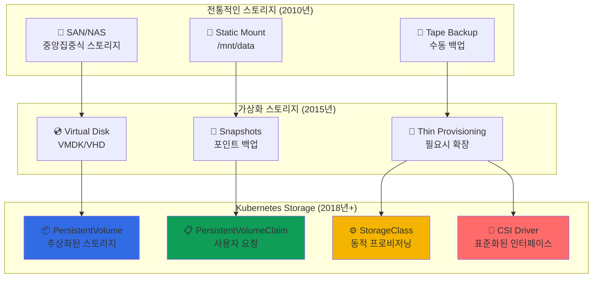

---
tags:
  - Kubernetes
  - Storage
  - PersistentVolumes
  - StatefulSets
  - CSI
---

# Kubernetes Storage - 우버가 페타바이트 상태 데이터를 관리하는 기술 💾

## 이 섹션을 읽으면 답할 수 있는 질문들

- 우버는 어떻게 운전자 위치를 실시간으로 저장하고 관리할까?
- 컨테이너가 재시작돼도 데이터가 사라지지 않는 마법의 원리는?
- PV와 PVC의 차이점과 실제 운영에서의 활용법은?
- CSI 드라이버로 클라우드 스토리지를 연동하는 실제 구현은?
- 상태가 있는 애플리케이션을 Kubernetes에서 안전하게 운영하는 비결은?

## 시작하며: 영속성의 도전

### 충격적인 딜레마: 컨테이너 vs 데이터

컨테이너의 핵심 철학은 **"불변성과 일회성"**입니다. 하지만 현실 세계의 애플리케이션은 **"상태와 영속성"**이 필요합니다.

```python
# 우버의 실시간 위치 데이터 딜레마
uber_location_challenge = {
    "data_volume": {
        "drivers": "5,000,000 active worldwide",
        "location_updates": "every 4 seconds",
        "daily_data_points": "100,000,000,000",  # 1000억 개
        "storage_requirement": "petabyte_scale"
    },
    
    "container_reality": {
        "principle": "stateless and ephemeral",
        "pod_lifecycle": "can be killed anytime",
        "local_storage": "disappears with pod",
        "challenge": "how to persist location data?"
    },
    
    "kubernetes_solution": [
        "PersistentVolumes for data persistence",
        "StatefulSets for ordered deployment",
        "CSI drivers for cloud storage integration", 
        "Dynamic provisioning for auto-scaling"
    ]
}

print("💡 깨달음: Kubernetes Storage는 상태 있는 세계와 상태 없는 철학의 완벽한 중재자!")
```

### Storage의 진화: 단순함에서 복잡함으로



**핵심 통찰**: Kubernetes Storage는 **물리적 스토리지를 논리적으로 추상화**하여 개발자가 스토리지 인프라를 몰라도 데이터를 안전하게 관리할 수 있게 합니다.

## Kubernetes Storage 완벽 마스터 📚

### [1. Volumes: Spotify의 데이터 영속성 비결](01-volumes.md)

**컨테이너의 일시적 특성을 극복하는 첫 번째 단계**

Spotify가 어떻게 3억 사용자의 플레이리스트와 음악 메타데이터를 안전하게 보관하면서도 Pod 재시작과 노드 장애에 대응하는지, Volume의 다양한 타입과 실제 활용법을 탐험합니다.

💿 **핵심 내용**:

- emptyDir vs hostPath vs configMap 활용 패턴
- Volume과 VolumeMount의 관계
- 임시 스토리지와 영구 스토리지의 구분
- 다중 컨테이너 Pod에서의 Volume 공유

---

### [2. Persistent Volumes: 우버의 상태 데이터 관리 시스템](02-persistent-volumes.md)

**PV/PVC 바인딩을 통한 스토리지 생명주기 관리**

우버가 어떻게 실시간 위치 데이터를 페타바이트 규모로 관리하면서도 Pod 재배포와 노드 교체 시에도 데이터 무결성을 보장하는지, PV/PVC 아키텍처의 깊은 원리를 알아봅니다.

📦 **핵심 내용**:

- PV Lifecycle: Available → Bound → Released → Failed
- Access Modes: ReadWriteOnce, ReadOnlyMany, ReadWriteMany
- Reclaim Policy: Retain, Delete, Recycle 전략
- Volume Binding Modes와 Topology Awareness

---

### [3. CSI Drivers: Netflix의 스토리지 통합 플랫폼](03-csi-drivers.md)

**Container Storage Interface를 통한 무제한 확장**

Netflix가 어떻게 AWS EBS, Google Persistent Disk, Azure Disk를 하나의 통일된 인터페이스로 관리하면서도 각 클라우드의 고유 기능을 최대한 활용하는지, CSI의 혁신적 설계를 탐구합니다.

🔌 **핵심 내용**:

- CSI 아키텍처: Controller vs Node Plugin
- Dynamic Provisioning과 StorageClass 설계
- Volume Snapshots과 Cloning 기능
- Multi-cloud 환경에서의 Storage 추상화

## Storage 활용 시나리오 가이드 🎯

### 시나리오 1: 상태가 있는 애플리케이션 배포

```yaml
# PostgreSQL 데이터베이스 배포
apiVersion: v1
kind: StorageClass
metadata:
  name: fast-ssd
provisioner: kubernetes.io/aws-ebs
parameters:
  type: gp3
  iops: "3000"
  throughput: "125"
  encrypted: "true"
allowVolumeExpansion: true
volumeBindingMode: WaitForFirstConsumer

---
apiVersion: apps/v1
kind: StatefulSet
metadata:
  name: postgres
spec:
  serviceName: postgres
  replicas: 3
  selector:
    matchLabels:
      app: postgres
  template:
    metadata:
      labels:
        app: postgres
    spec:
      containers:
      - name: postgres
        image: postgres:14
        ports:
        - containerPort: 5432
        env:
        - name: POSTGRES_DB
          value: myapp
        - name: POSTGRES_USER
          valueFrom:
            secretKeyRef:
              name: postgres-secret
              key: username
        - name: POSTGRES_PASSWORD
          valueFrom:
            secretKeyRef:
              name: postgres-secret
              key: password
        volumeMounts:
        - name: postgres-data
          mountPath: /var/lib/postgresql/data
        resources:
          requests:
            memory: "2Gi"
            cpu: "1000m"
          limits:
            memory: "4Gi"
            cpu: "2000m"
  volumeClaimTemplates:
  - metadata:
      name: postgres-data
    spec:
      accessModes: ["ReadWriteOnce"]
      storageClassName: fast-ssd
      resources:
        requests:
          storage: 100Gi
```

### 시나리오 2: 공유 스토리지와 콘텐츠 배포

```yaml
# 여러 Pod에서 공유하는 정적 콘텐츠
apiVersion: v1
kind: PersistentVolume
metadata:
  name: shared-content-pv
spec:
  capacity:
    storage: 1Ti
  accessModes:
  - ReadOnlyMany
  persistentVolumeReclaimPolicy: Retain
  storageClassName: nfs-storage
  nfs:
    server: nfs-server.storage.svc.cluster.local
    path: "/shared/content"

---
apiVersion: v1
kind: PersistentVolumeClaim
metadata:
  name: shared-content-pvc
spec:
  accessModes:
  - ReadOnlyMany
  resources:
    requests:
      storage: 1Ti
  storageClassName: nfs-storage

---
apiVersion: apps/v1
kind: Deployment
metadata:
  name: web-servers
spec:
  replicas: 10
  template:
    spec:
      containers:
      - name: nginx
        image: nginx:1.21
        volumeMounts:
        - name: content
          mountPath: /usr/share/nginx/html
          readOnly: true
      volumes:
      - name: content
        persistentVolumeClaim:
          claimName: shared-content-pvc
```

### 시나리오 3: 동적 볼륨 프로비저닝

```python
class DynamicVolumeProvisioning:
    """
    동적 볼륨 프로비저닝 패턴
    """
    
    def multi_tier_storage(self):
        """
        성능 계층별 스토리지 클래스 설계
        """
        storage_classes = {
            "ultra_fast": {
                "provisioner": "ebs.csi.aws.com",
                "parameters": {
                    "type": "io2",
                    "iops": "10000",
                    "throughput": "1000"
                },
                "use_case": "고성능 데이터베이스",
                "cost": "$$$$"
            },
            
            "fast": {
                "provisioner": "ebs.csi.aws.com", 
                "parameters": {
                    "type": "gp3",
                    "iops": "3000",
                    "throughput": "125"
                },
                "use_case": "일반적인 애플리케이션",
                "cost": "$$$"
            },
            
            "slow": {
                "provisioner": "ebs.csi.aws.com",
                "parameters": {
                    "type": "sc1",
                    "throughput": "12"
                },
                "use_case": "로그, 백업 데이터",
                "cost": "$"
            }
        }
        
        return storage_classes
    
    def automatic_scaling(self):
        """
        볼륨 자동 확장 패턴
        """
        config = {
            "volume_expansion": {
                "enabled": True,
                "trigger": "사용률 80% 도달",
                "expansion_size": "현재 크기의 50%",
                "max_size": "10Ti"
            },
            
            "monitoring": [
                "volume_usage_percentage",
                "disk_iops_utilization", 
                "throughput_utilization",
                "queue_depth"
            ],
            
            "alerts": {
                "high_usage": "85% 사용률 도달시 알림",
                "performance_degradation": "IOPS/대역폭 한계 근접시",
                "expansion_failure": "확장 실패시 즉시 알림"
            }
        }
        
        return config
```

### 시나리오 4: 백업과 복구 전략

```python
class BackupRecoveryStrategy:
    """
    Kubernetes Storage 백업/복구 전략
    """
    
    def snapshot_based_backup(self):
        """
        스냅샷 기반 백업 패턴
        """
        strategy = {
            "daily_snapshots": {
                "schedule": "0 2 * * *",  # 매일 오전 2시
                "retention": "30일",
                "storage_class": "snapshot-class"
            },
            
            "weekly_snapshots": {
                "schedule": "0 3 * * 0",  # 매주 일요일
                "retention": "12주",
                "cross_region": True
            },
            
            "monthly_snapshots": {
                "schedule": "0 4 1 * *",  # 매월 1일
                "retention": "12개월", 
                "archive_storage": "glacier"
            }
        }
        
        return strategy
    
    def disaster_recovery(self):
        """
        재해 복구 시나리오
        """
        scenarios = {
            "single_node_failure": {
                "rpo": "0 (real-time replication)",
                "rto": "< 5분",
                "method": "PV가 다른 노드에서 자동 재연결"
            },
            
            "az_failure": {
                "rpo": "< 1시간 (cross-AZ snapshots)",
                "rto": "< 30분",
                "method": "스냅샷에서 새 AZ로 복원"
            },
            
            "region_failure": {
                "rpo": "< 4시간 (cross-region backup)",
                "rto": "< 2시간",
                "method": "다른 리전에서 전체 클러스터 복원"
            }
        }
        
        return scenarios
```

## 고급 Storage 패턴 💡

### Local Storage 최적화

```python
class LocalStorageOptimization:
    """
    Local Storage 최적화 패턴
    """
    
    def nvme_optimization(self):
        """
        NVMe Local Storage 최적화
        """
        config = {
            "storage_class": {
                "provisioner": "kubernetes.io/no-provisioner",
                "volume_binding_mode": "WaitForFirstConsumer"
            },
            
            "node_preparation": [
                "NVMe 드라이브 포맷",
                "적절한 파일시스템 선택 (ext4/xfs)",
                "Local PV Static Provisioner 설치"
            ],
            
            "performance_benefits": {
                "latency": "네트워크 스토리지 대비 90% 감소",
                "throughput": "최대 6.5GB/s (NVMe)",
                "iops": "최대 1,000,000 IOPS"
            },
            
            "trade_offs": {
                "durability": "노드 장애시 데이터 손실 위험",
                "portability": "다른 노드로 이동 불가",
                "backup": "추가적인 백업 전략 필요"
            }
        }
        
        return config
```

### Multi-Cloud Storage 전략

```python
class MultiCloudStorage:
    """
    멀티 클라우드 스토리지 전략
    """
    
    def cloud_agnostic_design(self):
        """
        클라우드 독립적 스토리지 설계
        """
        design = {
            "abstraction_layers": [
                "Application (PVC 사용)",
                "Kubernetes Storage API",
                "CSI Driver Interface", 
                "Cloud Provider Storage"
            ],
            
            "csi_drivers": {
                "aws": "ebs.csi.aws.com",
                "gcp": "pd.csi.storage.gke.io",
                "azure": "disk.csi.azure.com",
                "on_premise": "local.csi.driver"
            },
            
            "migration_strategy": {
                "data_replication": "CSI Volume Cloning",
                "application_portability": "동일한 PVC 설정",
                "testing": "각 클라우드에서 동일한 워크로드 검증"
            }
        }
        
        return design
```

## Storage 마스터 로드맵 🗺️

### 기초 (1주)

- [ ] Volume과 VolumeMount 개념 이해
- [ ] emptyDir, hostPath 등 기본 Volume 타입 실습
- [ ] ConfigMap과 Secret의 Volume 활용

### 중급 (1개월)

- [ ] PV/PVC 생명주기 완전 이해
- [ ] StorageClass로 동적 프로비저닝 구현
- [ ] StatefulSet과 VolumeClaimTemplate 활용

### 고급 (3개월)

- [ ] CSI Driver 설치 및 설정
- [ ] Volume Snapshots과 Cloning 구현
- [ ] 멀티 클라우드 Storage 전략 수립

### 전문가 (6개월+)

- [ ] Custom CSI Driver 개발
- [ ] 대규모 스토리지 성능 최적화
- [ ] 재해 복구 시나리오 구축

## 실전 트러블슈팅 🔧

### 문제 1: PVC가 Pending 상태

```python
pvc_pending_debugging = {
    "일반적인_원인": [
        "적절한 PV가 없음",
        "StorageClass 프로비저너 오류",
        "리소스 부족 (디스크 공간)",
        "Node Affinity 제약"
    ],
    
    "디버깅_명령어": [
        "kubectl describe pvc <pvc-name>",
        "kubectl get storageclass",
        "kubectl describe storageclass <sc-name>",
        "kubectl get events --sort-by='.metadata.creationTimestamp'"
    ],
    
    "해결_방법": [
        "적절한 크기의 PV 생성",
        "StorageClass 프로비저너 상태 확인",
        "노드 디스크 용량 확인",
        "볼륨 바인딩 모드 검토"
    ]
}
```

### 문제 2: Volume Mount 실패

```python
volume_mount_debugging = {
    "증상별_진단": {
        "mount_failed": [
            "파일시스템 오류",
            "권한 문제",
            "볼륨이 다른 Pod에 연결됨"
        ],
        
        "read_only_filesystem": [
            "PV Access Mode 확인",
            "파일시스템 손상 검사",
            "ReadOnlyMany vs ReadWriteOnce"
        ],
        
        "performance_issues": [
            "스토리지 IOPS 한계",
            "네트워크 대역폭",
            "동시 접근 Pod 수"
        ]
    },
    
    "모니터링_메트릭": [
        "volume_manager_total_volumes",
        "storage_operation_duration_seconds",
        "persistentvolume_claim_capacity_bytes"
    ]
}
```

## 성능 벤치마크 📊

### 스토리지 타입별 성능

```python
storage_performance = {
    "local_nvme": {
        "latency": "< 0.1ms",
        "throughput": "6500 MB/s", 
        "iops": "1,000,000",
        "durability": "Node-local only"
    },
    
    "ebs_gp3": {
        "latency": "< 1ms",
        "throughput": "1000 MB/s",
        "iops": "16,000",
        "durability": "99.999%"
    },
    
    "ebs_io2": {
        "latency": "< 0.5ms", 
        "throughput": "1000 MB/s",
        "iops": "64,000",
        "durability": "99.999%"
    },
    
    "efs": {
        "latency": "1-3ms",
        "throughput": "10+ GB/s",
        "iops": "무제한",
        "durability": "99.999999999%"
    }
}
```

## 마치며: Storage는 상태의 수호자

Kubernetes Storage를 깊이 이해하면, **일시적인 컨테이너 세계에서 영구적인 데이터를 안전하게 관리하는 정교한 메커니즘**을 경험하게 됩니다.

**Storage가 가르쳐주는 교훈들**:

1. 💾 **추상화의 힘**: 복잡한 스토리지 인프라를 간단한 PVC 요청으로 사용
2. 🔄 **생명주기 관리**: 데이터의 생성부터 삭제까지 완전한 생명주기 제어
3. 📈 **동적 확장**: 애플리케이션 요구에 따라 스토리지가 자동으로 프로비저닝
4. 🛡️ **내구성 보장**: 노드/존 장애에도 데이터가 안전하게 보호됨

이제 기본 Volume부터 시작해서 고급 CSI Driver까지 완전히 마스터해보세요! 🚀

---

**다음 읽기**: [Volumes: Spotify의 데이터 영속성 비결](01-volumes.md)
