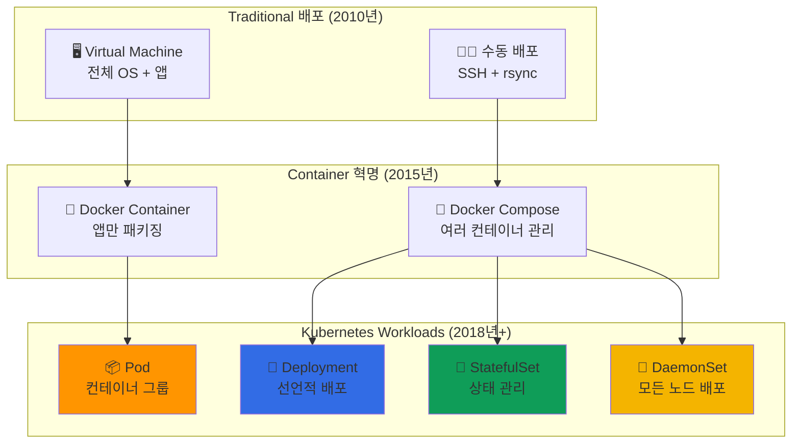

---
tags:
  - Kubernetes
  - Workloads
  - Pods
  - Deployments
  - StatefulSets
---

# Kubernetes Workloads - 에어비앤비가 10K 예약/초를 처리하는 비밀 📦

## 이 섹션을 읽으면 답할 수 있는 질문들

- 에어비앤비는 어떻게 초당 1만 건의 예약을 처리할까?
- Pod가 죽어도 서비스가 멈추지 않는 마법의 원리는?
- Deployment와 StatefulSet, 언제 어떤 걸 써야 할까?
- DaemonSet은 어떻게 모든 노드에서 로그를 수집하는가?
- Spotify가 하루에 50번 배포해도 안정적인 이유는?

## 시작하며: 컨테이너를 넘어선 추상화

### 충격적인 사실: Pod는 왜 필요했을까?

Docker만 있으면 되는데 왜 Pod라는 개념을 만들었을까요? 그 답은**현실 세계의 복잡함**에 있습니다.

```python
# Netflix 마이크로서비스의 현실
netflix_service_reality = {
    "main_app": {
        "container": "video-streaming:v1.2",
        "dependencies": ["sidecar_proxy", "log_collector", "metrics_exporter"]
    },
    
    "실제_필요한_것들": [
        "메인 앱 컨테이너",
        "사이드카 프록시 (Service Mesh)", 
        "로그 수집기 (Fluentd)",
        "메트릭 수집기 (Prometheus)",
        "설정 파일 동기화"
    ],
    
    "도커만으로는_해결_안_되는_문제": [
        "컨테이너 간 파일 공유",
        "네트워크 네임스페이스 공유",
        "생명주기 동기화",
        "원자적 배포/스케일링"
    ]
}

print("💡 깨달음: Pod는 '함께 배포되어야 하는 컨테이너들의 그룹'이다!")
```

### Workloads의 진화: 단순함에서 복잡함으로



**핵심 통찰**: 각 Workload 타입은**특정한 운영 패턴**을 해결하기 위해 만들어졌습니다.

## Kubernetes Workloads 완벽 마스터 📚

### [1. Pods: Airbnb의 10K 예약/초 처리 비결](01-pods.md)

**가장 작은 배포 단위의 숨겨진 복잡성**

Airbnb가 어떻게 Pod 설계를 통해 초당 1만 건의 예약 요청을 안정적으로 처리하는지, Pod 생명주기의 모든 단계와 실제 운영에서 만날 수 있는 함정들을 탐험합니다.

📦**핵심 내용**:

- Pod 내 컨테이너 간 네트워크/스토리지 공유 원리
- Init Container vs Sidecar Container 패턴
- Pod 생명주기와 Phase 상태 머신
- Readiness/Liveness Probe 설정 베스트 프랙티스

---

### [2. Controllers: Kubernetes의 자가치유 시스템](02-controllers.md)

**ReplicaSet, Deployment의 실제 동작 원리**

Spotify가 어떻게 하루에 50번 배포를 하면서도 서비스 중단 없이 운영하는지, Controller 패턴이 어떻게 선언적 관리와 자동 복구를 가능하게 하는지 알아봅니다.

🔄**핵심 내용**:

- Controller Loop와 Reconciliation 패턴
- ReplicaSet의 Pod 관리 알고리즘
- Deployment의 Rolling Update 전략
- Blue-Green vs Canary 배포 구현

---

### [3. StatefulSets: 영구 워크로드 관리의 예술](03-statefulsets.md)

**상태가 있는 애플리케이션의 도전과 해결**

MongoDB, Kafka, Elasticsearch 같은 상태가 있는 애플리케이션을 Kubernetes에서 어떻게 안정적으로 운영하는지, StatefulSet이 순서와 정체성을 보장하는 마법을 이해합니다.

💾**핵심 내용**:

- Stable Network Identity와 Ordered Deployment
- Persistent Volume과의 완벽한 통합
- StatefulSet vs Deployment 선택 기준
- 상태 있는 애플리케이션의 스케일링 전략

---

### [4. DaemonSets: 노드별 시스템 서비스의 완벽함](04-daemonsets.md)

**모든 노드에서 동작해야 하는 시스템의 우아한 관리**

로그 수집, 메트릭 수집, 네트워킹 등 모든 노드에서 실행되어야 하는 시스템 컴포넌트를 DaemonSet으로 어떻게 완벽하게 관리하는지 탐구합니다.

🔄**핵심 내용**:

- Node Selector와 Tolerations 활용
- Rolling Update Strategy for DaemonSets
- 시스템 리소스 접근 패턴
- 모니터링과 로그 수집 사례

## Workloads 활용 시나리오 가이드 🎯

### 시나리오 1: 무상태 웹 애플리케이션

```yaml
# 전형적인 웹 서비스 배포
apiVersion: apps/v1
kind: Deployment
metadata:
  name: web-app
  labels:
    app: web-app
spec:
  replicas: 10
  strategy:
    type: RollingUpdate
    rollingUpdate:
      maxSurge: 3          # 최대 13개까지 Pod 생성 가능
      maxUnavailable: 2    # 최대 2개까지 사용 불가 허용
  selector:
    matchLabels:
      app: web-app
  template:
    metadata:
      labels:
        app: web-app
    spec:
      containers:
      - name: web
        image: nginx:1.21
        ports:
        - containerPort: 80
        resources:
          requests:
            memory: "256Mi"
            cpu: "250m"
          limits:
            memory: "512Mi" 
            cpu: "500m"
        readinessProbe:
          httpGet:
            path: /health
            port: 80
          initialDelaySeconds: 5
          periodSeconds: 10
        livenessProbe:
          httpGet:
            path: /health
            port: 80
          initialDelaySeconds: 30
          periodSeconds: 30
```

### 시나리오 2: 상태가 있는 데이터베이스

```yaml
# MongoDB 클러스터 배포
apiVersion: apps/v1
kind: StatefulSet
metadata:
  name: mongodb
spec:
  serviceName: mongodb
  replicas: 3
  selector:
    matchLabels:
      app: mongodb
  template:
    metadata:
      labels:
        app: mongodb
    spec:
      containers:
      - name: mongodb
        image: mongo:5.0
        ports:
        - containerPort: 27017
        env:
        - name: MONGO_REPLICA_SET_NAME
          value: "rs0"
        volumeMounts:
        - name: mongodb-data
          mountPath: /data/db
        resources:
          requests:
            memory: "1Gi"
            cpu: "500m"
  volumeClaimTemplates:
  - metadata:
      name: mongodb-data
    spec:
      accessModes: ["ReadWriteOnce"]
      storageClassName: "fast-ssd"
      resources:
        requests:
          storage: 100Gi
```

### 시나리오 3: 시스템 데몬 배포

```yaml
# 로그 수집기 모든 노드 배포
apiVersion: apps/v1
kind: DaemonSet
metadata:
  name: log-collector
  namespace: kube-system
spec:
  selector:
    matchLabels:
      name: log-collector
  template:
    metadata:
      labels:
        name: log-collector
    spec:
      tolerations:
      - key: node-role.kubernetes.io/master
        effect: NoSchedule    # Master 노드에도 배포
      containers:
      - name: fluentd
        image: fluentd/fluentd-kubernetes-daemonset:v1.14
        resources:
          limits:
            memory: 512Mi
          requests:
            cpu: 100m
            memory: 256Mi
        volumeMounts:
        - name: varlog
          mountPath: /var/log
        - name: containers
          mountPath: /var/lib/docker/containers
          readOnly: true
      volumes:
      - name: varlog
        hostPath:
          path: /var/log
      - name: containers
        hostPath:
          path: /var/lib/docker/containers
```

## 고급 패턴과 베스트 프랙티스 💡

### Init Container 패턴

```python
class InitContainerPatterns:
    """
    Init Container를 활용한 고급 패턴들
    """
    
    def database_migration_pattern(self):
        """
        데이터베이스 마이그레이션 패턴
        """
        pattern = {
            "use_case": "앱 시작 전 DB 스키마 업데이트",
            "init_containers": [
                {
                    "name": "db-migration",
                    "image": "myapp/migration:v1.0",
                    "command": ["python", "migrate.py"],
                    "env": ["DB_URL=postgresql://..."]
                }
            ],
            "benefits": [
                "앱과 마이그레이션 분리",
                "멱등성 보장",
                "실패 시 앱 시작 방지"
            ]
        }
        return pattern
    
    def config_preparation_pattern(self):
        """
        설정 파일 준비 패턴
        """
        pattern = {
            "use_case": "설정 템플릿을 실제 환경값으로 렌더링",
            "init_containers": [
                {
                    "name": "config-renderer", 
                    "image": "consul-template:latest",
                    "command": ["consul-template", "-template=config.tpl:/shared/config.json:echo done"],
                    "volumeMounts": ["/shared"]
                }
            ],
            "shared_volume": "emptyDir"
        }
        return pattern
```

### Sidecar Container 패턴

```python
class SidecarPatterns:
    """
    Sidecar Container 고급 활용법
    """
    
    def service_mesh_pattern(self):
        """
        Service Mesh Sidecar 패턴
        """
        pattern = {
            "main_container": "business-app:v1.0",
            "sidecar_container": {
                "name": "istio-proxy",
                "image": "istio/proxyv2:1.17.1",
                "purpose": "트래픽 라우팅, 보안, 관찰성"
            },
            "shared_resources": [
                "network_namespace",  # 같은 Pod IP 공유
                "volumes"            # 설정 파일 공유
            ],
            "benefits": [
                "비즈니스 로직과 인프라 관심사 분리",
                "언어 독립적 기능 제공",
                "점진적 도입 가능"
            ]
        }
        return pattern
    
    def log_aggregation_pattern(self):
        """
        로그 수집 Sidecar 패턴
        """
        pattern = {
            "main_container": "web-app:v2.0",
            "sidecar_container": {
                "name": "log-shipper",
                "image": "fluent/fluent-bit:2.0",
                "purpose": "로그 파싱, 필터링, 전송"
            },
            "shared_volume": {
                "name": "app-logs",
                "type": "emptyDir",
                "mount_path": "/var/log/app"
            }
        }
        return pattern
```

## Workloads 마스터 로드맵 🗺️

### 기초 (1주)

- [ ] Pod 개념과 단순한 컨테이너 실행
- [ ] Deployment로 기본적인 앱 배포
- [ ] kubectl을 통한 Pod 상태 확인

### 중급 (1개월)

- [ ] Rolling Update와 Rollback 실습
- [ ] Init Container와 Sidecar 패턴 구현
- [ ] Resource Request/Limit 최적화

### 고급 (3개월)

- [ ] StatefulSet으로 데이터베이스 운영
- [ ] Custom Controller 개발
- [ ] HPA/VPA를 통한 자동 스케일링

### 전문가 (6개월+)

- [ ] Operator 패턴으로 복잡한 애플리케이션 관리
- [ ] Multi-tenant 환경에서의 Workload 격리
- [ ] 대규모 배포 파이프라인 구축

## 실전 트러블슈팅 🔧

### 문제 1: Pod가 Pending 상태에서 멈춤

```python
pod_pending_debugging = {
    "일반적인_원인": [
        "리소스 부족 (CPU/Memory)",
        "Node Selector 조건 불일치",
        "Taints/Tolerations 문제",
        "PVC 바인딩 실패"
    ],
    
    "디버깅_명령어": [
        "kubectl describe pod <pod-name>",
        "kubectl get events --sort-by=.metadata.creationTimestamp",
        "kubectl top nodes",
        "kubectl get pvc"
    ],
    
    "해결_방법": [
        "Node 리소스 확장",
        "Resource Request 조정",
        "Node Label 확인",
        "스토리지 클래스 확인"
    ]
}
```

### 문제 2: Rolling Update 실패

```python
rolling_update_debugging = {
    "실패_증상": [
        "새 Pod가 Ready 상태가 되지 않음",
        "Readiness Probe 실패",
        "이미지 Pull 실패",
        "설정 변경 문제"
    ],
    
    "복구_전략": [
        "즉시 이전 버전으로 Rollback",
        "문제 원인 분석 후 수정",
        "단계적 재배포 (Canary)",
        "Blue-Green 배포 전환"
    ],
    
    "예방_방법": [
        "철저한 테스트 환경 검증",
        "점진적 배포 전략",
        "모니터링 강화",
        "자동화된 Rollback 조건"
    ]
}
```

## 성능 최적화 전략 📈

### Resource 관리 최적화

```python
resource_optimization = {
    "requests_vs_limits": {
        "requests": {
            "purpose": "스케줄링 결정",
            "best_practice": "실제 사용량 기반 설정",
            "monitoring": "실제 사용 패턴 분석"
        },
        "limits": {
            "purpose": "리소스 제한",
            "best_practice": "OOM 방지를 위한 적절한 여유",
            "risk": "너무 낮으면 throttling 발생"
        }
    },
    
    "scaling_strategy": {
        "horizontal": "Pod 수 증가 (HPA)",
        "vertical": "Pod 리소스 증가 (VPA)",
        "cluster": "노드 수 증가 (CA)",
        "optimal": "워크로드 특성에 따라 조합"
    }
}
```

## 마치며: Workloads는 애플리케이션의 생명

Kubernetes Workloads를 마스터하면, 단순한 컨테이너 실행을 넘어서**애플리케이션의 전체 생명주기를 선언적으로 관리**할 수 있게 됩니다.

**Workloads가 가르쳐주는 교훈들**:

1. 📦**적절한 추상화**: 복잡한 배포 패턴을 간단한 YAML로 표현
2. 🔄**자동화된 관리**: 장애, 스케일링, 업데이트를 자동으로 처리
3. 💡**패턴 기반 설계**: 일반적인 운영 패턴을 재사용 가능한 형태로 제공
4. 🎯**선언적 운영**: 원하는 상태를 선언하면 시스템이 알아서 달성

이제 Pod부터 시작해서 복잡한 StatefulSet까지 완전히 마스터해보세요! 🚀

---

**다음 읽기**: [Pods: Airbnb의 10K 예약/초 처리 비결](01-pods.md)
