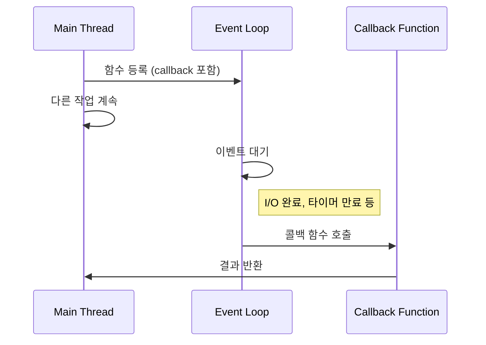
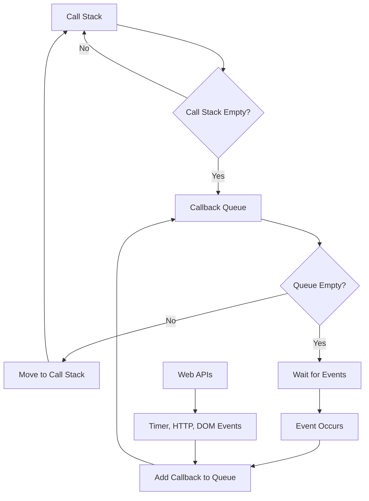

---
tags:
  - Programming
  - Callback
  - Function Pointer
  - Lambda
  - Closure
  - Event Loop
  - Async
  - JavaScript
  - Python
  - C
  - C++
  - Performance
---

# Callback Functions: 함수형 프로그래밍의 핵심 패턴

## 들어가며

"API 호출 후 응답을 어떻게 처리할까?" 이 질문에 대한 답이 바로 **콜백 함수(Callback Function)**입니다.

2024년 현재 프로덕션에서 발생하는 실제 시나리오를 생각해보세요:

- Node.js에서 10,000개의 동시 HTTP 요청 처리
- GUI 애플리케이션의 버튼 클릭 이벤트 처리
- 데이터베이스 쿼리 완료 후 결과 처리

이 모든 상황에서 콜백 함수가 핵심적인 역할을 합니다. 하지만 콜백 지옥(Callback Hell)이라는 악명 높은 문제와 메모리 관리, 성능 이슈까지 고려해야 합니다.

## Callback Function 이해하기

### 핵심 개념

콜백 함수는 **다른 함수에 인자로 전달되어, 특정 이벤트나 조건이 충족될 때 호출되는 함수**입니다.

```text
┌─────────────────────────────────────────────┐
│             Function A                      │
│  ┌─────────────────────────────────────┐   │
│  │         Function B                  │   │
│  │  (Callback Function)               │   │
│  │  - 이벤트 발생 시 호출              │   │
│  │  - 비동기 작업 완료 시 호출         │   │
│  └─────────────────────────────────────┘   │
└─────────────────────────────────────────────┘
```

### 내부 동작 원리

콜백 함수의 실행 흐름은 다음과 같습니다:



## Language-Specific Callback Patterns

### C Language: Function Pointers

C에서 콜백은 함수 포인터를 통해 구현됩니다:

```c
#include &lt;stdio.h&gt;
#include &lt;stdlib.h&gt;

// 콜백 함수 타입 정의
typedef void (*callback_t)(int result, void* userdata);

// 비동기 작업을 시뮬레이션하는 함수
void async_operation(int input, callback_t callback, void* userdata) {
    // 실제로는 네트워크 I/O, 파일 I/O 등
    int result = input * 2;
    
    // 작업 완료 후 콜백 호출
    if (callback) {
        callback(result, userdata);
    }
}

// 콜백 함수 구현
void on_completion(int result, void* userdata) {
    printf("Operation completed. Result: %d\n", result);
    int* counter = (int*)userdata;
    (*counter)++;
}

int main() {
    int counter = 0;
    
    // 콜백과 함께 비동기 작업 시작
    async_operation(10, on_completion, &counter);
    
    printf("Counter: %d\n", counter);
    return 0;
}
```

**Production에서의 실제 사용 사례:**

```c
// Linux epoll을 사용한 네트워크 이벤트 처리
struct epoll_event events[MAX_EVENTS];
int nfds = epoll_wait(epfd, events, MAX_EVENTS, timeout);

for (int i = 0; i &lt; nfds; i++) {
    struct connection* conn = (struct connection*)events[i].data.ptr;
    
    // 콜백 함수를 통한 이벤트 처리
    if (events[i].events & EPOLLIN) {
        conn->read_callback(conn);
    }
    if (events[i].events & EPOLLOUT) {
        conn->write_callback(conn);
    }
}
```

### C++: Function Objects and Lambdas

C++에서는 다양한 콜백 방식을 지원합니다:

```cpp
#include &lt;iostream&gt;
#include &lt;functional&gt;
#include &lt;vector&gt;
#include &lt;thread&gt;
#include &lt;chrono&gt;

class TaskManager {
public:
    // std::function을 사용한 콜백 저장
    using Callback = std::function&lt;void(int)&gt;;
    
    void execute_async(int input, Callback callback) {
        // 별도 스레드에서 비동기 실행
        std::thread worker([input, callback]() {
            std::this_thread::sleep_for(std::chrono::milliseconds(100));
            
            int result = input * input;
            callback(result);  // 콜백 호출
        });
        
        worker.detach();
    }
};

// 함수 객체 (Functor)
struct MultiplyCallback {
    int multiplier;
    
    MultiplyCallback(int m) : multiplier(m) {}
    
    void operator()(int result) {
        std::cout &lt;&lt; "Functor result: " &lt;&lt; result * multiplier &lt;&lt; std::endl;
    }
};

int main() {
    TaskManager manager;
    
    // 1. Lambda 콜백
    manager.execute_async(5, [](int result) {
        std::cout &lt;&lt; "Lambda result: " &lt;&lt; result &lt;&lt; std::endl;
    });
    
    // 2. Functor 콜백
    MultiplyCallback callback(3);
    manager.execute_async(7, callback);
    
    // 3. 일반 함수 포인터
    manager.execute_async(9, [](int result) {
        printf("Function pointer result: %d\n", result);
    });
    
    // 메인 스레드 잠시 대기
    std::this_thread::sleep_for(std::chrono::milliseconds(200));
    
    return 0;
}
```

### JavaScript: First-Class Functions

JavaScript에서 콜백은 일급 함수로 처리됩니다:

```javascript
// 전통적인 콜백 패턴
function fetchData(url, callback) {
    // XMLHttpRequest 또는 fetch API 사용
    const xhr = new XMLHttpRequest();
    
    xhr.onreadystatechange = function() {
        if (xhr.readyState === 4) {
            if (xhr.status === 200) {
                callback(null, JSON.parse(xhr.responseText));
            } else {
                callback(new Error(`HTTP ${xhr.status}`), null);
            }
        }
    };
    
    xhr.open('GET', url);
    xhr.send();
}

// 사용 예제
fetchData('/api/users', function(error, data) {
    if (error) {
        console.error('Error:', error.message);
        return;
    }
    
    console.log('Received data:', data);
    
    // 중첩 콜백 (Callback Hell의 시작)
    fetchData(`/api/users/${data[0].id}/posts`, function(error, posts) {
        if (error) {
            console.error('Posts error:', error.message);
            return;
        }
        
        console.log('User posts:', posts);
    });
});
```

**Event-driven Programming 예제:**

```javascript
// DOM 이벤트 콜백
document.getElementById('button').addEventListener('click', function(event) {
    console.log('Button clicked!', event.target);
});

// Node.js 스타일 콜백
const fs = require('fs');

fs.readFile('config.json', 'utf8', function(err, data) {
    if (err) {
        console.error('File read error:', err);
        return;
    }
    
    try {
        const config = JSON.parse(data);
        console.log('Config loaded:', config);
    } catch (parseError) {
        console.error('JSON parse error:', parseError);
    }
});
```

### Python: Higher-Order Functions

Python에서는 함수가 일급 객체이므로 콜백을 쉽게 구현할 수 있습니다:

```python
import threading
import time
from typing import Callable, Any, Optional

class AsyncTaskRunner:
    def __init__(self):
        self.tasks = []
    
    def run_async(self, 
                  task_func: Callable[[], Any],
                  callback: Callable[[Any, Optional[Exception]], None]) -> None:
        """비동기 태스크 실행 후 콜백 호출"""
        
        def worker():
            try:
                result = task_func()
                callback(result, None)
            except Exception as e:
                callback(None, e)
        
        thread = threading.Thread(target=worker)
        thread.daemon = True
        thread.start()

# 사용 예제
def heavy_computation():
    """CPU 집약적 작업 시뮬레이션"""
    time.sleep(2)
    return sum(i ** 2 for i in range(1000000))

def on_completion(result, error):
    """콜백 함수"""
    if error:
        print(f"Error occurred: {error}")
    else:
        print(f"Computation result: {result}")

# 비동기 실행
runner = AsyncTaskRunner()
runner.run_async(heavy_computation, on_completion)

# 데코레이터를 사용한 콜백 패턴
def with_callback(callback_func):
    def decorator(func):
        def wrapper(*args, **kwargs):
            try:
                result = func(*args, **kwargs)
                callback_func(result, None)
                return result
            except Exception as e:
                callback_func(None, e)
                raise
        return wrapper
    return decorator

# 사용 예제
def log_result(result, error):
    if error:
        print(f"Function failed: {error}")
    else:
        print(f"Function succeeded: {result}")

@with_callback(log_result)
def divide(a, b):
    return a / b

# 실행
divide(10, 2)  # Function succeeded: 5.0
try:
    divide(10, 0)  # Function failed: division by zero
except ZeroDivisionError:
    pass
```

## Event Loop와 콜백의 관계

### JavaScript Event Loop 내부



**실제 Node.js Event Loop 동작:**

```javascript
console.log('Start');  // 1. Call Stack에서 즉시 실행

setTimeout(() => {
    console.log('Timer callback');  // 4. Timer Queue에서 실행
}, 0);

setImmediate(() => {
    console.log('Immediate callback');  // 3. Check Queue에서 실행
});

process.nextTick(() => {
    console.log('NextTick callback');  // 2. 가장 높은 우선순위
});

console.log('End');  // 1. Call Stack에서 즉시 실행

// 출력 순서:
// Start
// End  
// NextTick callback
// Immediate callback
// Timer callback
```

### 성능 측정 및 최적화

```javascript
// 콜백 성능 측정
function measureCallbackPerformance() {
    const iterations = 1000000;
    
    // 직접 함수 호출
    console.time('Direct call');
    for (let i = 0; i &lt; iterations; i++) {
        simpleFunction();
    }
    console.timeEnd('Direct call');
    
    // 콜백을 통한 호출
    console.time('Callback call');
    for (let i = 0; i &lt; iterations; i++) {
        executeWithCallback(simpleFunction);
    }
    console.timeEnd('Callback call');
}

function simpleFunction() {
    return 42;
}

function executeWithCallback(callback) {
    return callback();
}

measureCallbackPerformance();
// 결과: 콜백 호출이 약 2-3배 더 느림 (V8 엔진 기준)
```

## Callback Hell과 해결책

### Callback Hell의 실제 문제

```javascript
// 전형적인 Callback Hell
function fetchUserProfile(userId, callback) {
    fetchUser(userId, function(err, user) {
        if (err) return callback(err);
        
        fetchUserPosts(user.id, function(err, posts) {
            if (err) return callback(err);
            
            fetchPostComments(posts[0].id, function(err, comments) {
                if (err) return callback(err);
                
                fetchUserFriends(user.id, function(err, friends) {
                    if (err) return callback(err);
                    
                    // 더 깊은 중첩...
                    callback(null, {
                        user: user,
                        posts: posts,
                        comments: comments,
                        friends: friends
                    });
                });
            });
        });
    });
}
```

**문제점:**

- **가독성**: 코드가 오른쪽으로 계속 밀려남
- **에러 처리**: 각 레벨에서 에러를 처리해야 함
- **유지보수**: 로직 변경이 어려움
- **디버깅**: 스택 트레이스 추적이 복잡함

### 해결책 1: Promises

```javascript
// Promise 체인으로 해결
function fetchUserProfile(userId) {
    return fetchUser(userId)
        .then(user => {
            return Promise.all([
                user,
                fetchUserPosts(user.id),
                fetchUserFriends(user.id)
            ]);
        })
        .then(([user, posts, friends]) => {
            return fetchPostComments(posts[0].id)
                .then(comments => ({
                    user,
                    posts,
                    comments,
                    friends
                }));
        });
}

// 사용
fetchUserProfile(123)
    .then(profile => console.log(profile))
    .catch(error => console.error(error));
```

### 해결책 2: Async/Await

```javascript
// 가장 현대적인 해결책
async function fetchUserProfile(userId) {
    try {
        const user = await fetchUser(userId);
        
        // 병렬 실행으로 성능 최적화
        const [posts, friends] = await Promise.all([
            fetchUserPosts(user.id),
            fetchUserFriends(user.id)
        ]);
        
        const comments = await fetchPostComments(posts[0].id);
        
        return {
            user,
            posts,
            comments,
            friends
        };
    } catch (error) {
        console.error('Profile fetch failed:', error);
        throw error;
    }
}

// 사용
try {
    const profile = await fetchUserProfile(123);
    console.log(profile);
} catch (error) {
    console.error(error);
}
```

## Memory Management와 Performance

### Memory Leaks in Callbacks

콜백 함수는 메모리 누수의 주요 원인이 될 수 있습니다:

```javascript
// 메모리 누수 예제
class DataProcessor {
    constructor() {
        this.cache = new Map();
        this.callbacks = new Set();
    }
    
    // 잘못된 구현 - 메모리 누수 발생
    processData(data, callback) {
        // 콜백이 제거되지 않음
        this.callbacks.add(callback);
        
        // 캐시에 대용량 데이터 저장
        this.cache.set(Date.now(), data);
        
        setTimeout(() => {
            callback(this.transformData(data));
        }, 1000);
    }
    
    // 올바른 구현
    processDataCorrectly(data, callback) {
        const callbackWrapper = (result) => {
            // 콜백 실행 후 참조 제거
            this.callbacks.delete(callbackWrapper);
            callback(result);
        };
        
        this.callbacks.add(callbackWrapper);
        
        setTimeout(() => {
            callbackWrapper(this.transformData(data));
            
            // 오래된 캐시 정리
            this.cleanupOldCache();
        }, 1000);
    }
    
    cleanupOldCache() {
        const now = Date.now();
        for (const [timestamp, data] of this.cache) {
            if (now - timestamp > 300000) { // 5분 이상 된 데이터
                this.cache.delete(timestamp);
            }
        }
    }
}
```

### Performance Optimization

```javascript
// 콜백 함수 최적화 기법
class OptimizedEventHandler {
    constructor() {
        this.eventListeners = new Map();
        this.throttledCallbacks = new Map();
    }
    
    // 디바운싱된 콜백
    addDebouncedCallback(event, callback, delay = 300) {
        const debouncedCallback = this.debounce(callback, delay);
        this.eventListeners.set(event, debouncedCallback);
        return debouncedCallback;
    }
    
    // 쓰로틀링된 콜백
    addThrottledCallback(event, callback, limit = 100) {
        const throttledCallback = this.throttle(callback, limit);
        this.throttledCallbacks.set(event, throttledCallback);
        return throttledCallback;
    }
    
    debounce(func, delay) {
        let timeoutId;
        return (...args) => {
            clearTimeout(timeoutId);
            timeoutId = setTimeout(() => func.apply(this, args), delay);
        };
    }
    
    throttle(func, limit) {
        let inThrottle;
        return (...args) => {
            if (!inThrottle) {
                func.apply(this, args);
                inThrottle = true;
                setTimeout(() => inThrottle = false, limit);
            }
        };
    }
}

// 사용 예제
const handler = new OptimizedEventHandler();

// 스크롤 이벤트를 100ms마다 한 번만 실행
const optimizedScrollHandler = handler.addThrottledCallback('scroll', 
    () => console.log('Scroll handled'), 100);

document.addEventListener('scroll', optimizedScrollHandler);
```

### CPU-Intensive Callbacks

```javascript
// Worker Thread를 사용한 CPU 집약적 콜백 처리
const { Worker, isMainThread, parentPort, workerData } = require('worker_threads');

if (isMainThread) {
    // 메인 스레드
    class WorkerCallback {
        constructor(workerScript) {
            this.workerScript = workerScript;
        }
        
        async executeAsync(data, callback) {
            const worker = new Worker(__filename, {
                workerData: data
            });
            
            worker.on('message', (result) => {
                callback(null, result);
                worker.terminate();
            });
            
            worker.on('error', (error) => {
                callback(error, null);
                worker.terminate();
            });
        }
    }
    
    // 사용
    const workerCallback = new WorkerCallback();
    const heavyData = Array.from({length: 1000000}, (_, i) => i);
    
    console.time('Worker callback');
    workerCallback.executeAsync(heavyData, (error, result) => {
        if (error) {
            console.error('Worker error:', error);
        } else {
            console.log('Worker result:', result);
            console.timeEnd('Worker callback');
        }
    });
    
} else {
    // 워커 스레드
    const data = workerData;
    
    // CPU 집약적 작업
    const result = data.reduce((sum, num) => sum + Math.sqrt(num), 0);
    
    parentPort.postMessage(result);
}
```

## Production에서의 모니터링

### 콜백 성능 모니터링

```javascript
// 프로덕션 콜백 모니터링 시스템
class CallbackMonitor {
    constructor() {
        this.metrics = {
            totalCalls: 0,
            totalTime: 0,
            errors: 0,
            slowCalls: 0
        };
        
        this.slowThreshold = 100; // 100ms 이상이면 slow call
    }
    
    wrapCallback(callback, name = 'anonymous') {
        return (...args) => {
            const startTime = process.hrtime.bigint();
            this.metrics.totalCalls++;
            
            try {
                const result = callback(...args);
                
                // Promise인 경우 처리
                if (result && typeof result.then === 'function') {
                    return result.finally(() => {
                        this.recordMetrics(startTime, name);
                    });
                }
                
                this.recordMetrics(startTime, name);
                return result;
                
            } catch (error) {
                this.metrics.errors++;
                this.recordMetrics(startTime, name);
                throw error;
            }
        };
    }
    
    recordMetrics(startTime, name) {
        const endTime = process.hrtime.bigint();
        const duration = Number(endTime - startTime) / 1000000; // nanoseconds to ms
        
        this.metrics.totalTime += duration;
        
        if (duration > this.slowThreshold) {
            this.metrics.slowCalls++;
            console.warn(`Slow callback detected: ${name} took ${duration.toFixed(2)}ms`);
        }
    }
    
    getStats() {
        return {
            ...this.metrics,
            averageTime: this.metrics.totalCalls > 0 
                ? this.metrics.totalTime / this.metrics.totalCalls 
                : 0,
            errorRate: this.metrics.totalCalls > 0 
                ? (this.metrics.errors / this.metrics.totalCalls) * 100 
                : 0,
            slowCallRate: this.metrics.totalCalls > 0 
                ? (this.metrics.slowCalls / this.metrics.totalCalls) * 100 
                : 0
        };
    }
}

// 사용 예제
const monitor = new CallbackMonitor();

// API 콜백 모니터링
const monitoredApiCallback = monitor.wrapCallback((data) => {
    // API 처리 로직
    return processApiData(data);
}, 'api-callback');

// Express.js 미들웨어로 사용
app.use('/api/*', (req, res, next) => {
    const monitoredNext = monitor.wrapCallback(next, `${req.method}-${req.path}`);
    monitoredNext();
});

// 주기적으로 메트릭스 출력
setInterval(() => {
    console.log('Callback Metrics:', monitor.getStats());
}, 30000); // 30초마다
```

## 현대적 대안들

### Reactive Programming (RxJS)

```javascript
import { fromEvent, debounceTime, map, switchMap } from 'rxjs';
import { ajax } from 'rxjs/ajax';

// 전통적 콜백 방식
document.getElementById('search').addEventListener('input', function(event) {
    const query = event.target.value;
    
    // 디바운싱 직접 구현
    clearTimeout(this.searchTimeout);
    this.searchTimeout = setTimeout(() => {
        fetchSearchResults(query, (error, results) => {
            if (error) {
                console.error(error);
                return;
            }
            displayResults(results);
        });
    }, 300);
});

// RxJS를 사용한 Reactive 방식
const searchInput$ = fromEvent(document.getElementById('search'), 'input');

searchInput$.pipe(
    map(event => event.target.value),
    debounceTime(300),
    switchMap(query => 
        ajax.getJSON(`/api/search?q=${encodeURIComponent(query)}`)
    )
).subscribe({
    next: results => displayResults(results),
    error: error => console.error('Search failed:', error)
});
```

### Generator Functions

```javascript
// 콜백 대신 Generator를 사용한 순차 실행
function* fetchUserData(userId) {
    try {
        const user = yield fetchUser(userId);
        const posts = yield fetchUserPosts(user.id);
        const comments = yield fetchPostComments(posts[0].id);
        
        return { user, posts, comments };
    } catch (error) {
        console.error('Fetch failed:', error);
        throw error;
    }
}

// Generator 실행기
async function runGenerator(generatorFn, ...args) {
    const generator = generatorFn(...args);
    let result = generator.next();
    
    while (!result.done) {
        try {
            const value = await result.value;
            result = generator.next(value);
        } catch (error) {
            result = generator.throw(error);
        }
    }
    
    return result.value;
}

// 사용
runGenerator(fetchUserData, 123)
    .then(data => console.log(data))
    .catch(error => console.error(error));
```

## Real Production Incident Example

### 2024년 2월 Node.js 서비스 장애 사례

프로덕션에서 발생한 실제 콜백 관련 장애입니다:

**증상:**

- 메모리 사용량이 지속적으로 증가
- 응답 시간이 점진적으로 느려짐
- 최종적으로 서비스 전체 장애

**초기 분석:**

```javascript
// 문제가 된 코드
class NotificationService {
    constructor() {
        this.pendingCallbacks = [];
    }
    
    sendNotification(userId, message, callback) {
        // 콜백을 배열에 저장 (문제!)
        this.pendingCallbacks.push(callback);
        
        this.httpClient.post('/api/notify', {
            userId, message
        }, (error, response) => {
            // 콜백 실행하지만 배열에서 제거하지 않음!
            callback(error, response);
        });
    }
}
```

**실제 원인:**

- 콜백 함수들이 `pendingCallbacks` 배열에 계속 누적
- 각 콜백은 클로저로 인해 관련 변수들을 참조
- 가비지 컬렉션이 되지 않아 메모리 누수 발생

**해결책:**

```javascript
class NotificationService {
    constructor() {
        this.pendingCallbacks = new Map(); // WeakMap 사용 고려
    }
    
    sendNotification(userId, message, callback) {
        const callbackId = this.generateCallbackId();
        
        // 콜백을 Map에 저장 (ID로 관리)
        this.pendingCallbacks.set(callbackId, callback);
        
        this.httpClient.post('/api/notify', {
            userId, message, callbackId
        }, (error, response) => {
            const storedCallback = this.pendingCallbacks.get(callbackId);
            if (storedCallback) {
                // 콜백 실행 후 즉시 제거
                this.pendingCallbacks.delete(callbackId);
                storedCallback(error, response);
            }
        });
        
        // 타임아웃 처리
        setTimeout(() => {
            if (this.pendingCallbacks.has(callbackId)) {
                this.pendingCallbacks.delete(callbackId);
                callback(new Error('Notification timeout'));
            }
        }, 30000);
    }
    
    generateCallbackId() {
        return Date.now() + '-' + Math.random().toString(36);
    }
}
```

## 문제 해결 체크리스트

### 콜백 함수 디버깅

- [ ] **메모리 누수 확인**

  ```bash
  # Node.js 메모리 사용량 모니터링
  node --inspect --inspect-brk app.js
  # Chrome DevTools에서 Heap Snapshot 분석
  ```

- [ ] **콜백 실행 추적**

  ```javascript
  // 콜백 실행 추적
  function traceCallback(callback, name) {
      return function(...args) {
          console.trace(`Callback ${name} executed`);
          return callback.apply(this, args);
      };
  }
  ```

- [ ] **성능 프로파일링**

  ```bash
  # Node.js 성능 프로파일링
  node --prof app.js
  node --prof-process isolate-0x...log > processed.txt
  ```

- [ ] **이벤트 루프 블로킹 확인**

  ```javascript
  // 이벤트 루프 지연 측정
  const { performance } = require('perf_hooks');
  
  let lastTime = performance.now();
  setInterval(() => {
      const now = performance.now();
      const delay = now - lastTime - 100; // 예상 지연시간 차이
      if (delay > 10) {
          console.warn(`Event loop delay: ${delay}ms`);
      }
      lastTime = now;
  }, 100);
  ```

## 정리

콜백 함수는 현대 프로그래밍에서 핵심적인 패턴이지만, 올바르게 사용하지 않으면 메모리 누수, 성능 저하, 코드 복잡성 증가 등의 문제를 야기할 수 있습니다.

**핵심 takeaways:**

1. **메모리 관리**: 콜백 참조를 적절히 해제해야 함
2. **에러 처리**: 모든 콜백에서 에러 케이스를 고려해야 함  
3. **성능 최적화**: 디바운싱/쓰로틀링으로 과도한 콜백 호출 방지
4. **모던 대안**: Promise, async/await, RxJS 등을 적절히 활용
5. **모니터링**: 프로덕션에서 콜백 성능을 지속적으로 모니터링

프로덕션 환경에서는 단순히 "동작하는 코드"가 아닌, **확장 가능하고 유지보수 가능한 콜백 패턴**을 구현하는 것이 중요합니다.

## 관련 문서

- [Coroutine 완벽 가이드](coroutine.md) - 콜백을 대체하는 혁신적 동시성 모델
- [Event Loop 완벽 가이드](event-loop.md) - 비동기 콜백 실행 메커니즘
- [epoll 심화 분석](../network/epoll.md) - I/O 이벤트 콜백 및 성능 최적화
- [File Descriptor 완벽 가이드](../system/file-descriptor.md) - 시스템 레벨 I/O 콜백
- [Socket 프로그래밍](../network/socket.md) - 네트워크 콜백 패턴
