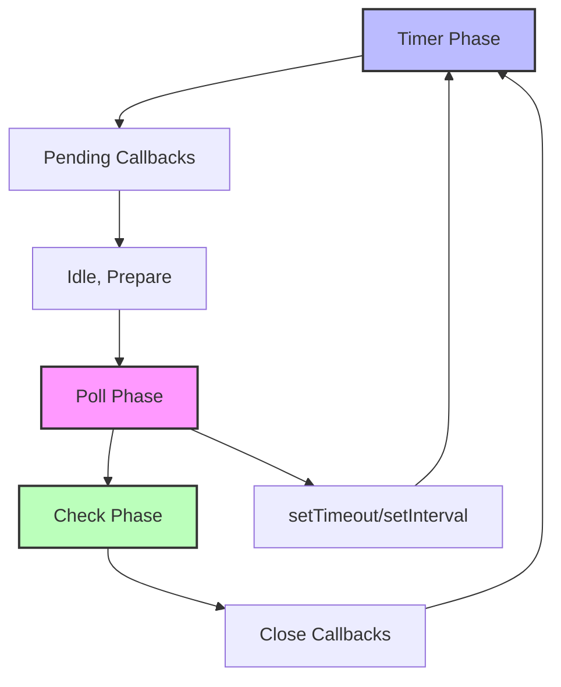

---
tags:
  - Programming
  - Event Loop
  - JavaScript
  - Node.js
  - Python
  - Asyncio
  - libuv
  - Reactor Pattern
  - Proactor Pattern
  - Concurrency
  - Performance
  - I/O Multiplexing
  - epoll
  - Callbacks
---

# Event Loop: 단일 스레드에서 동시성을 구현하는 마법

## 들어가며

"어떻게 Node.js는 단일 스레드인데도 10,000개의 동시 연결을 처리할 수 있을까?" 이 질문의 답이 바로 **이벤트 루프(Event Loop)**입니다.

2024년 현재, 대부분의 모던 애플리케이션은 이벤트 기반 비동기 프로그래밍 모델을 사용합니다:
- JavaScript의 브라우저 및 Node.js 런타임
- Python의 asyncio 프레임워크
- Go의 runtime scheduler
- Java의 NIO와 Netty

하지만 많은 개발자들이 "콜백 지옥"에서 벗어나기 위해 async/await를 사용하면서도, 이벤트 루프의 내부 동작을 제대로 이해하지 못하고 있습니다. 프로덕션에서 발생하는 성능 병목과 예상치 못한 동작의 원인이 바로 여기에 있습니다.

## Event Loop란 무엇인가

### 핵심 개념

이벤트 루프는 **단일 스레드에서 I/O 작업을 비동기적으로 처리하기 위한 프로그래밍 패턴**입니다. 운영체제의 I/O multiplexing 기능(`epoll`, `kqueue`, `IOCP`)을 활용하여 블로킹 없이 수많은 I/O 작업을 동시에 처리할 수 있습니다.

```
┌─────────────────────────────────────────────────────────────┐
│                    Event Loop Architecture                   │
├─────────────────────────────────────────────────────────────┤
│  ┌─────────────┐    ┌──────────────┐    ┌─────────────────┐ │
│  │   Timer     │    │   I/O Poll   │    │   Check Phase   │ │
│  │   Phase     │    │    Phase     │    │                 │ │
│  │             │───&gt;│              │───&gt;│  setImmediate()  │ │
│  │setTimeout() │    │   epoll()    │    │                 │ │
│  │setInterval()│    │   File I/O   │    └─────────────────┘ │
│  └─────────────┘    │   Network    │                        │
│                     │   I/O        │                        │
│                     └──────────────┘                        │
└─────────────────────────────────────────────────────────────┘
```

### 전통적인 스레드 모델과의 차이

```c
// Traditional Thread Model - Apache HTTP Server
void* handle_request(void* client_socket) {
    int sock = *(int*)client_socket;
    char buffer[4096];

    // 블로킹 I/O: 스레드가 대기상태로 전환
    // socket I/O에 대한 자세한 내용은 Socket 프로그래밍 참조
    ssize_t bytes = read(sock, buffer, sizeof(buffer));

    // CPU만 사용하는 작업
    process_request(buffer);

    // 다시 블로킹 I/O
    write(sock, response, response_len);

    close(sock);
    return NULL;
}

// 10,000개 연결 = 10,000개 스레드 = 약 80GB 메모리
```

```javascript
// Event Loop Model - Node.js
const http = require('http');

const server = http.createServer((req, res) => {
    // 논블로킹: 즉시 반환되고 콜백 등록
    fs.readFile('large_file.txt', (err, data) => {
        if (err) throw err;

        // 파일 읽기 완료 후 콜백 실행
        res.end(data);
    });
    // 이 함수는 즉시 반환되어 다음 요청 처리 가능
});

// 10,000개 연결도 단일 스레드에서 처리 = 약 50MB 메모리
```

## Event Loop 아키텍처와 페이즈

### Node.js Event Loop의 6단계

Node.js의 이벤트 루프는 libuv 라이브러리를 기반으로 하며, 다음 6개 페이즈를 순환합니다:



### 각 페이즈의 상세 동작

#### 1. Timer Phase
```c
// libuv/src/timer.c의 실제 구현 (단순화)
void uv__run_timers(uv_loop_t* loop) {
    uv_timer_t* handle;

    for (;;) {
        handle = heap_min((struct heap*) &loop->timer_heap);

        if (handle == NULL)
            break;

        // 현재 시간과 비교하여 실행 가능한 타이머 찾기
        if (handle->timeout > loop->time)
            break;

        // 타이머 콜백 실행
        handle->timer_cb(handle);

        // 반복 타이머라면 다시 스케줄링
        if (handle->repeat != 0) {
            handle->timeout = loop->time + handle->repeat;
            heap_insert((struct heap*) &loop->timer_heap,
                       (struct heap_node*) &handle->heap_node);
        }
    }
}
```

#### 2. Poll Phase (가장 중요)
```c
// Poll phase에서 epoll을 사용한 I/O 대기
int uv__io_poll(uv_loop_t* loop, int timeout) {
    struct epoll_event events[1024];
    int nfds;

    // epoll_wait: I/O 이벤트 대기
    nfds = epoll_wait(loop->backend_fd, events, 1024, timeout);

    for (int i = 0; i < nfds; i++) {
        struct epoll_event* pe = events + i;
        uv__io_t* w = pe->data.ptr;

        // I/O 콜백 실행
        w->cb(loop, w, pe->events);
    }

    return nfds;
}
```

### 실제 동작 시나리오

```javascript
console.log('Start');

// Timer Phase에서 실행될 예약
setTimeout(() => console.log('Timer 1'), 0);
setTimeout(() => console.log('Timer 2'), 0);

// Check Phase에서 실행될 예약
setImmediate(() => console.log('Immediate 1'));
setImmediate(() => console.log('Immediate 2'));

// 다음 틱에 실행될 예약
process.nextTick(() => console.log('Next Tick 1'));
process.nextTick(() => console.log('Next Tick 2'));

console.log('End');

// 출력 순서:
// Start
// End
// Next Tick 1
// Next Tick 2
// Timer 1
// Timer 2
// Immediate 1
// Immediate 2
```

## JavaScript Event Loop (브라우저 vs Node.js)

### 브라우저 Event Loop

브라우저의 이벤트 루프는 HTML5 표준에 정의되어 있으며, 렌더링과 밀접한 관계가 있습니다:

```javascript
// 브라우저에서의 이벤트 루프
function browserEventLoop() {
    while (true) {
        // 1. Task Queue (Macrotask)에서 하나의 작업 실행
        let task = taskQueue.dequeue();
        if (task) {
            task.execute();
        }

        // 2. Microtask Queue의 모든 작업 실행
        while (!microtaskQueue.isEmpty()) {
            let microtask = microtaskQueue.dequeue();
            microtask.execute();
        }

        // 3. 렌더링 필요 시 수행
        if (needsRendering()) {
            requestAnimationFrame.callbacks.forEach(callback => callback());
            updateRendering();
        }

        // 4. Idle 시간에 IdleCallback 실행
        if (hasIdleTime()) {
            requestIdleCallback.callbacks.forEach(callback => callback());
        }
    }
}
```

### Task Queue vs Microtask Queue

```javascript
console.log('1');

// Macrotask (Task Queue)
setTimeout(() => console.log('2'), 0);

// Microtask
Promise.resolve().then(() => console.log('3'));
Promise.resolve().then(() => console.log('4'));

// Macrotask
setTimeout(() => console.log('5'), 0);

console.log('6');

// 출력: 1, 6, 3, 4, 2, 5
// Microtask가 항상 Macrotask보다 우선순위가 높음
```

### 실제 성능 분석

```javascript
// Microtask 무한 루프로 인한 렌더링 블로킹
function blockingMicrotasks() {
    Promise.resolve().then(() => {
        console.log('Microtask executed');
        // 다음 Microtask를 계속 생성
        blockingMicrotasks(); // 렌더링이 영원히 블로킹됨!
    });
}

// 올바른 방법: setTimeout을 사용하여 렌더링 기회 제공
function nonBlockingTasks() {
    setTimeout(() => {
        console.log('Task executed');
        nonBlockingTasks(); // 각 Task 후에 렌더링 기회 있음
    }, 0);
}
```

## libuv와 Node.js 내부 구조

### libuv Architecture

libuv는 Node.js의 핵심 C++ 라이브러리로, 크로스 플랫폼 비동기 I/O를 제공합니다:

```c
// libuv의 핵심 구조체
typedef struct uv_loop_s uv_loop_t;

struct uv_loop_s {
    /* 이벤트 루프 상태 */
    int stop_flag;
    uint64_t time;

    /* I/O 관련 */
    int backend_fd;        // epoll/kqueue 파일 디스크립터
    void* watcher_queue[2];

    /* 타이머 */
    struct heap timer_heap;
    uint64_t timer_counter;

    /* 스레드 풀 */
    uv_thread_t* threads;
    unsigned int nthreads;
    uv_sem_t thread_sem;

    /* 페이즈별 큐 */
    void* pending_queue[2];
    void* idle_handles[2];
    void* check_handles[2];
};
```

### Thread Pool과 I/O 작업 분류

Node.js는 모든 I/O가 비동기인 것은 아닙니다. libuv는 작업 유형에 따라 다르게 처리합니다:

```javascript
const fs = require('fs');
const crypto = require('crypto');

// Network I/O: epoll을 사용한 진짜 비동기
const http = require('http');
http.get('http://example.com', (res) => {
    // 메인 스레드에서 실행, 논블로킹
    console.log('HTTP Response received');
});

// File I/O: Thread Pool을 사용한 가짜 비동기 (기본 4개 스레드)
fs.readFile('large_file.txt', (err, data) => {
    // Worker 스레드에서 읽기 후 메인 스레드로 콜백
    console.log('File read complete');
});

// CPU 집약적 작업: Thread Pool 사용
crypto.pbkdf2('secret', 'salt', 100000, 64, 'sha512', (err, key) => {
    console.log('Crypto operation complete');
});
```

### Thread Pool 크기 조정

```bash
# 환경변수로 스레드 풀 크기 조정 (기본값: 4)
export UV_THREADPOOL_SIZE=16

# 또는 코드에서
process.env.UV_THREADPOOL_SIZE = 16;
```

### 실제 성능 측정

```javascript
const fs = require('fs');
const { performance } = require('perf_hooks');

// Thread Pool 경합 상황 재현
console.log('Thread pool size:', process.env.UV_THREADPOOL_SIZE || 4);

const startTime = performance.now();
let completed = 0;

// 동시에 8개의 파일 읽기 (Thread Pool = 4개)
for (let i = 0; i < 8; i++) {
    const taskStart = performance.now();

    fs.readFile(__filename, () => {
        const taskEnd = performance.now();
        completed++;

        console.log(`Task ${i} completed in ${(taskEnd - taskStart).toFixed(2)}ms`);

        if (completed === 8) {
            const totalTime = performance.now() - startTime;
            console.log(`Total time: ${totalTime.toFixed(2)}ms`);
        }
    });
}

// 결과: 처음 4개는 빠르게 완료, 나머지 4개는 대기 후 완료
```

## Python asyncio Event Loop

### asyncio 내부 구조

Python의 asyncio는 Python으로 구현된 이벤트 루프입니다:

```python
import asyncio
import selectors
import socket

# asyncio의 핵심 구현 (단순화)
class EventLoop:
    def __init__(self):
        self.selector = selectors.DefaultSelector()  # epoll on Linux
        self.ready_queue = []
        self.scheduled_tasks = []
        self.running = False

    def run_forever(self):
        self.running = True

        while self.running:
            # 1. 스케줄된 작업 중 실행 가능한 것들을 ready_queue로 이동
            self._move_ready_tasks()

            # 2. ready_queue의 모든 작업 실행
            while self.ready_queue:
                task = self.ready_queue.popleft()
                task.run()

            # 3. I/O 이벤트 대기 (timeout 계산)
            timeout = self._calculate_timeout()
            events = self.selector.select(timeout)

            # 4. I/O 이벤트 처리
            for key, mask in events:
                callback = key.data
                callback()

    def create_task(self, coro):
        task = Task(coro, self)
        self.ready_queue.append(task)
        return task
```

### Coroutine과 Task의 관계

```python
import asyncio
import time

async def slow_operation(name, delay):
    print(f"{name}: Starting")
    await asyncio.sleep(delay)  # 다른 코루틴에게 제어권 양보
    print(f"{name}: Finished after {delay}s")
    return f"Result from {name}"

async def main():
    start_time = time.time()

    # 동시에 3개의 작업 시작
    tasks = [
        asyncio.create_task(slow_operation("Task 1", 2)),
        asyncio.create_task(slow_operation("Task 2", 1)),
        asyncio.create_task(slow_operation("Task 3", 3))
    ]

    # 모든 작업 완료 대기
    results = await asyncio.gather(*tasks)

    end_time = time.time()
    print(f"Total time: {end_time - start_time:.2f}s")  # 약 3초 (순차 실행시 6초)
    print(f"Results: {results}")

# 실행
asyncio.run(main())
```

### asyncio vs threading 성능 비교

```python
import asyncio
import aiohttp
import threading
import requests
import time
from concurrent.futures import ThreadPoolExecutor

# asyncio 버전
async def fetch_async(session, url):
    async with session.get(url) as response:
        return await response.text()

async def asyncio_version():
    urls = ['http://httpbin.org/delay/1'] * 100

    async with aiohttp.ClientSession() as session:
        start_time = time.time()
        tasks = [fetch_async(session, url) for url in urls]
        results = await asyncio.gather(*tasks)
        end_time = time.time()

        print(f"asyncio: {len(results)} requests in {end_time - start_time:.2f}s")

# threading 버전
def fetch_sync(url):
    response = requests.get(url)
    return response.text

def threading_version():
    urls = ['http://httpbin.org/delay/1'] * 100

    start_time = time.time()
    with ThreadPoolExecutor(max_workers=100) as executor:
        results = list(executor.map(fetch_sync, urls))
    end_time = time.time()

    print(f"threading: {len(results)} requests in {end_time - start_time:.2f}s")

# 메모리 사용량 비교
import psutil
import os

def measure_memory():
    process = psutil.Process(os.getpid())
    return process.memory_info().rss / 1024 / 1024  # MB

# asyncio: ~50MB, threading: ~500MB+ (스레드당 8MB 스택)
```

## Reactor Pattern vs Proactor Pattern

### Reactor Pattern (동기 I/O 기반)

```python
# Reactor Pattern 구현 예제
import select
import socket

class ReactorEventLoop:
    def __init__(self):
        self.socket_handlers = {}
        self.selector = select.epoll()  # Linux epoll

    def register_handler(self, sock, handler, events=select.EPOLLIN):
        """소켓과 이벤트 핸들러 등록"""
        fd = sock.fileno()
        self.socket_handlers[fd] = (sock, handler)
        self.selector.register(fd, events)

    def run(self):
        """이벤트 루프 실행"""
        while True:
            # 1. I/O 이벤트 대기 (블로킹)
            events = self.selector.poll(timeout=1.0)

            # 2. 준비된 이벤트 처리
            for fd, event in events:
                sock, handler = self.socket_handlers[fd]

                if event & select.EPOLLIN:
                    # 읽기 가능 상태
                    data = sock.recv(4096)  # 동기 읽기
                    handler.handle_read(data)

                elif event & select.EPOLLOUT:
                    # 쓰기 가능 상태
                    handler.handle_write(sock)  # 동기 쓰기

# 사용 예제
class HttpHandler:
    def handle_read(self, data):
        print(f"Received: {data}")
        # 응답 데이터 준비
        response = b"HTTP/1.1 200 OK\r\n\r\nHello World"
        # 쓰기 이벤트 등록 필요

    def handle_write(self, sock):
        sock.send(response)
```

### Proactor Pattern (비동기 I/O 기반)

```python
# Proactor Pattern 구현 예제 (Windows IOCP 스타일)
import asyncio

class ProactorEventLoop:
    def __init__(self):
        self.completion_handlers = {}
        self.pending_operations = {}

    async def async_read(self, sock, buffer_size):
        """비동기 읽기 시작"""
        # 운영체제에 비동기 읽기 요청
        operation_id = self._start_async_read(sock, buffer_size)

        # 완료될 때까지 대기 (다른 코루틴에게 제어권 양보)
        result = await self._wait_for_completion(operation_id)
        return result

    def _start_async_read(self, sock, buffer_size):
        """실제 비동기 I/O 시작 (OS에 위임)"""
        # Windows: ReadFile with OVERLAPPED
        # Linux: io_uring (최신) 또는 aio_read
        pass

    async def _wait_for_completion(self, operation_id):
        """I/O 완료 대기"""
        future = asyncio.Future()
        self.completion_handlers[operation_id] = future
        return await future

    def handle_io_completion(self, operation_id, result):
        """I/O 완료 시 호출 (OS 콜백)"""
        future = self.completion_handlers.pop(operation_id)
        future.set_result(result)

# 현재 대부분의 시스템은 Reactor Pattern + 에뮬레이션
# Python asyncio: Reactor + Thread Pool
# Node.js libuv: Reactor (network) + Thread Pool (file)
```

### 실제 운영체제별 구현

```c
// Linux: epoll (Reactor)
int epoll_fd = epoll_create1(0);
struct epoll_event ev;
ev.events = EPOLLIN;
ev.data.fd = socket_fd;
epoll_ctl(epoll_fd, EPOLL_CTL_ADD, socket_fd, &ev);

// 이벤트 대기
struct epoll_event events[MAX_EVENTS];
int nfds = epoll_wait(epoll_fd, events, MAX_EVENTS, -1);

// Windows: IOCP (Proactor)
HANDLE iocp = CreateIoCompletionPort(INVALID_HANDLE_VALUE, NULL, 0, 0);
CreateIoCompletionPort((HANDLE)socket, iocp, (ULONG_PTR)socket, 0);

// 비동기 읽기 시작
OVERLAPPED overlapped = {0};
WSARecv(socket, &wsabuf, 1, NULL, &flags, &overlapped, NULL);

// 완료 대기
DWORD bytes;
ULONG_PTR key;
LPOVERLAPPED lpOverlapped;
GetQueuedCompletionStatus(iocp, &bytes, &key, &lpOverlapped, INFINITE);
```

## Event Loop 구현해보기

### 최소한의 Event Loop 구현

```python
import heapq
import time
import select
from collections import deque

class SimpleEventLoop:
    def __init__(self):
        self.ready_queue = deque()        # 실행 준비된 태스크
        self.timer_queue = []             # 타이머 (힙큐)
        self.selector = select.select     # I/O multiplexing
        self.read_fds = {}               # 읽기 대기 파일 디스크립터
        self.write_fds = {}              # 쓰기 대기 파일 디스크립터
        self.running = False

    def call_soon(self, callback, *args):
        """다음 틱에 콜백 실행"""
        self.ready_queue.append((callback, args))

    def call_later(self, delay, callback, *args):
        """지연 후 콜백 실행"""
        when = time.time() + delay
        heapq.heappush(self.timer_queue, (when, callback, args))

    def add_reader(self, fd, callback, *args):
        """파일 디스크립터 읽기 이벤트 등록"""
        self.read_fds[fd] = (callback, args)

    def add_writer(self, fd, callback, *args):
        """파일 디스크립터 쓰기 이벤트 등록"""
        self.write_fds[fd] = (callback, args)

    def run_forever(self):
        """이벤트 루프 실행"""
        self.running = True

        while self.running:
            # 1. 타이머 처리
            self._process_timers()

            # 2. 준비된 태스크 실행
            self._process_ready_queue()

            # 3. I/O 이벤트 대기
            self._process_io_events()

    def _process_timers(self):
        """만료된 타이머 처리"""
        now = time.time()

        while self.timer_queue and self.timer_queue[0][0] <= now:
            when, callback, args = heapq.heappop(self.timer_queue)
            self.ready_queue.append((callback, args))

    def _process_ready_queue(self):
        """준비된 모든 태스크 실행"""
        while self.ready_queue:
            callback, args = self.ready_queue.popleft()
            try:
                callback(*args)
            except Exception as e:
                print(f"Error in callback: {e}")

    def _process_io_events(self):
        """I/O 이벤트 처리"""
        # 타임아웃 계산
        timeout = self._calculate_timeout()

        # select() 호출
        ready_read, ready_write, _ = self.selector(
            list(self.read_fds.keys()),
            list(self.write_fds.keys()),
            [],
            timeout
        )

        # 읽기 이벤트 처리
        for fd in ready_read:
            callback, args = self.read_fds[fd]
            self.ready_queue.append((callback, args))

        # 쓰기 이벤트 처리
        for fd in ready_write:
            callback, args = self.write_fds[fd]
            self.ready_queue.append((callback, args))

    def _calculate_timeout(self):
        """다음 타이머까지의 시간 계산"""
        if not self.timer_queue:
            return 1.0  # 기본 1초

        next_timer = self.timer_queue[0][0]
        timeout = max(0, next_timer - time.time())
        return min(timeout, 1.0)  # 최대 1초

    def stop(self):
        """이벤트 루프 중지"""
        self.running = False

# 사용 예제
def main():
    loop = SimpleEventLoop()

    def print_hello():
        print(f"Hello at {time.time():.2f}")
        # 1초 후 다시 실행
        loop.call_later(1.0, print_hello)

    def print_world():
        print(f"World at {time.time():.2f}")

    # 즉시 실행
    loop.call_soon(print_hello)

    # 0.5초 후 실행
    loop.call_later(0.5, print_world)

    # 5초 후 종료
    loop.call_later(5.0, loop.stop)

    print("Starting event loop...")
    loop.run_forever()
    print("Event loop stopped")

if __name__ == "__main__":
    main()
```

### 코루틴 지원 Event Loop

```python
import types
from collections import deque

class Task:
    def __init__(self, coro):
        self.coro = coro
        self.done = False
        self.result = None
        self.exception = None

    def run(self):
        """코루틴 한 단계 실행"""
        try:
            # 코루틴에서 yield된 값 받기
            yielded = self.coro.send(None)
            return yielded
        except StopIteration as e:
            # 코루틴 완료
            self.done = True
            self.result = e.value
        except Exception as e:
            self.done = True
            self.exception = e

class Future:
    def __init__(self):
        self.done = False
        self.result = None
        self.exception = None
        self.callbacks = []

    def set_result(self, result):
        self.done = True
        self.result = result
        self._run_callbacks()

    def set_exception(self, exception):
        self.done = True
        self.exception = exception
        self._run_callbacks()

    def add_done_callback(self, callback):
        if self.done:
            callback(self)
        else:
            self.callbacks.append(callback)

    def _run_callbacks(self):
        for callback in self.callbacks:
            callback(self)
        self.callbacks.clear()

class CoroutineEventLoop(SimpleEventLoop):
    def __init__(self):
        super().__init__()
        self.tasks = set()

    def create_task(self, coro):
        """코루틴을 태스크로 래핑"""
        task = Task(coro)
        self.tasks.add(task)
        self.call_soon(self._step_task, task)
        return task

    def _step_task(self, task):
        """태스크 한 단계 실행"""
        if task.done:
            self.tasks.discard(task)
            return

        try:
            result = task.run()

            if not task.done:
                # 아직 완료되지 않음, 다음 틱에 계속 실행
                self.call_soon(self._step_task, task)
            else:
                # 완료됨
                self.tasks.discard(task)

        except Exception as e:
            task.exception = e
            task.done = True
            self.tasks.discard(task)

# async/await 시뮬레이션
def async_function(func):
    """async 함수 데코레이터"""
    def wrapper(*args, **kwargs):
        gen = func(*args, **kwargs)
        return gen
    return wrapper

def await_future(future):
    """await 시뮬레이션"""
    while not future.done:
        yield  # 제어권 양보

    if future.exception:
        raise future.exception
    return future.result

# 사용 예제
@async_function
def async_task(name, delay):
    print(f"{name}: Starting")

    # sleep 시뮬레이션
    future = Future()
    loop.call_later(delay, future.set_result, f"Slept for {delay}s")

    # await 시뮬레이션
    result = yield from await_future(future)
    print(f"{name}: {result}")

    return f"Task {name} completed"

# 실행
if __name__ == "__main__":
    loop = CoroutineEventLoop()

    task1 = loop.create_task(async_task("Task1", 1.0))
    task2 = loop.create_task(async_task("Task2", 2.0))

    loop.call_later(3.0, loop.stop)
    loop.run_forever()
```

## 성능 최적화와 함정

### 성능 최적화 기법

#### 1. 적절한 배치 크기 (Batch Size)

```javascript
// 잘못된 방법: 매번 개별 처리
async function processItemsIndividually(items) {
    for (const item of items) {
        await processItem(item);  // 각각 이벤트 루프 순환
    }
}

// 올바른 방법: 배치 처리
async function processItemsInBatches(items, batchSize = 100) {
    for (let i = 0; i < items.length; i += batchSize) {
        const batch = items.slice(i, i + batchSize);

        // 배치 내에서는 동시 처리
        await Promise.all(batch.map(item => processItem(item)));

        // 배치 간에는 이벤트 루프에 제어권 양보
        await new Promise(resolve => setImmediate(resolve));
    }
}
```

#### 2. 메모리 효율적인 스트림 처리

```javascript
const fs = require('fs');
const { Transform } = require('stream');

// 잘못된 방법: 메모리에 모든 데이터 로드
async function processLargeFileWrong(filename) {
    const data = await fs.promises.readFile(filename, 'utf8');
    const lines = data.split('\n');

    const results = await Promise.all(
        lines.map(line => processLine(line))
    );

    return results;
}

// 올바른 방법: 스트림을 사용한 메모리 효율적 처리
function processLargeFileCorrect(filename) {
    return new Promise((resolve, reject) => {
        const results = [];

        fs.createReadStream(filename, { encoding: 'utf8' })
            .pipe(new Transform({
                transform(chunk, encoding, callback) {
                    // 청크 단위로 처리
                    const lines = chunk.toString().split('\n');

                    Promise.all(lines.map(line => processLine(line)))
                        .then(processedLines => {
                            processedLines.forEach(line => results.push(line));
                            callback();
                        })
                        .catch(callback);
                }
            }))
            .on('end', () => resolve(results))
            .on('error', reject);
    });
}
```

### 일반적인 함정과 해결책

#### 1. Blocking Operations in Event Loop

```javascript
// 위험한 코드: CPU 집약적 작업으로 이벤트 루프 블로킹
function fibonacci(n) {
    if (n < 2) return n;
    return fibonacci(n - 1) + fibonacci(n - 2);
}

app.get('/fibonacci/:n', (req, res) => {
    const n = parseInt(req.params.n);
    const result = fibonacci(n);  // 이벤트 루프 블로킹!
    res.json({ result });
});

// 해결책 1: Worker Threads 사용
const { Worker, isMainThread, parentPort, workerData } = require('worker_threads');

if (isMainThread) {
    app.get('/fibonacci/:n', async (req, res) => {
        const n = parseInt(req.params.n);

        const worker = new Worker(__filename, {
            workerData: { n }
        });

        worker.on('message', (result) => {
            res.json({ result });
        });

        worker.on('error', (err) => {
            res.status(500).json({ error: err.message });
        });
    });
} else {
    // Worker thread에서 실행
    const result = fibonacci(workerData.n);
    parentPort.postMessage(result);
}

// 해결책 2: 작업 분할
function fibonacciNonBlocking(n, callback) {
    function fibStep(a, b, steps) {
        if (steps === 0) {
            callback(a);
            return;
        }

        // 이벤트 루프에 제어권 양보
        setImmediate(() => fibStep(b, a + b, steps - 1));
    }

    fibStep(0, 1, n);
}
```

#### 2. Memory Leaks in Event Loop

```javascript
// 메모리 누수 패턴 1: 콜백 누적
class EventEmitterLeak {
    constructor() {
        this.listeners = [];
        setInterval(() => {
            // 리스너가 계속 누적됨
            this.on('data', (data) => {
                console.log(data);
            });
        }, 1000);
    }

    on(event, callback) {
        this.listeners.push(callback);
    }
}

// 해결책: 적절한 리스너 관리
class EventEmitterFixed {
    constructor() {
        this.listeners = new Map();
        this.maxListeners = 10;
    }

    on(event, callback) {
        if (!this.listeners.has(event)) {
            this.listeners.set(event, []);
        }

        const eventListeners = this.listeners.get(event);

        if (eventListeners.length >= this.maxListeners) {
            console.warn(`Too many listeners for event: ${event}`);
            return;
        }

        eventListeners.push(callback);
    }

    off(event, callback) {
        if (this.listeners.has(event)) {
            const eventListeners = this.listeners.get(event);
            const index = eventListeners.indexOf(callback);
            if (index > -1) {
                eventListeners.splice(index, 1);
            }
        }
    }
}

// 메모리 누수 패턴 2: 타이머 해제 누락
class TimerLeak {
    constructor() {
        this.intervalId = setInterval(() => {
            this.doSomething();
        }, 1000);

        // 타이머가 해제되지 않으면 메모리 누수
    }

    destroy() {
        // 반드시 타이머 해제
        if (this.intervalId) {
            clearInterval(this.intervalId);
            this.intervalId = null;
        }
    }
}
```

#### 3. Promise Hell과 성능 문제

```javascript
// Promise Hell: 순차 실행으로 인한 성능 저하
async function fetchUserDataWrong(userIds) {
    const users = [];

    for (const id of userIds) {
        const user = await fetchUser(id);      // 순차 대기
        const profile = await fetchProfile(id); // 순차 대기
        const settings = await fetchSettings(id); // 순차 대기

        users.push({ user, profile, settings });
    }

    return users;
}

// 최적화된 버전: 병렬 처리
async function fetchUserDataOptimized(userIds) {
    // 모든 사용자 데이터를 병렬로 가져오기
    const userPromises = userIds.map(async (id) => {
        // 각 사용자의 데이터도 병렬로 가져오기
        const [user, profile, settings] = await Promise.all([
            fetchUser(id),
            fetchProfile(id),
            fetchSettings(id)
        ]);

        return { user, profile, settings };
    });

    return Promise.all(userPromises);
}

// 더 세밀한 제어: 동시성 제한
async function fetchUserDataControlled(userIds, concurrency = 5) {
    const results = [];

    for (let i = 0; i < userIds.length; i += concurrency) {
        const batch = userIds.slice(i, i + concurrency);

        const batchPromises = batch.map(async (id) => {
            const [user, profile, settings] = await Promise.all([
                fetchUser(id),
                fetchProfile(id),
                fetchSettings(id)
            ]);
            return { user, profile, settings };
        });

        const batchResults = await Promise.all(batchPromises);
        results.push(...batchResults);
    }

    return results;
}
```

### 실제 Production 시나리오 분석

#### 시나리오 1: High CPU Usage in Event Loop

```javascript
// 문제 상황: CPU 사용률이 지속적으로 높음
const express = require('express');
const app = express();

// 문제가 있는 엔드포인트
app.get('/process-data', async (req, res) => {
    const data = req.body.items || [];

    // CPU 집약적 작업이 이벤트 루프를 블로킹
    const processed = data.map(item => {
        // 복잡한 계산
        let result = 0;
        for (let i = 0; i < 1000000; i++) {
            result += Math.sqrt(i * item.value);
        }
        return { ...item, processed: result };
    });

    res.json(processed);
});

// 진단 방법
const { performance } = require('perf_hooks');

function measureEventLoopDelay() {
    const start = performance.now();

    setImmediate(() => {
        const delay = performance.now() - start;
        console.log(`Event Loop Delay: ${delay.toFixed(2)}ms`);

        if (delay > 10) {
            console.warn('Event Loop is being blocked!');
        }
    });
}

setInterval(measureEventLoopDelay, 1000);

// 해결책: 작업 분할 및 Worker Threads
const { Worker } = require('worker_threads');

app.get('/process-data-fixed', async (req, res) => {
    const data = req.body.items || [];

    // 큰 데이터셋을 청크로 분할
    const chunkSize = 1000;
    const chunks = [];

    for (let i = 0; i < data.length; i += chunkSize) {
        chunks.push(data.slice(i, i + chunkSize));
    }

    // Worker에서 병렬 처리
    const workerPromises = chunks.map(chunk => {
        return new Promise((resolve, reject) => {
            const worker = new Worker('./data-processor-worker.js', {
                workerData: { chunk }
            });

            worker.on('message', resolve);
            worker.on('error', reject);
        });
    });

    const results = await Promise.all(workerPromises);
    const processed = results.flat();

    res.json(processed);
});
```

#### 시나리오 2: Memory Leak Detection

```javascript
// 메모리 사용량 모니터링
const v8 = require('v8');
const fs = require('fs');

function logMemoryUsage() {
    const usage = process.memoryUsage();
    const heapStats = v8.getHeapStatistics();

    const memInfo = {
        timestamp: new Date().toISOString(),
        rss: Math.round(usage.rss / 1024 / 1024),        // MB
        heapUsed: Math.round(usage.heapUsed / 1024 / 1024),
        heapTotal: Math.round(usage.heapTotal / 1024 / 1024),
        external: Math.round(usage.external / 1024 / 1024),
        heapLimit: Math.round(heapStats.heap_size_limit / 1024 / 1024)
    };

    console.log(JSON.stringify(memInfo));

    // 메모리 사용량이 임계값을 초과하면 힙 덤프 생성
    if (memInfo.heapUsed > 500) { // 500MB
        const filename = `heap-dump-${Date.now()}.heapsnapshot`;
        const heapSnapshot = v8.getHeapSnapshot();
        const fileStream = fs.createWriteStream(filename);
        heapSnapshot.pipe(fileStream);

        console.log(`Heap dump saved to ${filename}`);
    }
}

// 주기적으로 메모리 사용량 확인
setInterval(logMemoryUsage, 30000); // 30초마다

// GC 강제 실행 (개발 환경에서만)
if (process.env.NODE_ENV === 'development') {
    global.gc = require('vm').runInThisContext('gc');

    // 수동 GC 트리거 엔드포인트
    app.get('/force-gc', (req, res) => {
        const before = process.memoryUsage();
        global.gc();
        const after = process.memoryUsage();

        res.json({
            before: Math.round(before.heapUsed / 1024 / 1024),
            after: Math.round(after.heapUsed / 1024 / 1024),
            freed: Math.round((before.heapUsed - after.heapUsed) / 1024 / 1024)
        });
    });
}
```

## 정리

### 핵심 개념 요약

이벤트 루프는 단일 스레드에서 고성능 비동기 프로그래밍을 가능하게 하는 핵심 메커니즘입니다:

**핵심 원리:**

1. **Non-blocking I/O**: 운영체제의 `epoll`, `kqueue`, `IOCP` 활용
2. **Event-driven**: I/O 완료 시점에 콜백 실행
3. **Single-threaded**: 동시성 문제 없이 높은 처리량 달성

**성능 특성:**

- **메모리 효율성**: 스레드당 8MB vs 이벤트 루프 ~50MB 전체
- **컨텍스트 스위치 오버헤드 없음**: 사용자 공간에서 스케줄링
- **C10K 문제 해결**: 10,000개 이상의 동시 연결 처리 가능

### Production 환경에서 주의사항

1. **CPU 집약적 작업 분리**: Worker Threads 또는 별도 프로세스 사용
2. **메모리 관리**: 리스너, 타이머, 스트림의 적절한 해제
3. **에러 처리**: Unhandled Promise Rejection으로 인한 프로세스 종료 방지
4. **모니터링**: 이벤트 루프 지연, 메모리 사용량, GC 패턴 추적

## 관련 문서

- [Callback 함수 심화 분석](callback.md) - 콜백 함수의 메모리 관리와 성능 최적화
- [Coroutine 완벽 가이드](coroutine.md) - 코루틴과 이벤트 루프의 결합
- [epoll 심화 분석](../network/epoll.md) - Linux I/O 멀티플렉싱과 이벤트 루프
- [File Descriptor 완벽 가이드](../system/file-descriptor.md) - I/O 이벤트의 기반 개념
- [Socket 프로그래밍](../network/socket.md) - 비동기 네트워크 I/O
