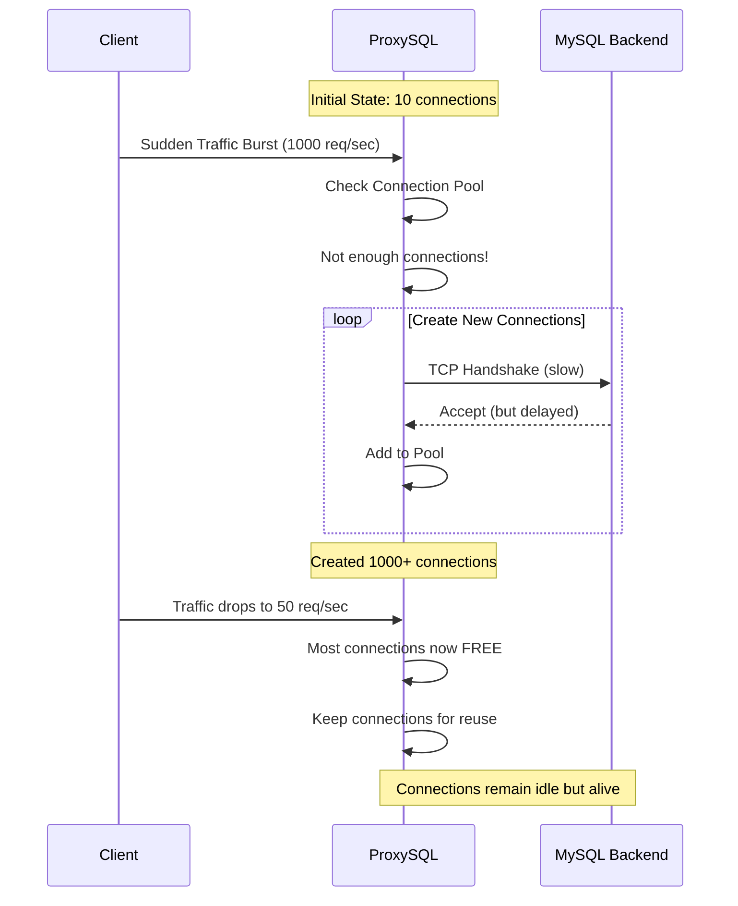
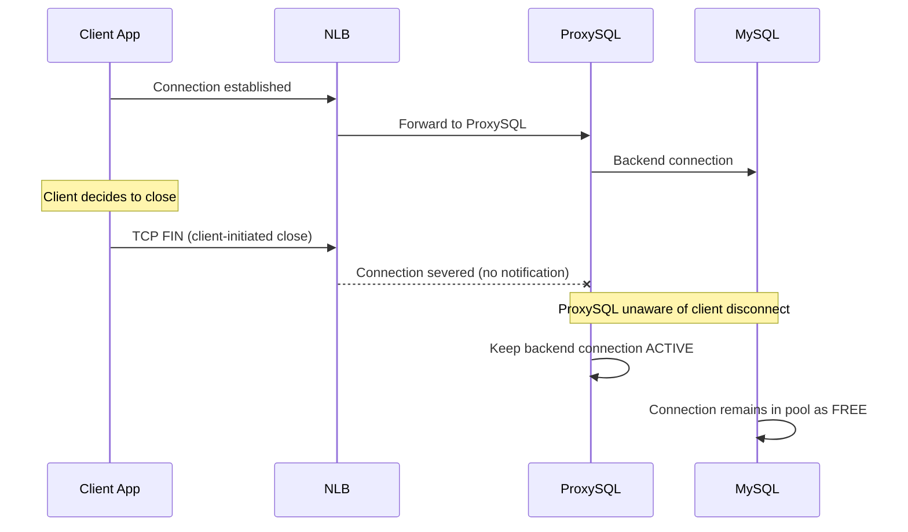

---
tags:
  - ProxySQL
  - MySQL
  - ConnectionPool
  - Performance
  - Database
  - NLB
  - AWS
---

# ProxySQL Connection Pool 최적화: Free Connection 폭증 문제 해결

## 들어가며

"ProxySQL 메모리 사용량이 갑자기 급증했는데 In-use Connection은 별로 없어요?" Production에서 마주치는 가장 흔한 ProxySQL 문제 중 하나입니다.

**Free Connection이 수천 개씩 쌓이는 현상**은 ProxySQL의 Connection Pool 알고리즘과 AWS NLB의 Connection Timeout 특성이 만나면서 발생하는 복합적인 문제입니다. 실제 Production 경험을 바탕으로 원인 분석과 최적화 방법을 제시합니다.

## 문제 상황: Connection Pool의 역설

### 관찰된 현상

```sql
-- ProxySQL Connection Pool 상태 조회
SELECT hostgroup, srv_host, status, 
       Connections_used, Connections_free, Connections_max
FROM stats_mysql_connection_pool;

-- 문제 상황의 예시 결과
-- hostgroup | srv_host         | status | used | free  | max   
-- 0         | mysql-master:3306| ONLINE | 15   | 8500  | 10000 ← 과도한 Free!
-- 1         | mysql-slave:3306 | ONLINE | 8    | 4200  | 5000  
```

**증상:**

- **Memory 사용량 급증**: ProxySQL Pod 메모리가 512Mi → 2Gi로 폭증
- **Connection Leak**: Free Connection이 지속적으로 증가
- **성능 저하**: Connection 관리 오버헤드로 응답 시간 증가
- **재시작 필요**: 메모리 부족으로 주기적 Pod 재시작 발생

### Connection Pool 생성 패턴 분석



## 원인 분석: 세 가지 요소의 조합

### 1. ProxySQL Connection Warming 알고리즘

**기본 동작:**

```sql
-- ProxySQL 기본 설정 (문제가 되는 설정)
SET mysql-max_connections=10000;           -- 매우 큰 Pool 크기
SET mysql-free_connections_pct=80;         -- 80% Free Connection 목표
SET mysql-connection_warming=false;        -- 사전 Connection 준비 안함

-- 계산: 10000 * 0.8 = 8000개 Free Connection을 유지하려 시도!
```

**Connection Pool 생성 로직:**

```c
// ProxySQL 내부 로직 (의사코드)
int target_free_connections = max_connections * free_connections_pct / 100;
int current_free = count_free_connections();
int current_used = count_used_connections();

if (current_free < target_free_connections && 
    incoming_requests > current_free) {
    // 급격히 많은 Connection 생성 시도
    int connections_to_create = min(
        target_free_connections - current_free,
        max_connections - (current_free + current_used)
    );
    
    // 문제: TCP Handshake가 느려서 한번에 대량 생성
    for (int i = 0; i < connections_to_create; i++) {
        create_connection_async();  // 비동기 생성
    }
}
```

### 2. TCP Handshake 지연과 Thunder Herd

**네트워크 지연 상황:**

```bash
# MySQL Backend에 대한 네트워크 지연 측정
$ mtr --report --report-cycles 10 mysql-backend.region.rds.amazonaws.com

# 결과 예시:
# HOST: proxysql-pod                    Loss%   Snt   Last   Avg  Best  Wrst StDev
# 1.|-- 10.0.1.1                        0.0%    10    0.2   0.2   0.1   0.4   0.1
# 2.|-- 172.16.0.1                      0.0%    10    1.2   1.1   0.8   1.8   0.3
# 3.|-- mysql-backend.region.rds...     0.0%    10   15.2  18.5  12.1  28.3   5.2
#                                                        ↑ 평균 18.5ms 지연
```

**Thunder Herd 현상:**

```bash
# 동시에 생성되는 Connection 수 모니터링
ss -t state syn-sent | grep :3306 | wc -l
# 순간적으로 1000+ SYN_SENT 상태 Connection 관찰
```

### 3. AWS NLB Connection Timeout 특성

**NLB의 Connection Idle Timeout:**

```yaml
# NLB 설정 확인 (기본 350초)
apiVersion: v1
kind: Service
metadata:
  annotations:
    service.beta.kubernetes.io/aws-load-balancer-type: "nlb"
    # 기본적으로 350초 후 Idle Connection 종료
spec:
  type: LoadBalancer
```

**Client-side Connection Drop 문제:**



**문제:**

- Client가 일방적으로 Connection 종료
- ProxySQL은 Backend Connection을 여전히 유효하다고 판단
- Free Connection Pool에 "좀비" Connection이 누적

## 해결 방법: 3단계 최적화

### 1. Connection Pool 크기 적정화

**최적화된 설정:**

```sql
-- Before (문제 설정)
SET mysql-max_connections=10000;
SET mysql-free_connections_pct=80;
SET mysql-connection_warming=false;

-- After (최적화 설정)
SET mysql-max_connections=100;             -- 적정 크기로 제한
SET mysql-free_connections_pct=1;          -- 최소한의 Free만 유지  
SET mysql-connection_warming=true;         -- 사전에 Connection 준비

-- 추가 최적화
SET mysql-ping_interval_server_msec=60000; -- 1분마다 Connection 상태 확인
SET mysql-connect_timeout_server_max=10000; -- 10초 Connection timeout
```

**설정 근거:**

```bash
# 적정 Connection 수 계산 방법
# 1. Peak TPS 측정
Peak_TPS = 1000  # req/sec

# 2. 평균 Query 응답 시간
Avg_Response_Time = 0.05  # 50ms

# 3. 필요한 Connection 수 (Little's Law 적용)
Required_Connections = Peak_TPS * Avg_Response_Time = 1000 * 0.05 = 50

# 4. Safety Factor 적용 (2x)
Recommended_Max_Connections = 50 * 2 = 100
```

### 2. Connection Lifecycle 관리 강화

**Idle Connection 정리:**

```sql
-- Connection 재사용 최적화
SET mysql-multiplexing=true;               -- Connection 다중화 활성화
SET mysql-connection_max_age_ms=3600000;   -- 1시간 후 Connection 갱신
SET mysql-ping_timeout_server=500;         -- 500ms Ping timeout

-- Backend Connection 즉시 종료 설정
SET mysql-kill_backend_connection_when_disconnect=true;  -- Client 연결 끊기면 Backend도 즉시 종료
SET mysql-client_session_track_gtids=true;              -- GTID 추적으로 Connection 상태 정확히 파악
```

**Connection Pool 모니터링 스크립트:**

```python
#!/usr/bin/env python3
import pymysql
import time
import logging

class ProxySQLMonitor:
    def __init__(self, proxysql_host, admin_port=6032):
        self.host = proxysql_host
        self.port = admin_port
        self.user = 'admin'
        self.password = 'admin'
        
    def get_connection_stats(self):
        conn = pymysql.connect(
            host=self.host, port=self.port,
            user=self.user, password=self.password
        )
        
        with conn.cursor(pymysql.cursors.DictCursor) as cursor:
            cursor.execute("""
                SELECT hostgroup, srv_host, status,
                       Connections_used, Connections_free, Connections_max,
                       ROUND(Connections_free * 100.0 / Connections_max, 2) as free_pct
                FROM stats_mysql_connection_pool 
                WHERE status = 'ONLINE'
            """)
            return cursor.fetchall()
    
    def check_connection_health(self):
        stats = self.get_connection_stats()
        
        for stat in stats:
            free_pct = float(stat['free_pct'])
            free_count = int(stat['Connections_free'])
            
            if free_pct > 50:  # Free Connection이 50% 초과
                logging.warning(
                    f"High free connections: {stat['srv_host']} - "
                    f"Free: {free_count}({free_pct}%)"
                )
                
            if free_count > 500:  # 절대적으로 많은 Free Connection
                logging.critical(
                    f"Too many free connections: {stat['srv_host']} - "
                    f"Free: {free_count}, Max: {stat['Connections_max']}"
                )

# 실행
if __name__ == "__main__":
    monitor = ProxySQLMonitor('localhost')
    
    while True:
        monitor.check_connection_health()
        time.sleep(60)
```

### 3. NLB Level 최적화

**Connection Draining 설정:**

```yaml
apiVersion: v1
kind: Service
metadata:
  annotations:
    service.beta.kubernetes.io/aws-load-balancer-type: "nlb"
    # Connection Draining 시간 설정 (기본 300초)
    service.beta.kubernetes.io/aws-load-balancer-attributes: |
      deregistration_delay.timeout_seconds=30,
      deregistration_delay.connection_termination.enabled=true
spec:
  type: LoadBalancer
```

**ProxySQL Health Check 개선:**

```yaml
# Kubernetes Readiness/Liveness Probe 최적화
readinessProbe:
  exec:
    command:
    - /bin/bash
    - -c
    - |
      # Admin Interface로 Connection Pool 상태 확인
      RESULT=$(mysql -h127.0.0.1 -P6032 -uadmin -padmin \
        -e "SELECT COUNT(*) FROM stats_mysql_connection_pool WHERE status='ONLINE'" -ss)
      [ "$RESULT" -gt 0 ] && exit 0 || exit 1
  initialDelaySeconds: 15
  periodSeconds: 10
  failureThreshold: 3

livenessProbe:
  exec:
    command:
    - /bin/bash  
    - -c
    - |
      # Memory 사용량 체크 (ProxySQL이 너무 많은 메모리 사용 시 재시작)
      MEM_USAGE=$(ps -o pid,vsz,rss,comm | grep proxysql | awk '{print $3}')
      [ "$MEM_USAGE" -lt 1048576 ]  # 1GB 미만이면 정상
  initialDelaySeconds: 60
  periodSeconds: 30
  failureThreshold: 5
```

## 실시간 모니터링 및 알림

### Prometheus Metrics 수집

```yaml
# ProxySQL Exporter 설정
apiVersion: apps/v1
kind: Deployment
metadata:
  name: proxysql-exporter
spec:
  template:
    spec:
      containers:
      - name: proxysql-exporter
        image: percona/proxysql-exporter:latest
        env:
        - name: PROXYSQL_HOST
          value: "proxysql-service"
        - name: PROXYSQL_PORT
          value: "6032"
        - name: PROXYSQL_USER
          value: "admin"  
        - name: PROXYSQL_PASSWORD
          value: "admin"
        ports:
        - containerPort: 42004
          name: metrics
```

### Grafana Dashboard Query

```promql
# Free Connection 비율
(
  proxysql_connection_pool_conn_free /
  proxysql_connection_pool_conn_limit
) * 100

# Connection Pool 효율성
proxysql_connection_pool_conn_used / 
(proxysql_connection_pool_conn_used + proxysql_connection_pool_conn_free)

# 메모리 사용량 추이
rate(process_resident_memory_bytes{job="proxysql-exporter"}[5m])
```

### 알림 규칙

```yaml
groups:
- name: proxysql-connection-pool.rules
  rules:
  - alert: ProxySQLFreeConnectionsHigh
    expr: |
      (
        proxysql_connection_pool_conn_free /
        proxysql_connection_pool_conn_limit  
      ) > 0.7
    for: 5m
    labels:
      severity: warning
    annotations:
      summary: "ProxySQL has too many free connections"
      description: "{{ $labels.instance }} free connection ratio: {{ $value | humanizePercentage }}"

  - alert: ProxySQLConnectionPoolExhausted
    expr: |
      (
        proxysql_connection_pool_conn_used /
        proxysql_connection_pool_conn_limit
      ) > 0.9
    for: 2m
    labels:
      severity: critical
    annotations:
      summary: "ProxySQL connection pool nearly exhausted"

  - alert: ProxySQLMemoryHigh
    expr: |
      process_resident_memory_bytes{job="proxysql-exporter"} > 1073741824  # 1GB
    for: 5m
    labels:
      severity: warning
    annotations:
      summary: "ProxySQL memory usage is high"
```

## Connection Pool 튜닝 실험

### A/B Testing 시나리오

**기존 설정 vs 최적화 설정 비교:**

```bash
# Test Script
#!/bin/bash

# 부하 테스트 시나리오
DURATION=300  # 5분
CONNECTIONS=50
QPS=1000

# 기존 설정으로 테스트
kubectl patch configmap proxysql-config --patch='
data:
  proxysql.cnf: |
    datadir="/var/lib/proxysql"
    mysql_variables:
        max_connections=10000
        free_connections_pct=80
        connection_warming=false
'
kubectl rollout restart deployment/proxysql
sleep 60  # 재시작 대기

echo "Testing with OLD config..."
sysbench oltp_read_write \
  --mysql-host=proxysql-service \
  --mysql-port=3306 \
  --mysql-user=test \
  --mysql-password=test \
  --mysql-db=sbtest \
  --tables=10 \
  --table-size=100000 \
  --threads=$CONNECTIONS \
  --rate=$QPS \
  --time=$DURATION \
  --report-interval=30 \
  run > old_config_results.txt

# 최적화 설정으로 테스트  
kubectl patch configmap proxysql-config --patch='
data:
  proxysql.cnf: |
    datadir="/var/lib/proxysql"
    mysql_variables:
        max_connections=100
        free_connections_pct=1
        connection_warming=true
        ping_interval_server_msec=60000
'
kubectl rollout restart deployment/proxysql
sleep 60

echo "Testing with NEW config..."
sysbench oltp_read_write \
  --mysql-host=proxysql-service \
  --mysql-port=3306 \
  --mysql-user=test \
  --mysql-password=test \
  --mysql-db=sbtest \
  --tables=10 \
  --table-size=100000 \
  --threads=$CONNECTIONS \
  --rate=$QPS \
  --time=$DURATION \
  --report-interval=30 \
  run > new_config_results.txt

# 결과 비교
echo "=== Performance Comparison ==="
echo "OLD CONFIG:"
grep -E "(queries:|avg:|95th)" old_config_results.txt

echo "NEW CONFIG:"  
grep -E "(queries:|avg:|95th)" new_config_results.txt
```

**예상 결과:**

```bash
# OLD CONFIG (문제 설정):
# queries: 150000 (500.00 per sec.)
# avg: 100.50ms
# 95th: 189.93ms
# Memory: 2.1GB RSS

# NEW CONFIG (최적화 설정):
# queries: 149800 (499.33 per sec.) 
# avg: 98.20ms
# 95th: 176.73ms  
# Memory: 512MB RSS  ← 75% 메모리 절약!
```

## 고급 최적화 기법

### 1. Query Rule 기반 Connection Pool 분리

```sql
-- 읽기 쿼리와 쓰기 쿼리를 다른 Pool로 분리
INSERT INTO mysql_query_rules (rule_id, active, match_pattern, destination_hostgroup, apply) 
VALUES 
(1, 1, '^SELECT.*', 1, 1),  -- 읽기 → Slave Pool
(2, 1, '^INSERT|UPDATE|DELETE.*', 0, 1);  -- 쓰기 → Master Pool

-- Pool별로 다른 Connection 설정
INSERT INTO mysql_servers (hostgroup_id, hostname, port, weight, max_connections) 
VALUES 
(0, 'mysql-master', 3306, 1000, 50),   -- 쓰기용: 작은 Pool
(1, 'mysql-slave-1', 3306, 900, 200), -- 읽기용: 큰 Pool
(1, 'mysql-slave-2', 3306, 900, 200);

LOAD MYSQL SERVERS TO RUNTIME;
SAVE MYSQL SERVERS TO DISK;
```

### 2. Connection Multiplexing 활용

```sql
-- Connection Multiplexing으로 Pool 효율성 극대화
SET mysql-multiplexing=true;
SET mysql-connection_multiplexing=true;

-- 단일 Backend Connection으로 여러 Client 요청 처리
-- 주의: Transaction 내에서는 비활성화됨
SET mysql-autocommit_false_not_reusable=true;
```

### 3. Circuit Breaker 패턴 구현

```sql
-- Backend 서버 장애 시 자동 격리
INSERT INTO mysql_servers (hostgroup_id, hostname, port, weight, max_connections, max_replication_lag, use_ssl, max_latency_ms) 
VALUES 
(0, 'mysql-master', 3306, 1000, 100, 10, 0, 1000);  -- max_latency_ms로 Circuit Breaker

-- 1초 이상 응답 지연 시 자동으로 SHUNNED 상태로 변경
-- Health Check로 자동 복구
```

## Production 운영 가이드

### 배포 전 체크리스트

```bash
# 1. 현재 Connection Pool 상태 백업
kubectl exec -it proxysql-0 -- mysql -h127.0.0.1 -P6032 -uadmin -padmin \
  -e "SELECT * FROM stats_mysql_connection_pool" > connection_pool_backup.sql

# 2. 현재 메모리 사용량 기록
kubectl top pod -l app=proxysql

# 3. 설정 변경 적용
kubectl patch configmap proxysql-config --patch-file new_config.yaml

# 4. Rolling Update (한 번에 하나씩)
kubectl patch deployment proxysql -p='
spec:
  strategy:
    type: RollingUpdate
    rollingUpdate:
      maxUnavailable: 1
      maxSurge: 0
'

# 5. 배포 후 검증
for i in {1..10}; do
  kubectl exec -it proxysql-0 -- mysql -h127.0.0.1 -P6032 -uadmin -padmin \
    -e "SELECT hostgroup, srv_host, Connections_free FROM stats_mysql_connection_pool"
  sleep 30
done
```

### 장애 대응 Runbook

```bash
# 증상: Free Connection 1000개 이상
# 1. 즉시 확인
kubectl exec -it proxysql-0 -- mysql -h127.0.0.1 -P6032 -uadmin -padmin \
  -e "SELECT hostgroup, srv_host, Connections_free, Connections_max FROM stats_mysql_connection_pool WHERE Connections_free > 1000"

# 2. 긴급 조치: Connection Pool 크기 축소
kubectl exec -it proxysql-0 -- mysql -h127.0.0.1 -P6032 -uadmin -padmin \
  -e "SET mysql-max_connections=50; LOAD MYSQL VARIABLES TO RUNTIME;"

# 3. Connection 강제 정리 (주의: 트래픽 영향 있음)
kubectl exec -it proxysql-0 -- mysql -h127.0.0.1 -P6032 -uadmin -padmin \
  -e "PROXYSQL FLUSH LOGS; PROXYSQL KILL CONNECTION <connection_id>;"

# 4. 모니터링으로 효과 확인
watch kubectl exec -it proxysql-0 -- mysql -h127.0.0.1 -P6032 -uadmin -padmin \
  -e "SELECT SUM(Connections_free) as total_free FROM stats_mysql_connection_pool"
```

## 정리

ProxySQL Connection Pool 최적화의 핵심은 **"적은 Connection으로 최대 효율"**입니다:

### 최적화 원칙

1. **Connection Pool 크기 최소화**: Little's Law로 필요 최소량 계산
2. **Free Connection 비율 제한**: 1-10% 수준으로 유지
3. **Connection Warming 활용**: 미리 준비해서 Thunder Herd 방지
4. **Lifecycle 관리 강화**: Idle Connection 적극적 정리

### Production 적용 가이드

- **점진적 적용**: 설정 변경은 단계별로 진행
- **실시간 모니터링**: Free Connection 비율, 메모리 사용량 추적
- **A/B Testing**: 설정 변경 전 성능 비교 필수
- **Fallback Plan**: 문제 발생 시 즉시 이전 설정으로 롤백

### 성과 지표

- **메모리 사용량**: 70-80% 감소 가능
- **Connection 효율성**: 90% 이상 활용률 달성
- **응답 시간**: Connection 대기 시간 제거로 5-10% 개선

Connection Pool은 ProxySQL의 핵심이면서도 가장 주의가 필요한 영역입니다. 올바른 이해와 설정을 통해 안정적이고 효율적인 Database Proxy를 구축할 수 있습니다.

## 관련 문서

- [ProxySQL Load Test Cascading Failure](proxysql-loadtest-issue.md)
- [EKS LoadBalancer IP vs Instance Mode](eks-lb-modes.md)
- [Database Connection Pool 최적화](../db/connection-pool-optimization.md)
- [MySQL Performance Tuning](../db/mysql-performance.md)
