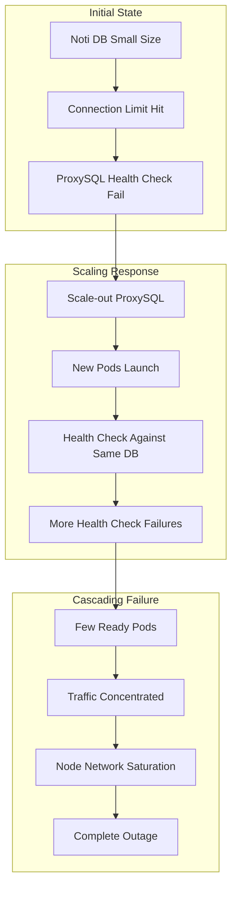

---
tags:
  - ProxySQL
  - MySQL
  - LoadBalancer
  - Kubernetes
  - Database
  - Performance
  - Network
---

# ProxySQL Load Test Cascading Failure: Scale-out이 오히려 장애를 키우는 이유

## 들어가며

"Scale-out하면 문제가 해결될 거야!" 하지만 Production에서 로드테스트 중 ProxySQL Pod을 늘렸더니 오히려 **전체 서비스가 다운**되는 경험을 해봤나요? 

이는 ProxySQL의 Connection Pool 특성과 Health Check 메커니즘, 그리고 Kubernetes Readiness Probe가 만들어내는 **악순환 고리** 때문입니다. 실제 Production 장애를 통해 분석한 ProxySQL Scale-out의 함정과 해결책을 살펴보겠습니다.

## 문제 상황: Partial Outage → Complete Outage

### 장애 시나리오



### 실제 발생한 문제

1. **초기 상황**: Noti DB 크기 부족으로 connection limit 도달
2. **잘못된 대응**: API, Edge, Worker Pod 증가로 Frontend Connection 급증
3. **악화**: 새로운 ProxySQL Pod들이 같은 DB에 Health Check
4. **완전 장애**: 소수의 Ready Pod에 트래픽 집중, 노드 네트워크 대역폭 초과

```bash
# 장애 당시 Prometheus 쿼리로 확인된 네트워크 Drop
sum(rate(node_network_receive_drop_total{product=~"$product",sbregion="$sbregion",node=~"^$node$",job="kubernetes-service-endpoints"}[5m])) by (node) + 
sum(rate(node_network_transmit_drop_total{product=~"$product",sbregion="$sbregion",node=~"^$node$",job="kubernetes-service-endpoints"}[5m])) by (node)
```

## 원인 분석: 세 가지 함정

### 1. Shared Resource Health Check의 함정

**기존 Health Check 방식:**
```yaml
readinessProbe:
  exec:
    command: 
    - /bin/bash
    - -c
    - |
      mysql -h noti-db -u health_user -p$MYSQL_PASSWORD -e "SELECT 1" > /dev/null 2>&1
  initialDelaySeconds: 5
  periodSeconds: 10
  failureThreshold: 3
```

**문제점:**
- 모든 ProxySQL Pod이 **동일한 Noti DB**에 Health Check
- DB의 `max_connections`에 도달하면 **모든 신규 Pod이 Not Ready**
- Scale-out이 오히려 Health Check 부하를 증가

### 2. Connection Pool의 Thunder Herd

```sql
-- ProxySQL에서 확인된 Connection Pool 상태
SELECT hostgroup, srv_host, status, Connections_used, Connections_free, Connections_max
FROM stats_mysql_connection_pool;

-- 장애 시점의 상태 예시
-- hostgroup | srv_host    | status | used | free  | max
-- 0         | noti-db:3306| ONLINE | 5    | 1995  | 2000  ← 과도한 Free Connection
-- 0         | main-db:3306| ONLINE | 150  | 850   | 1000
```

**Thunder Herd 패턴:**
1. 요청 급증 → In-use Connection 부족
2. 대량의 새 Connection 생성 시도
3. TCP Handshake 지연으로 과도한 Connection Pool 생성
4. 요청 감소 후에도 Free Connection이 대량 잔존

### 3. 지역별 Pod 배치 불균형

```bash
# Zone별 ProxySQL Pod 분포 확인
kubectl get pods -l app=proxysql -o custom-columns=NAME:.metadata.name,NODE:.spec.nodeName | \
awk 'NR>1 {print $2}' | cut -d- -f3 | sort | uniq -c

# 장애 시점
#  3 zone-a  ← 트래픽 집중, 장애 지속
# 40 zone-c  ← 충분한 분산, 정상 복구
```

**Zone-A가 복구되지 않은 이유:**
- Pod 수 부족으로 트래픽 집중
- 노드 네트워크 대역폭 초과
- DNS 해결 실패까지 발생

## 해결 방법: 3단계 접근

### 1. Health Check 독립성 확보

**개선된 Health Check 전략:**
```yaml
readinessProbe:
  exec:
    command: 
    - /bin/bash
    - -c
    - |
      # ProxySQL Admin Interface 사용 (별도 DB 의존성 없음)
      mysql -h 127.0.0.1 -P 6032 -u admin -padmin \
        -e "SELECT * FROM stats_mysql_connection_pool LIMIT 1" > /dev/null 2>&1
  initialDelaySeconds: 10
  periodSeconds: 15
  failureThreshold: 5  # 더 관대한 설정
```

**Alternative: Multi-Backend Health Check**
```bash
#!/bin/bash
# 여러 DB 중 하나라도 연결 가능하면 Ready
DBS=("main-db:3306" "user-db:3306" "order-db:3306")
SUCCESS=0

for db in "${DBS[@]}"; do
  if mysql -h ${db%%:*} -P ${db##*:} -u health_user -p$MYSQL_PASSWORD \
     -e "SELECT 1" > /dev/null 2>&1; then
    SUCCESS=1
    break
  fi
done

exit $((1 - $SUCCESS))
```

### 2. Connection Pool 최적화

**ProxySQL Configuration 튜닝:**
```sql
-- 기존 설정 (문제 있던 설정)
SET mysql-max_connections=10000;        -- 너무 큰 값
SET mysql-free_connections_pct=80;      -- 80% Free Connection 유지
SET mysql-connection_warming=false;     -- 사전 Connection 준비 안함

-- 최적화된 설정
SET mysql-max_connections=100;          -- 적절한 제한
SET mysql-free_connections_pct=1;       -- 최소한의 Free만 유지
SET mysql-connection_warming=true;      -- 미리 Connection 준비
SET mysql-ping_interval_server_msec=60000;  -- 1분마다 Idle Connection Ping

-- Backend Connection 정리 주기 설정
SET mysql-connect_timeout_server_max=10000;  -- 10초 연결 타임아웃
SET mysql-free_connections_pct=10;           -- Free Connection 10%로 제한
```

**Connection Pool 모니터링:**
```sql
-- Connection Pool 상태 실시간 모니터링
SELECT 
  hostgroup,
  srv_host,
  status,
  Connections_used,
  Connections_free,
  Connections_max,
  ROUND(Connections_free * 100.0 / Connections_max, 2) as free_pct
FROM stats_mysql_connection_pool
WHERE status = 'ONLINE'
ORDER BY free_pct DESC;
```

### 3. 고가용성 확보: Zone-aware Scaling

**PodDisruptionBudget 설정:**
```yaml
apiVersion: policy/v1
kind: PodDisruptionBudget
metadata:
  name: proxysql-pdb
spec:
  minAvailable: 50%
  selector:
    matchLabels:
      app: proxysql
```

**Zone별 최소 Pod 보장:**
```yaml
apiVersion: apps/v1
kind: Deployment
metadata:
  name: proxysql
spec:
  replicas: 9  # 3 zones * 3 pods minimum
  template:
    spec:
      topologySpreadConstraints:
      - maxSkew: 1
        topologyKey: topology.kubernetes.io/zone
        whenUnsatisfiable: DoNotSchedule
        labelSelector:
          matchLabels:
            app: proxysql
      - maxSkew: 2
        topologyKey: kubernetes.io/hostname
        whenUnsatisfiable: ScheduleAnyway  # 노드 장애 시에도 스케줄링
        labelSelector:
          matchLabels:
            app: proxysql
```

## 모니터링 및 알림 설정

### ProxySQL 핵심 메트릭

```yaml
# Prometheus Alert Rules
groups:
- name: proxysql.rules
  rules:
  - alert: ProxySQLHighConnectionUtilization
    expr: |
      (
        sum(proxysql_connection_pool_conn_used) by (instance) /
        sum(proxysql_connection_pool_conn_max) by (instance)
      ) > 0.8
    for: 2m
    labels:
      severity: warning
    annotations:
      summary: "ProxySQL connection pool utilization is high"
      
  - alert: ProxySQLHealthCheckFailure
    expr: |
      (
        sum(rate(proxysql_mysql_backend_connect_error_total[5m])) by (instance) /
        sum(rate(proxysql_mysql_backend_connect_total[5m])) by (instance)
      ) > 0.1
    for: 1m
    labels:
      severity: critical
    annotations:
      summary: "ProxySQL backend connection failure rate is high"

  - alert: ProxySQLFreeConnectionsHigh
    expr: |
      sum(proxysql_connection_pool_conn_free) by (instance) > 500
    for: 5m
    labels:
      severity: warning
    annotations:
      summary: "ProxySQL has too many free connections"
```

### 실시간 대시보드 쿼리

```sql
-- ProxySQL Connection Pool 효율성
SELECT 
  srv_host,
  SUM(Connections_used) as total_used,
  SUM(Connections_free) as total_free,
  SUM(Connections_max) as total_max,
  ROUND(SUM(Connections_used) * 100.0 / SUM(Connections_max), 2) as utilization_pct
FROM stats_mysql_connection_pool 
GROUP BY srv_host
ORDER BY utilization_pct DESC;

-- Query 처리 통계
SELECT 
  rule_id,
  match_digest,
  count_star as total_queries,
  sum_time/1000 as total_time_ms,
  ROUND((sum_time/count_star)/1000, 2) as avg_time_ms
FROM stats_mysql_query_rules
WHERE count_star > 0
ORDER BY count_star DESC
LIMIT 10;
```

## 네트워크 레벨 최적화

### Node Network Monitoring

```bash
# 네트워크 Drop 실시간 모니터링
watch -n 1 'echo "=== Network Drops ===" && \
cat /proc/net/dev | grep -E "(eth0|ens)" | \
awk "{print \$1 \$4 \$12}" | column -t'

# 네트워크 대역폭 사용률 확인
iftop -i eth0 -P -n -t -s 10

# Connection 상태별 통계
ss -s
# Total: 1289 (kernel 2104)
# TCP:   45 (estab:23, closed:12, orphaned:0, synrecv:0, timewait:10/0)
```

### TCP Tuning for High Connection Load

```bash
# /etc/sysctl.conf 최적화 (Node 레벨)
net.core.somaxconn = 32768
net.core.netdev_max_backlog = 5000
net.ipv4.tcp_max_syn_backlog = 8192
net.ipv4.tcp_max_tw_buckets = 2000000
net.ipv4.tcp_tw_recycle = 1
net.ipv4.tcp_tw_reuse = 1
net.ipv4.tcp_fin_timeout = 10

# Connection tracking 최적화
net.netfilter.nf_conntrack_max = 1048576
net.netfilter.nf_conntrack_tcp_timeout_established = 86400
```

## 로드테스트 시나리오 개선

### Gradual Ramp-up 전략

```python
# 개선된 Load Test Script (Python + asyncio)
import asyncio
import aiomysql
import time
from concurrent.futures import ThreadPoolExecutor

class ProxySQLLoadTest:
    def __init__(self, proxysql_host, max_connections=1000):
        self.proxysql_host = proxysql_host
        self.max_connections = max_connections
        self.active_connections = 0
        
    async def gradual_ramp_up(self, duration_minutes=30):
        """30분에 걸쳐 점진적으로 부하 증가"""
        ramp_steps = 10
        connections_per_step = self.max_connections // ramp_steps
        step_duration = (duration_minutes * 60) // ramp_steps
        
        for step in range(ramp_steps):
            target_connections = (step + 1) * connections_per_step
            print(f"Step {step + 1}: Ramping up to {target_connections} connections")
            
            # 점진적 Connection 증가
            while self.active_connections < target_connections:
                asyncio.create_task(self.create_connection())
                await asyncio.sleep(0.1)  # 100ms 간격으로 Connection 생성
                
            await asyncio.sleep(step_duration)
            
    async def create_connection(self):
        """ProxySQL Connection 생성 및 유지"""
        try:
            conn = await aiomysql.connect(
                host=self.proxysql_host,
                port=6033,  # ProxySQL MySQL Interface
                user='test_user',
                password='test_password',
                db='test_db',
                connect_timeout=10
            )
            self.active_connections += 1
            
            # Connection 활동 시뮬레이션
            cursor = await conn.cursor()
            await cursor.execute("SELECT SLEEP(RAND() * 5)")  # 0-5초 랜덤 쿼리
            await cursor.close()
            
        except Exception as e:
            print(f"Connection failed: {e}")
        finally:
            if 'conn' in locals():
                await conn.ensure_closed()
            self.active_connections -= 1
```

## 정리

ProxySQL Scale-out 장애를 통해 배운 핵심 교훈들:

### 1. 공유 리소스 의존성 주의
- Health Check가 Backend DB에 의존하면 Scale-out이 역효과
- **독립적인 Health Check** 메커니즘 필요

### 2. Connection Pool은 적을수록 좋다
- 과도한 Free Connection은 메모리 낭비이자 성능 저해 요소
- **Thunder Herd 방지**를 위한 적극적인 Connection 제한 필요

### 3. Zone별 균등 배치가 핵심
- 소수 Pod에 트래픽 집중되면 노드 레벨 장애로 확산
- **Topology Spread Constraints** 필수 적용

### 4. 점진적 Load Testing
- 급격한 부하 증가는 예상치 못한 Cascade Failure 유발
- **Gradual Ramp-up**으로 시스템 한계 정확히 파악

**Production 운영 체크리스트:**
- [ ] ProxySQL Admin Interface 기반 Health Check 적용
- [ ] Connection Pool 설정 최적화 (`max_connections < 500`)  
- [ ] Zone별 최소 3개 Pod 보장
- [ ] Network 레벨 모니터링 알림 설정
- [ ] 점진적 Load Test 수행 후 배포

## 관련 문서

- [ProxySQL Connection Pooling 최적화](proxysql-connection-pooling.md)
- [EKS LoadBalancer IP vs Instance Mode](eks-lb-modes.md)
- [Kubernetes Network Policy 심화](../devops/k8s-network-policy.md)
- [Container Memory Management](../cs/memory/cgroup-container-memory.md)