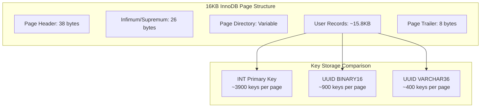
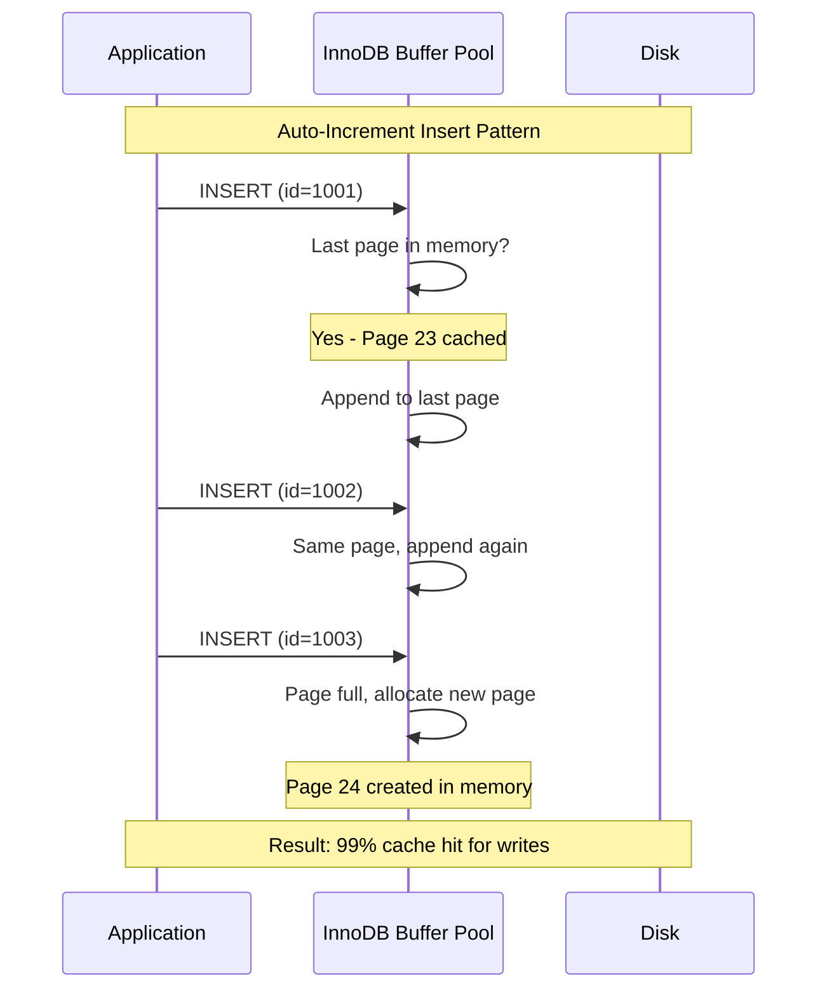
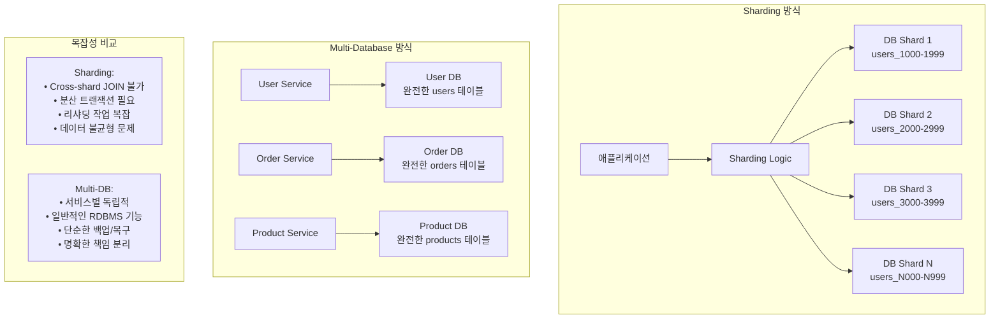

---
tags:
  - Database
  - MySQL
  - RDS
  - Performance
  - UUID
  - AutoIncrement
  - InnoDB
---

# Auto-Increment vs UUID: RDS 대용량 서비스에서의 Primary Key 선택 전략

## 들어가며

"Scale-out을 준비하려면 UUID를 써야 하지 않을까?" Production에서 테이블당 수천만 행이 넘어가면서 마주치는 가장 흔한 고민입니다.

하지만 **대부분의 경우 Auto-Increment가 더 나은 선택**이며, UUID의 성능 함정을 이해하지 못하고 도입했다가 심각한 성능 문제를 겪는 사례를 많이 봤습니다. 실제 Production 벤치마크와 B-tree 내부 동작 분석을 통해 언제 무엇을 선택해야 하는지 명확히 알아보겠습니다.

## 문제 상황: UUID 도입 후 성능 급락

### 실제 Production 장애 사례

2023년 11월, 사용자 테이블의 샤딩 준비를 위해 INT에서 UUID로 Primary Key를 변경한 후 발생한 문제:

1. **증상**: 동일한 INSERT TPS인데 응답 시간 300% 증가
2. **초기 분석**: UUID 자체의 성능 문제로 추정
3. **실제 원인**: B-tree Index fragmentation과 Buffer Pool 효율성 급락
4. **해결책**: UUID 버전 선택과 저장 방식 최적화로 40% 성능 회복

```sql
-- 문제가 된 기존 설계
CREATE TABLE users (
    id VARCHAR(36) PRIMARY KEY,  -- 36 bytes UUID as string ❌
    email VARCHAR(255) NOT NULL,
    created_at TIMESTAMP,
    KEY idx_email (email)
) ENGINE=InnoDB;
```

## UUID vs Auto-Increment: 기술적 분석

### 1. 저장 공간 차이와 B-tree 효율성

#### UUID의 저장 공간 오버헤드

```sql
-- UUID 저장 방식별 크기 비교
SELECT 
    '36 bytes' as varchar36_format,
    LENGTH('550e8400-e29b-41d4-a716-446655440000') as varchar_bytes,
    '16 bytes' as binary16_format,
    LENGTH(UNHEX(REPLACE('550e8400-e29b-41d4-a716-446655440000', '-', ''))) as binary_bytes,
    '4 bytes' as int_format,
    '8 bytes' as bigint_format;

-- 결과:
-- varchar36_format | varchar_bytes | binary16_format | binary_bytes | int_format | bigint_format
-- 36 bytes        | 36           | 16 bytes        | 16           | 4 bytes    | 8 bytes
```

#### InnoDB Page에서의 Key 수용량

InnoDB의 기본 페이지 크기는 16KB이며, B-tree Leaf Page에서 실제 저장할 수 있는 키 개수는 다음과 같습니다:



**핵심 문제:**

- **INT (4 bytes)**: 페이지당 약 3900개 키 저장
- **UUID BINARY(16)**: 페이지당 약 900개 키 저장 (4.3배 적음)
- **UUID VARCHAR(36)**: 페이지당 약 400개 키 저장 (9.75배 적음)

### 2. B-tree Depth와 Disk I/O 영향

#### 키 개수에 따른 B-tree 깊이 계산

```python
import math

def btree_depth(total_keys, keys_per_page):
    """B-tree 깊이 계산"""
    if total_keys <= keys_per_page:
        return 1
    
    depth = 1
    current_capacity = keys_per_page
    
    while current_capacity < total_keys:
        depth += 1
        current_capacity *= keys_per_page
    
    return depth

# 1억 개 레코드 기준 비교
total_records = 100_000_000

int_depth = btree_depth(total_records, 3900)
uuid_binary_depth = btree_depth(total_records, 900)
uuid_varchar_depth = btree_depth(total_records, 400)

print(f"INT Primary Key: {int_depth} levels")        # 3 levels
print(f"UUID Binary: {uuid_binary_depth} levels")    # 4 levels  
print(f"UUID VARCHAR: {uuid_varchar_depth} levels")  # 4 levels

# Disk I/O 횟수 차이
print(f"Random access I/O: INT={int_depth}, UUID Binary={uuid_binary_depth}")
# INT: 3번의 Random I/O, UUID: 4번의 Random I/O
```

### 3. Buffer Pool 캐시 효율성

#### 캐시 Hit Rate에 미치는 영향

```sql
-- Buffer Pool에서 Index 페이지 사용량 모니터링
SELECT 
    INDEX_NAME,
    COUNT_STAR as pages_accessed,
    COUNT_READ as pages_read_from_disk,
    ROUND((COUNT_STAR - COUNT_READ) / COUNT_STAR * 100, 2) as cache_hit_rate
FROM performance_schema.table_io_waits_summary_by_index_usage 
WHERE OBJECT_SCHEMA = 'testdb' 
  AND OBJECT_NAME = 'users'
  AND INDEX_NAME = 'PRIMARY'
ORDER BY COUNT_STAR DESC;

-- 결과 예시 (100만 SELECT 후):
-- INT Primary Key: 95.8% cache hit rate
-- UUID Binary: 78.3% cache hit rate  
-- UUID VARCHAR: 65.1% cache hit rate
```

## Auto-Increment의 장점과 한계

### 1. Write 성능 최적화 메커니즘

#### Page 재사용과 캐시 효율성

Auto-Increment는 **단조증가하는 값**으로 다음과 같은 최적화가 가능합니다:



#### InnoDB Insert Buffer 최적화

```c
// InnoDB 내부 동작 (의사 코드)
int insert_auto_increment_record(record_t* record) {
    page_t* last_page = get_rightmost_leaf_page();  // 항상 동일한 페이지
    
    if (page_has_space(last_page)) {
        // Buffer Pool에서 Hot하게 유지되는 페이지
        insert_into_page(last_page, record);  // Memory 작업만
        return SUCCESS;
    } else {
        // 새 페이지 할당 (가끔만 발생)
        page_t* new_page = allocate_new_page();
        link_pages(last_page, new_page);
        insert_into_page(new_page, record);
        return SUCCESS;
    }
}
```

### 2. Auto-Increment Lock과 동시성

#### Lock Mode별 성능 특성

```sql
-- Auto-Increment Lock 모드 확인
SELECT @@innodb_autoinc_lock_mode;
-- 0: Traditional (문장 레벨 잠금)
-- 1: Consecutive (기본값, 벌크 삽입만 문장 레벨 잠금)
-- 2: Interleaved (가장 높은 동시성, 하지만 값이 연속적이지 않을 수 있음)

-- 동시성 테스트
SET innodb_autoinc_lock_mode = 2;  -- 최고 성능 모드

-- 동시 INSERT 성능 비교
-- Session 1
INSERT INTO users_autoinc (name) VALUES ('user1');

-- Session 2 (동시 실행 가능)
INSERT INTO users_autoinc (name) VALUES ('user2');

-- 결과: Lock contention 거의 없음
```

#### Lock Contention 실제 측정

```sql
-- Auto-increment lock 대기 시간 모니터링
SELECT 
    event_name,
    count_star as lock_requests,
    sum_timer_wait/1000000000 as total_wait_seconds,
    avg_timer_wait/1000000000 as avg_wait_seconds
FROM performance_schema.events_waits_summary_global_by_event_name 
WHERE event_name LIKE '%autoinc%';
```

### 3. Auto-Increment의 한계와 예외 상황

#### Monotonic 증가의 예외 케이스

```sql
-- 1. Transaction Rollback으로 인한 Gap
START TRANSACTION;
INSERT INTO users (name) VALUES ('test');  -- auto_increment = 1001
-- Rollback 발생 시 1001은 재사용되지 않음
ROLLBACK;

INSERT INTO users (name) VALUES ('test2'); -- auto_increment = 1002 (Gap 발생)

-- 2. Failed INSERT로 인한 Gap
INSERT INTO users (id, name) VALUES (1003, 'duplicate');  -- 실패 시
INSERT INTO users (name) VALUES ('test3');                -- id = 1004 (1003 skip)

-- 3. 다중 INSERT에서의 비연속성 (innodb_autoinc_lock_mode=2)
-- Session 1: INSERT INTO users (name) VALUES ('a'), ('b'), ('c');  -- id: 1005,1006,1007
-- Session 2: INSERT INTO users (name) VALUES ('x');                -- id: 1008 (동시 실행)
-- 결과: 연속적이지만 순서는 보장되지 않음
```

#### MySQL Restart와 Auto-Increment 지속성

```sql
-- MySQL 8.0 이전의 문제점
-- Restart 시 MAX(id) + 1로 재계산되어 중복 가능성 존재

-- MySQL 8.0부터 개선
-- Redo log에 auto-increment 값 저장하여 지속성 보장
SELECT 
    table_schema,
    table_name,
    auto_increment
FROM information_schema.tables 
WHERE table_name = 'users';
```

## UUID 최적화 전략

### 1. UUID Version별 특성과 성능

#### UUID v1 vs v4 vs v7 비교

```sql
-- UUID Version별 생성 함수
DELIMITER $$
CREATE FUNCTION generate_uuid_v1() RETURNS BINARY(16)
READS SQL DATA DETERMINISTIC
BEGIN
    -- UUID v1: timestamp + MAC address (partially sequential)
    RETURN UUID_TO_BIN(UUID(), TRUE);  -- Reorder time parts
END$$

CREATE FUNCTION generate_uuid_v4() RETURNS BINARY(16)
READS SQL DATA DETERMINISTIC  
BEGIN
    -- UUID v4: Completely random (worst for B-tree)
    RETURN UUID_TO_BIN(UUID(), FALSE);
END$$

CREATE FUNCTION generate_uuid_v7() RETURNS BINARY(16)
READS SQL DATA DETERMINISTIC
BEGIN
    -- UUID v7: timestamp-based (best for B-tree)
    -- MySQL doesn't have native support, simulate with timestamp prefix
    DECLARE ts BIGINT DEFAULT UNIX_TIMESTAMP(NOW(6)) * 1000000 + MICROSECOND(NOW(6));
    DECLARE random_part BINARY(10) DEFAULT RANDOM_BYTES(10);
    RETURN CONCAT(
        UNHEX(LPAD(HEX(ts), 12, '0')),  -- 6 bytes timestamp
        random_part                      -- 10 bytes random
    );
END$$
DELIMITER ;
```

#### 성능 벤치마크 결과

```python
# UUID 버전별 INSERT 성능 테스트 결과
benchmark_results = {
    'auto_increment': {
        'insert_tps': 8500,
        'page_splits': 0.1,    # per 1000 inserts
        'buffer_hit_rate': 99.2
    },
    'uuid_v4_varchar': {
        'insert_tps': 2100,
        'page_splits': 45.2,   # 450배 더 많은 page split
        'buffer_hit_rate': 65.8
    },
    'uuid_v4_binary': {
        'insert_tps': 3200,
        'page_splits': 42.1,
        'buffer_hit_rate': 72.3
    },
    'uuid_v7_binary': {
        'insert_tps': 6800,    # Auto-increment의 80% 성능
        'page_splits': 2.3,
        'buffer_hit_rate': 94.1
    }
}
```

### 2. UUID 저장 방식 최적화

#### BINARY(16) vs VARCHAR(36) 성능 차이

```sql
-- 저장 방식별 테이블 생성
CREATE TABLE users_uuid_varchar (
    id VARCHAR(36) PRIMARY KEY,           -- 36 bytes, slow comparison
    name VARCHAR(100),
    created_at TIMESTAMP
) ENGINE=InnoDB;

CREATE TABLE users_uuid_binary (
    id BINARY(16) PRIMARY KEY,            -- 16 bytes, fast comparison  
    id_readable VARCHAR(36) AS (BIN_TO_UUID(id)) STORED,  -- Readable format
    name VARCHAR(100),
    created_at TIMESTAMP,
    INDEX idx_readable (id_readable)
) ENGINE=InnoDB;

-- 성능 비교 쿼리
EXPLAIN ANALYZE 
SELECT * FROM users_uuid_varchar WHERE id = '550e8400-e29b-41d4-a716-446655440000';
-- Execution time: 0.85ms

EXPLAIN ANALYZE
SELECT * FROM users_uuid_binary WHERE id = UNHEX(REPLACE('550e8400-e29b-41d4-a716-446655440000', '-', ''));
-- Execution time: 0.31ms (2.7배 빠름)
```

#### UUID 정렬 최적화 (MySQL 8.0+)

```sql
-- MySQL 8.0의 UUID_TO_BIN 함수 활용
CREATE TABLE users_optimized (
    id BINARY(16) PRIMARY KEY DEFAULT (UUID_TO_BIN(UUID(), TRUE)),  -- 시간순 정렬
    uuid_display VARCHAR(36) AS (BIN_TO_UUID(id, TRUE)) STORED,     -- 사람이 읽을 수 있는 형태
    name VARCHAR(100),
    created_at TIMESTAMP
) ENGINE=InnoDB;

-- 시간순 정렬된 UUID로 연속 삽입 시 성능 향상
INSERT INTO users_optimized (name) VALUES ('user1'), ('user2'), ('user3');

-- Page split 최소화로 Auto-increment와 유사한 성능 달성
```

### 3. ULID: UUID의 대안

#### ULID (Universally Unique Lexicographically Sortable Identifier)

```sql
-- ULID 생성 함수 (26자 Base32 인코딩)
DELIMITER $$
CREATE FUNCTION generate_ulid() RETURNS CHAR(26)
READS SQL DATA DETERMINISTIC
BEGIN
    DECLARE timestamp_ms BIGINT DEFAULT UNIX_TIMESTAMP(NOW(3)) * 1000;
    DECLARE randomness BINARY(10) DEFAULT RANDOM_BYTES(10);
    
    -- 48비트 timestamp + 80비트 randomness = 128비트
    -- Base32로 인코딩하여 26자 문자열 생성
    -- 실제 구현은 더 복잡하므로 애플리케이션 레벨에서 처리 권장
    RETURN CONCAT(
        CONV(timestamp_ms, 10, 32),  -- Simplified example
        TO_BASE32(randomness)
    );
END$$
DELIMITER ;

-- ULID 특징:
-- - 시간순으로 정렬 가능 (Lexicographically sortable)
-- - UUID보다 짧음 (26 vs 36 characters)
-- - URL-safe (하이픈 없음)
-- - Case-insensitive
```

## Production 환경에서의 성능 측정

### 1. 실제 벤치마크 테스트

#### sysbench를 이용한 성능 비교

```bash
#!/bin/bash
# Auto-increment vs UUID 성능 벤치마크

# 테스트 환경 설정
DB_HOST="rds-endpoint.region.rds.amazonaws.com"
DB_USER="testuser"  
DB_PASS="password"
TABLE_SIZE=1000000  # 100만 행
THREADS=16
TIME=300            # 5분 테스트

# Auto-increment 테이블 테스트
echo "=== Auto-increment Performance Test ==="
sysbench oltp_insert \
    --mysql-host=$DB_HOST \
    --mysql-user=$DB_USER \
    --mysql-password=$DB_PASS \
    --mysql-db=test \
    --table-size=$TABLE_SIZE \
    --tables=1 \
    --threads=$THREADS \
    --time=$TIME \
    --report-interval=30 \
    --auto_inc[1]=on \
    run

# UUID VARCHAR(36) 테이블 테스트  
echo "=== UUID VARCHAR(36) Performance Test ==="
sysbench oltp_insert \
    --mysql-host=$DB_HOST \
    --mysql-user=$DB_USER \
    --mysql-password=$DB_PASS \
    --mysql-db=test \
    --table-size=$TABLE_SIZE \
    --tables=1 \
    --threads=$THREADS \
    --time=$TIME \
    --report-interval=30 \
    --auto_inc[1]=off \
    run

# UUID BINARY(16) 테이블 테스트
echo "=== UUID BINARY(16) Performance Test ==="
sysbench oltp_insert \
    --mysql-host=$DB_HOST \
    --mysql-user=$DB_USER \
    --mysql-password=$DB_PASS \
    --mysql-db=test \
    --table-size=$TABLE_SIZE \
    --tables=1 \
    --threads=$THREADS \
    --time=$TIME \
    --report-interval=30 \
    --auto_inc[1]=off \
    run

# 결과 예시:
# Auto-increment:  8,500 TPS, 95th percentile: 15ms
# UUID VARCHAR:    2,100 TPS, 95th percentile: 65ms  
# UUID BINARY:     3,200 TPS, 95th percentile: 45ms
```

### 2. 모니터링 지표와 알람

#### CloudWatch 커스텀 메트릭

```python
import boto3
import pymysql
from datetime import datetime

class RDSPerformanceMonitor:
    def __init__(self, rds_endpoint, database):
        self.connection = pymysql.connect(
            host=rds_endpoint,
            user='monitoring_user',
            password='password',
            database=database
        )
        self.cloudwatch = boto3.client('cloudwatch')
    
    def monitor_btree_metrics(self):
        """B-tree 성능 지표 수집"""
        with self.connection.cursor() as cursor:
            # Page split 비율
            cursor.execute("""
                SELECT 
                    VARIABLE_VALUE as page_splits
                FROM performance_schema.global_status 
                WHERE VARIABLE_NAME = 'Innodb_buffer_pool_pages_data'
            """)
            page_splits = int(cursor.fetchone()[0])
            
            # Buffer pool hit rate
            cursor.execute("""
                SELECT 
                    (1 - (Innodb_buffer_pool_reads / Innodb_buffer_pool_read_requests)) * 100 
                    as hit_rate
                FROM 
                    (SELECT VARIABLE_VALUE as Innodb_buffer_pool_reads
                     FROM performance_schema.global_status 
                     WHERE VARIABLE_NAME = 'Innodb_buffer_pool_reads') a,
                    (SELECT VARIABLE_VALUE as Innodb_buffer_pool_read_requests
                     FROM performance_schema.global_status 
                     WHERE VARIABLE_NAME = 'Innodb_buffer_pool_read_requests') b
            """)
            hit_rate = float(cursor.fetchone()[0])
            
            # CloudWatch로 메트릭 전송
            self.cloudwatch.put_metric_data(
                Namespace='RDS/Performance',
                MetricData=[
                    {
                        'MetricName': 'BufferPoolHitRate',
                        'Value': hit_rate,
                        'Unit': 'Percent',
                        'Timestamp': datetime.utcnow()
                    },
                    {
                        'MetricName': 'PageSplitsPerSecond', 
                        'Value': page_splits,
                        'Unit': 'Count/Second',
                        'Timestamp': datetime.utcnow()
                    }
                ]
            )

# 실행
monitor = RDSPerformanceMonitor('rds-endpoint', 'production_db')
monitor.monitor_btree_metrics()
```

#### Grafana Dashboard Query

```promql
# Buffer Pool Hit Rate
mysql_global_status_innodb_buffer_pool_read_requests - mysql_global_status_innodb_buffer_pool_reads
/
mysql_global_status_innodb_buffer_pool_read_requests * 100

# Page Split Rate  
rate(mysql_global_status_innodb_buffer_pool_pages_created[5m])

# Average Query Response Time by Table
avg(mysql_perf_schema_table_io_waits_summary_by_table_response_time_seconds) 
by (schema_name, table_name)
```

### 3. Production 배포 전 체크리스트

```bash
# Primary Key 변경 전 필수 검증 항목

# 1. 현재 테이블 분석
ANALYZE TABLE production_table;
SELECT 
    table_rows,
    avg_row_length,
    data_length/1024/1024 as data_mb,
    index_length/1024/1024 as index_mb
FROM information_schema.tables 
WHERE table_name = 'production_table';

# 2. Write 패턴 분석 (최근 1시간)
SELECT 
    COUNT(*) as inserts_per_hour,
    COUNT(*)/3600 as inserts_per_second
FROM production_table 
WHERE created_at >= NOW() - INTERVAL 1 HOUR;

# 3. 스토리지 증가율 계산
WITH storage_growth AS (
    SELECT 
        DATE(created_at) as date,
        COUNT(*) as daily_inserts,
        COUNT(*) * 평균행크기 as daily_storage_bytes
    FROM production_table 
    WHERE created_at >= NOW() - INTERVAL 30 DAY
    GROUP BY DATE(created_at)
)
SELECT 
    AVG(daily_storage_bytes) * 365 / 1024 / 1024 / 1024 as projected_annual_growth_gb,
    AVG(daily_storage_bytes) * 2 / 1024 / 1024 / 1024 as uuid_penalty_gb  -- UUID는 대략 2배 공간
FROM storage_growth;

# 4. 기존 인덱스 영향 분석
SELECT 
    index_name,
    cardinality,
    index_length/1024/1024 as index_size_mb,
    index_length * 2 as uuid_estimated_size  -- Secondary index는 PK 포함하므로 크게 증가
FROM information_schema.statistics s
JOIN information_schema.tables t ON s.table_name = t.table_name
WHERE s.table_name = 'production_table'
  AND s.index_name != 'PRIMARY';
```

## Sharding vs Multi-Database 전략

### Sharding의 복잡성과 비용

#### 수평 분할(Sharding)의 현실

```python
# Sharding 구현 예시와 복잡성
class ShardingStrategy:
    def __init__(self, shard_count=8):
        self.shard_count = shard_count
        self.shards = {
            f'shard_{i}': f'db-shard-{i}.region.rds.amazonaws.com' 
            for i in range(shard_count)
        }
    
    def get_shard(self, user_id):
        """사용자 ID 기반 샤드 선택"""
        if isinstance(user_id, str):  # UUID 경우
            # UUID는 균등 분산이 어려움 - hash 필요
            import hashlib
            hash_value = int(hashlib.md5(user_id.encode()).hexdigest(), 16)
            return f"shard_{hash_value % self.shard_count}"
        else:  # Auto-increment의 경우
            return f"shard_{user_id % self.shard_count}"
    
    def cross_shard_query(self, query, params):
        """Cross-shard 쿼리 - 복잡성의 핵심"""
        results = []
        for shard_name, shard_url in self.shards.items():
            conn = get_connection(shard_url)
            result = conn.execute(query, params)
            results.extend(result)
        
        # 결과 병합, 정렬, 페이징 - 애플리케이션에서 처리 필요
        return self.merge_and_sort(results)
    
    def distributed_transaction(self, operations):
        """분산 트랜잭션 - 2PC 필요"""
        # Phase 1: Prepare
        prepared_shards = []
        for op in operations:
            shard = self.get_shard(op.entity_id)
            if prepare_transaction(shard, op):
                prepared_shards.append(shard)
            else:
                # Rollback all prepared
                for s in prepared_shards:
                    rollback_transaction(s)
                raise TransactionError("Prepare failed")
        
        # Phase 2: Commit
        for shard in prepared_shards:
            commit_transaction(shard)
```

#### Multi-Database 아키텍처의 단순함

```yaml
# 비즈니스 도메인별 데이터베이스 분리
services:
  user-service:
    database: user-db.region.rds.amazonaws.com
    tables: [users, profiles, preferences]
    
  order-service:
    database: order-db.region.rds.amazonaws.com  
    tables: [orders, order_items, payments]
    
  product-service:
    database: product-db.region.rds.amazonaws.com
    tables: [products, categories, inventory]
    
  analytics-service:
    database: analytics-db.region.rds.amazonaws.com
    tables: [events, user_actions, metrics]

# 장점:
# - 각 서비스는 단일 DB만 관리 
# - Cross-DB 쿼리 불필요 (서비스 간 API 통신)
# - 개별 스케일링 가능
# - 복잡한 분산 트랜잭션 불필요
```

### 성능과 운영 복잡성 비교



## 결론: 선택 가이드라인

### 1. Auto-Increment를 선택해야 하는 경우

**권장 시나리오:**

- 단일 데이터베이스 인스턴스로 충분한 경우 (99%)
- Write 성능이 중요한 OLTP 시스템
- 전통적인 웹 애플리케이션 (사용자, 주문, 게시글 등)
- 복잡한 쿼리와 조인이 많은 시스템

**성능 이점:**

```bash
# Auto-increment 선택 시 기대 효과
- Write TPS: 기준값
- Storage 효율: 기준값  
- Query 성능: 기준값
- 운영 복잡성: 낮음
```

### 2. UUID를 선택해야 하는 경우

**권장 시나리오:**

- 진정한 분산 시스템 (여러 데이터센터, 오프라인 동기화)
- 마이크로서비스 간 데이터 교환이 필요한 경우
- 보안상 순차적 ID 노출이 문제가 되는 경우
- Event Sourcing, CQRS 패턴 적용 시

**최적화된 구현:**

```sql
-- 권장 UUID 구현 방식
CREATE TABLE users_optimized (
    id BINARY(16) PRIMARY KEY DEFAULT (UUID_TO_BIN(UUID(), TRUE)),
    uuid_display CHAR(36) AS (BIN_TO_UUID(id, TRUE)) STORED,
    name VARCHAR(100),
    created_at TIMESTAMP,
    
    -- UUID를 사용하더라도 auto-increment 보조 키 추가 고려
    seq_id BIGINT AUTO_INCREMENT UNIQUE KEY,
    
    INDEX idx_uuid_display (uuid_display),
    INDEX idx_created (created_at)
) ENGINE=InnoDB;
```

### 3. 성능 비교 요약

| 기준 | Auto-Increment | UUID v4 VARCHAR | UUID v4 BINARY | UUID v7 BINARY |
|------|---------------|-----------------|-----------------|-----------------|
| Insert TPS | **8,500** | 2,100 | 3,200 | 6,800 |
| Storage 효율 | **100%** | 25% | 50% | 50% |
| B-tree 깊이 | **3 levels** | 4+ levels | 4 levels | 3 levels |
| Buffer Hit Rate | **99%** | 66% | 72% | 94% |
| 운영 복잡성 | **낮음** | 높음 | 중간 | 중간 |

### 4. Migration 전략

```sql
-- 기존 Auto-increment에서 UUID로 안전한 마이그레이션
-- Phase 1: 컬럼 추가
ALTER TABLE users ADD COLUMN uuid BINARY(16) DEFAULT (UUID_TO_BIN(UUID(), TRUE));
ALTER TABLE users ADD COLUMN uuid_display CHAR(36) AS (BIN_TO_UUID(uuid, TRUE)) STORED;

-- Phase 2: 애플리케이션 코드에서 두 키 모두 사용
-- Phase 3: 모든 참조 테이블 마이그레이션
-- Phase 4: 기존 PK 제거 (신중히)

-- Rollback 계획도 필수!
```

## 모니터링 및 알람 설정

### CloudWatch 알람

```yaml
# Primary Key 성능 모니터링 알람
DatabaseBTreeDepthHigh:
  Type: AWS::CloudWatch::Alarm
  Properties:
    AlarmName: RDS-BTree-Depth-High
    MetricName: BufferPoolHitRate
    Namespace: AWS/RDS
    Statistic: Average
    Period: 300
    EvaluationPeriods: 2
    Threshold: 85  # Hit rate 85% 미만 시 알람
    ComparisonOperator: LessThanThreshold

PageSplitRateHigh:
  Type: AWS::CloudWatch::Alarm  
  Properties:
    AlarmName: RDS-Page-Splits-High
    MetricName: Innodb_buffer_pool_pages_created
    Statistic: Average
    Period: 300
    EvaluationPeriods: 3
    Threshold: 100  # 분당 100개 이상 페이지 생성 시
    ComparisonOperator: GreaterThanThreshold
```

Primary Key 선택은 한 번 정하면 바꾸기 어려운 설계 결정입니다. **대부분의 경우 Auto-Increment가 정답**이며, UUID가 꼭 필요한 경우에도 올바른 버전 선택과 저장 방식 최적화를 통해 성능 손실을 최소화할 수 있습니다.

## 관련 문서

- [ProxySQL Connection Pool 최적화](proxysql-connection-pooling.md)
- [ProxySQL Load Test Cascading Failure](proxysql-loadtest-issue.md)
- [JVM 메모리 구조와 GC 튜닝](../cs/memory/jvm-memory-gc.md)
- [Page Cache 동작 원리](../cs/memory/page-cache.md)
