---
tags:
  - Demo
  - Mermaid
  - Diagram
---

# Mermaid 다이어그램 예시

ASCII 아트 대신 Mermaid 다이어그램을 사용하면 더 안정적이고 보기 좋은 다이어그램을 만들 수 있습니다.

## 1. 프로세스 메모리 구조 (Graph)


## 2. Tree 구조 예시


## 3. Flow Chart 예시


## 4. Sequence Diagram 예시


## 5. State Diagram 예시


## 6. Class Diagram 예시


## 7. Gantt Chart 예시


## 8. Pie Chart 예시

```mermaid
pie title 메모리 사용량 분포
    "Stack" : 10
    "Heap" : 45
    "Code" : 15
    "Data" : 30
```



## 9. Git Graph 예시


## 10. ER Diagram 예시


## Mermaid 사용 장점

1. **안정성**: 렌더링이 일관되고 깨지지 않음
2. **반응형**: 화면 크기에 따라 자동 조정
3. **스타일링**: 테마에 맞춰 자동으로 색상 적용
4. **유지보수**: 수정이 쉽고 버전 관리 용이
5. **접근성**: 스크린 리더 지원
6. **Export**: SVG, PNG 등으로 내보내기 가능

## ASCII Art vs Mermaid 비교

### ASCII Art 문제점

- 폰트에 따라 정렬이 깨짐
- 모바일에서 보기 어려움
- 수정이 번거로움
- 복사/붙여넣기 시 깨짐

### Mermaid 장점

- 항상 일정한 렌더링
- 반응형 디자인
- 간단한 문법으로 복잡한 다이어그램 생성
- MkDocs Material 테마와 완벽 호환

## 마이그레이션 가이드

ASCII Art를 Mermaid로 변환하는 예시:

**Before (ASCII):**

```text
    A
   / \
  B   C
 / \   \
D   E   F
```

**After (Mermaid):**


더 자세한 Mermaid 문법은 [공식 문서](https://mermaid.js.org/)를 참고하세요.
