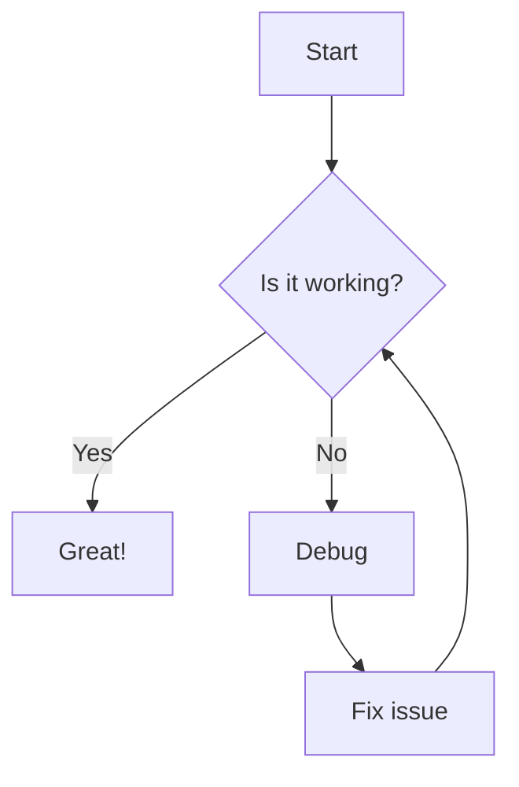
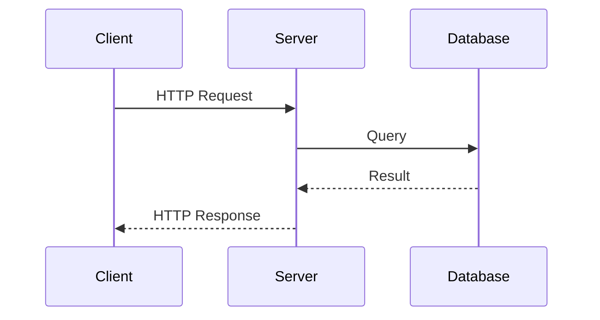
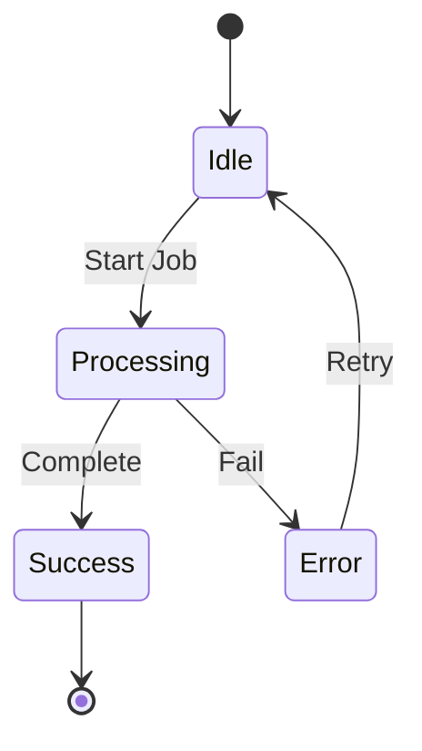
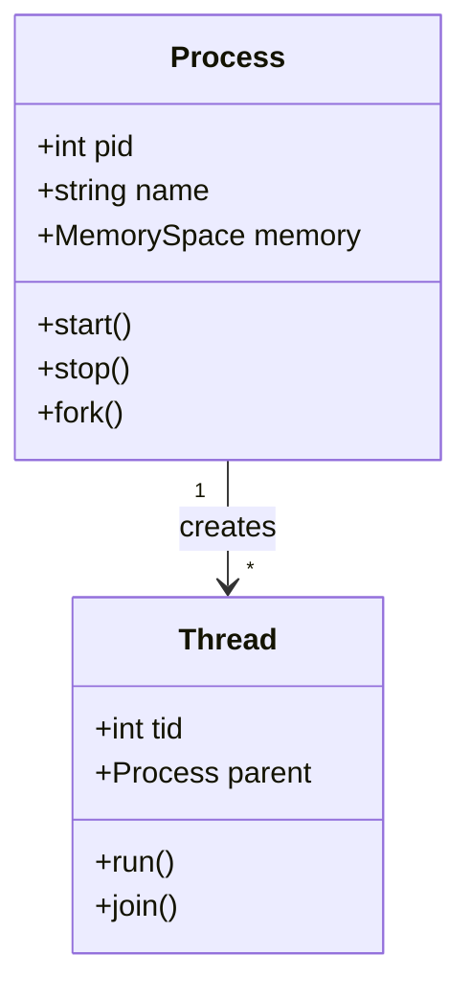

# Demo: Extended Markdown Features

This page demonstrates all the extended markdown features supported by this wiki.

## LaTeX Math Support

### Inline Math

The quadratic formula is \(x = \frac{-b \pm \sqrt{b^2-4ac}}{2a}\).

Euler's identity: \(e^{i\pi} + 1 = 0\)

### Display Math

Maxwell's equations:

\[
\begin{align}
\nabla \cdot \vec{E} &= \frac{\rho}{\epsilon_0} \\
\nabla \cdot \vec{B} &= 0 \\
\nabla \times \vec{E} &= -\frac{\partial \vec{B}}{\partial t} \\
\nabla \times \vec{B} &= \mu_0 \vec{J} + \mu_0 \epsilon_0 \frac{\partial \vec{E}}{\partial t}
\end{align}
\]

Time complexity of merge sort: \(O(n \log n)\)

## Mermaid Diagrams

### Flow Chart



### Sequence Diagram



### State Diagram



### Class Diagram



## Advanced Code Blocks

### With Line Numbers and Highlighting

```python linenums="1" hl_lines="3 4"
def fibonacci(n):
    if n <= 1:
        return n  # Base case
    return fibonacci(n-1) + fibonacci(n-2)  # Recursive case

# Calculate first 10 Fibonacci numbers
for i in range(10):
    print(f"F({i}) = {fibonacci(i)}")
```

### Code Annotations

```python
def allocate_memory(size: int) -> bytes:
    """Allocate memory with proper alignment."""
    aligned_size = (size + 7) & ~7  # (1)!
    buffer = bytearray(aligned_size)
    return bytes(buffer)
```

1. Align to 8-byte boundary for optimal performance

## Tabbed Content

=== "C"

    ```c
    #include <stdio.h>
    
    int main() {
        printf("Hello, World!\n");
        return 0;
    }
    ```

=== "Python"

    ```python
    print("Hello, World!")
    ```

=== "Go"

    ```go
    package main
    
    import "fmt"
    
    func main() {
        fmt.Println("Hello, World!")
    }
    ```

## Admonitions

!!! note "참고사항"
    This is a note with Korean title. 한글과 영어를 혼용할 수 있습니다.

!!! warning "Memory Management"
    Always free allocated memory to prevent memory leaks.

!!! tip "Performance Tip"
    Use `mmap()` for large file operations instead of reading entire file into memory.

??? question "Collapsible Question"
    Why does Linux use virtual memory?

    **Answer**: Virtual memory provides process isolation, enables memory sharing, 
    and allows the system to use more memory than physically available through paging.

!!! danger "Critical"
    Never run `rm -rf /` on a production system!

## Task Lists

- [x] Set up MkDocs Material
- [x] Add LaTeX support
- [x] Configure Mermaid diagrams
- [x] Enable syntax highlighting
- [ ] Add search functionality
- [ ] Set up CI/CD pipeline

## Tables

| Language | Memory Management | GC Type | Use Case |
|----------|------------------|---------|----------|
| C | Manual | None | System Programming |
| Go | Automatic | Concurrent Mark & Sweep | Cloud Native |
| Java | Automatic | Generational | Enterprise |
| Rust | Ownership | None | Systems + Safety |
| Python | Automatic | Reference Counting + Cycle Detection | Scripting |

## Keyboard Keys

Press ++ctrl+alt+del++ to open task manager.

Use ++cmd+shift+p++ on macOS or ++ctrl+shift+p++ on Linux/Windows.

## Abbreviations

The CPU executes instructions from RAM using the fetch-decode-execute cycle.

*[CPU]: Central Processing Unit
*[RAM]: Random Access Memory

## Footnotes

Linux uses a completely fair scheduler[^1] for process scheduling.

The kernel maintains a red-black tree[^2] for efficient process management.

[^1]: CFS - Completely Fair Scheduler introduced in Linux 2.6.23
[^2]: A self-balancing binary search tree with O(log n) operations

## Definition Lists

Process
:   An instance of a program in execution with its own memory space

Thread
:   A lightweight unit of execution that shares memory with other threads in the same process

Virtual Memory
:   An abstraction that provides each process with its own address space

## Smart Symbols

- (c) (r) (tm)
- --> <-- <-->
- 1/2 1/4 3/4
- +/- =/=

## Highlighting Text

This is ==highlighted text== for emphasis.

You can also use ^^superscript^^ and ~~subscript~~ text.

~~Strikethrough~~ text is also supported.

## Critic Markup

{++Addition++}
{--Deletion--}
{~~Old~>New~~}
{==Highlight==}
{>>Comment<<}
