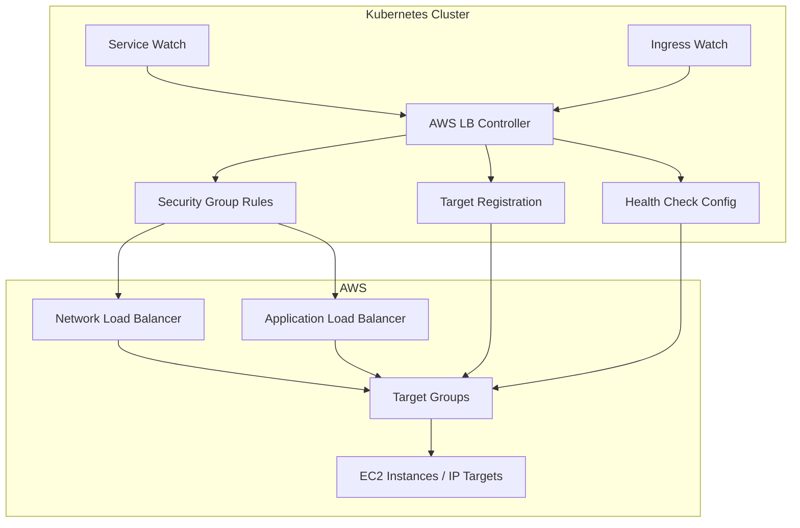

---
tags:
  - EKS
  - AWS
  - LoadBalancer
  - NLB
  - ALB
  - Kubernetes
  - Network
---

# EKS LoadBalancer: IP Mode vs Instance Mode 완벽 분석

## 들어가며

"EKS에서 Service를 LoadBalancer로 노출했더니 Target 수가 500개를 넘어서 AWS 한도에 걸렸어" - 이런 경험 있나요?

AWS Load Balancer Controller의 **IP Mode**와 **Instance Mode**는 근본적으로 다른 트래픽 라우팅 방식을 사용합니다. 각각의 동작 원리와 장단점, 그리고 Production에서 마주하는 실제 문제와 해결책을 깊이 있게 살펴보겠습니다.

## AWS Load Balancer Controller 아키텍처

### Controller의 역할



AWS Load Balancer Controller는 Kubernetes `Service`와 `Ingress` 리소스를 감시해서 AWS Load Balancer를 자동으로 생성하고 관리합니다.

```yaml
# IngressClass 정의 예시
apiVersion: networking.k8s.io/v1
kind: IngressClass
metadata:
  name: aws-alb
spec:
  controller: ingress.k8s.aws/alb
  parameters:
    apiGroup: elbv2.k8s.aws
    kind: IngressClassParams
    name: alb-params
```

## IP Mode vs Instance Mode: 핵심 차이점

### IP Mode: Direct Pod Targeting

**동작 원리:**

```text
Client Request → NLB → Pod IP:Port (Direct)
```

```yaml
apiVersion: v1
kind: Service
metadata:
  name: proxysql-service
  annotations:
    service.beta.kubernetes.io/aws-load-balancer-type: "nlb"
    service.beta.kubernetes.io/aws-load-balancer-nlb-target-type: "ip"  # IP Mode
    service.beta.kubernetes.io/aws-load-balancer-scheme: "internet-facing"
spec:
  type: LoadBalancer
  selector:
    app: proxysql
  ports:
  - port: 3306
    targetPort: 3306
    protocol: TCP
```

**Target Group 구성:**

```bash
# IP Mode Target Group 예시
aws elbv2 describe-targets --target-group-arn arn:aws:elasticloadbalancing:...

# Targets:
# 10.0.1.100:3306 (proxysql-pod-1)
# 10.0.1.101:3306 (proxysql-pod-2) 
# 10.0.2.100:3306 (proxysql-pod-3)
# 10.0.2.101:3306 (proxysql-pod-4)
# ... (Pod 수만큼 Target 존재)
```

### Instance Mode: Node-level Targeting

**동작 원리:**

```text
Client Request → NLB → Node IP:NodePort → iptables → Pod IP:Port
```

```yaml
apiVersion: v1
kind: Service
metadata:
  name: proxysql-service
  annotations:
    service.beta.kubernetes.io/aws-load-balancer-type: "nlb"
    service.beta.kubernetes.io/aws-load-balancer-nlb-target-type: "instance"  # Instance Mode
    service.beta.kubernetes.io/aws-load-balancer-scheme: "internet-facing"
spec:
  type: LoadBalancer
  selector:
    app: proxysql
  ports:
  - port: 3306
    targetPort: 3306
    nodePort: 30306  # NodePort 자동 할당 또는 명시적 지정
    protocol: TCP
```

**Target Group 구성:**

```bash
# Instance Mode Target Group 예시
aws elbv2 describe-targets --target-group-arn arn:aws:elasticloadbalancing:...

# Targets:
# i-1234567890abcdef0:30306 (worker-node-1)
# i-0987654321fedcba0:30306 (worker-node-2)
# i-abcdef1234567890:30306 (worker-node-3)
# ... (Node 수만큼 Target 존재)
```

## IP Mode 심화 분석

### 장점: 성능 최적화와 정확한 라우팅

```bash
# IP Mode에서의 직접적인 Pod 통신
┌─────────────┐    ┌─────────────┐    ┌─────────────┐
│   Client    │───▶│     NLB     │───▶│ Pod IP:3306 │
└─────────────┘    └─────────────┘    └─────────────┘
   1 hop             2 hop             3 hop (최종)
```

**성능 이점:**

- **낮은 레이턴시**: 추가 hop 없이 직접 Pod 통신
- **정확한 로드 밸런싱**: NLB가 실제 Pod 수만큼 균등 분산
- **Connection Stickiness**: Client IP가 특정 Pod에 고정 가능

### 단점: Target 수 제한과 운영 복잡성

**AWS NLB Target 제한:**

```bash
# Cross-Zone Load Balancing 활성화 시
# Target Group당 최대 500개 Target

# 계산 예시:
# - ProxySQL Pod: 50개
# - Port: 3306, 6033 (2개)
# - Total Targets: 50 * 2 = 100개 ✓

# 문제 시나리오:
# - Microservice Pod: 200개
# - Port: 8080, 8443, 9090 (3개) 
# - Total Targets: 200 * 3 = 600개 ✗ (한도 초과)
```

**해결 방법 1: Node Labeling으로 Target 제한**

```yaml
# Init Container로 특정 Node만 Target에 포함
initContainers:
- name: label-nlb-target-node
  image: bitnami/kubectl:1.28
  command: ["sh", "-c"]
  args:
  - |
    # ProxySQL과 ZooKeeper Pod가 실행 중인 Node만 Label
    kubectl get pods -n soda -o custom-columns=NAME:.metadata.name,NODENAME:.spec.nodeName | \
    grep -E 'proxysql|zk' | \
    awk '{print $2}' | \
    sort | uniq | \
    xargs -I {} kubectl label nodes {} sendbird.com/proxysql=true --overwrite
  securityContext:
    runAsUser: 0
```

```yaml
# NodeSelector로 특정 Node에만 배치
spec:
  nodeSelector:
    sendbird.com/proxysql: "true"
```

**해결 방법 2: Service 분리 전략**

```yaml
# Service를 기능별로 분리하여 Target 수 감소
---
apiVersion: v1
kind: Service
metadata:
  name: proxysql-mysql
  annotations:
    service.beta.kubernetes.io/aws-load-balancer-nlb-target-type: "ip"
spec:
  selector:
    app: proxysql
  ports:
  - port: 3306
    targetPort: 3306

---
apiVersion: v1
kind: Service  
metadata:
  name: proxysql-admin
  annotations:
    service.beta.kubernetes.io/aws-load-balancer-nlb-target-type: "ip"
spec:
  selector:
    app: proxysql
  ports:
  - port: 6033
    targetPort: 6033
```

## Instance Mode 심화 분석

### 장점: 확장성과 단순성

```bash
# Instance Mode에서의 Node 경유 통신  
┌─────────────┐    ┌─────────────┐    ┌─────────────┐    ┌─────────────┐
│   Client    │───▶│     NLB     │───▶│  Node:30306 │───▶│ Pod IP:3306 │
└─────────────┘    └─────────────┘    └─────────────┘    └─────────────┘
   1 hop             2 hop             3 hop             4 hop (최종)
                                       kube-proxy        iptables
                                       iptables rules    DNAT
```

**확장성 이점:**

- **Target 수 제한 없음**: Node 수만큼만 Target 등록 (보통 10-50개)
- **Port 무관**: 여러 Port를 사용해도 Target 수 변화 없음
- **Dynamic Pod Scaling**: Pod 수가 변해도 Target Group 변경 불필요

### 단점: 추가 홉과 불균등 분산

**성능 측면:**

```bash
# iptables 규칙으로 인한 추가 처리
$ iptables -t nat -L KUBE-SERVICES | grep proxysql
KUBE-SVC-XYZ  tcp  --  anywhere  anywhere  tcp dpt:30306

$ iptables -t nat -L KUBE-SVC-XYZ
KUBE-SEP-ABC  all  --  anywhere  anywhere  statistic mode random probability 0.25000
KUBE-SEP-DEF  all  --  anywhere  anywhere  statistic mode random probability 0.33333  
KUBE-SEP-GHI  all  --  anywhere  anywhere  statistic mode random probability 0.50000
KUBE-SEP-JKL  all  --  anywhere  anywhere
```

**로드 밸런싱 이슈:**

```bash
# 문제 시나리오: Node별 Pod 분포 불균등
Node-1: 5 pods  ←── NLB가 1/3 트래픽 전송
Node-2: 1 pod   ←── NLB가 1/3 트래픽 전송 (과부하!)
Node-3: 4 pods  ←── NLB가 1/3 트래픽 전송

# 결과: Node-2의 1개 Pod가 Node-1의 5개 Pod과 동일한 부하 처리
```

## Production 최적화 전략

### 1. Hybrid Approach: 서비스별 모드 선택

```yaml
# High-throughput 서비스: IP Mode
apiVersion: v1
kind: Service
metadata:
  name: api-gateway
  annotations:
    service.beta.kubernetes.io/aws-load-balancer-nlb-target-type: "ip"
    service.beta.kubernetes.io/aws-load-balancer-cross-zone-load-balancing-enabled: "true"

---
# 다수의 Microservice: Instance Mode  
apiVersion: v1
kind: Service
metadata:
  name: user-service
  annotations:
    service.beta.kubernetes.io/aws-load-balancer-nlb-target-type: "instance"
```

### 2. Pod Distribution 최적화

```yaml
# PodAntiAffinity로 Node별 균등 분산
apiVersion: apps/v1
kind: Deployment
spec:
  template:
    spec:
      affinity:
        podAntiAffinity:
          preferredDuringSchedulingIgnoredDuringExecution:
          - weight: 100
            podAffinityTerm:
              labelSelector:
                matchLabels:
                  app: proxysql
              topologyKey: kubernetes.io/hostname
```

### 3. Network Performance 모니터링

```yaml
# CloudWatch Metrics for NLB Performance
groups:
- name: nlb-performance.rules
  rules:
  - alert: NLBHighTargetResponseTime
    expr: |
      aws_networkelb_target_response_time_average > 0.1  # 100ms
    for: 2m
    labels:
      severity: warning

  - alert: NLBUnhealthyTargets  
    expr: |
      aws_networkelb_un_healthy_host_count > 0
    for: 1m
    labels:
      severity: critical
```

**상세 성능 분석:**

```bash
# Target별 Connection 분포 확인
aws elbv2 describe-target-health \
  --target-group-arn $TARGET_GROUP_ARN \
  --query 'TargetHealthDescriptions[*].[Target.Id,TargetHealth.State,TargetHealth.Description]' \
  --output table

# NLB CloudWatch 메트릭 조회
aws cloudwatch get-metric-statistics \
  --namespace AWS/NetworkELB \
  --metric-name ActiveFlowCount \
  --dimensions Name=LoadBalancer,Value=$NLB_NAME \
  --start-time 2024-03-01T00:00:00Z \
  --end-time 2024-03-01T23:59:59Z \
  --period 300 \
  --statistics Average
```

## Ingress vs Service: 언제 무엇을 사용할까

### ALB Ingress Controller 활용

```yaml
# HTTP/HTTPS 서비스: ALB Ingress 사용
apiVersion: networking.k8s.io/v1
kind: Ingress
metadata:
  name: api-ingress
  annotations:
    kubernetes.io/ingress.class: alb
    alb.ingress.kubernetes.io/scheme: internet-facing
    alb.ingress.kubernetes.io/target-type: ip  # 또는 instance
    alb.ingress.kubernetes.io/listen-ports: '[{"HTTP": 80}, {"HTTPS": 443}]'
    alb.ingress.kubernetes.io/certificate-arn: arn:aws:acm:region:account:certificate/xxx
spec:
  rules:
  - host: api.example.com
    http:
      paths:
      - path: /
        pathType: Prefix
        backend:
          service:
            name: api-service
            port:
              number: 8080
```

### TCP/UDP 서비스: NLB Service 사용

```yaml
# Database, Cache 등: NLB Service 사용
apiVersion: v1  
kind: Service
metadata:
  name: redis-cluster
  annotations:
    service.beta.kubernetes.io/aws-load-balancer-type: "nlb"
    service.beta.kubernetes.io/aws-load-balancer-nlb-target-type: "ip"
    service.beta.kubernetes.io/aws-load-balancer-internal: "true"  # Internal NLB
spec:
  type: LoadBalancer
  selector:
    app: redis
  ports:
  - port: 6379
    protocol: TCP
```

## 트러블슈팅 가이드

### 1. Target이 500개 제한에 걸린 경우

**증상:**

```text
error: failed to create target group: ValidationError: A target group can have at most 500 targets
```

**해결책:**

```bash
# 현재 Target 수 확인
aws elbv2 describe-targets --target-group-arn $ARN | jq '.Targets | length'

# Option 1: Instance Mode로 변경
kubectl annotate service myapp \
  service.beta.kubernetes.io/aws-load-balancer-nlb-target-type=instance \
  --overwrite

# Option 2: Service 분리
kubectl get svc myapp -o yaml | \
sed 's/name: myapp/name: myapp-mysql/' | \
sed '/port: 8080/d' | \
kubectl apply -f -
```

### 2. Instance Mode에서 불균등 분산 문제

**확인 방법:**

```bash
# Node별 Pod 분포 확인
kubectl get pods -o wide | awk '{print $7}' | sort | uniq -c

# kube-proxy iptables 규칙 확인  
kubectl get pods -n kube-system -l k8s-app=kube-proxy
kubectl exec -n kube-system kube-proxy-xxx -- iptables -t nat -L | grep myapp
```

**해결책:**

```yaml
# Deployment에 podAntiAffinity 추가
spec:
  template:
    spec:
      affinity:
        podAntiAffinity:
          requiredDuringSchedulingIgnoredDuringExecution:
          - labelSelector:
              matchLabels:
                app: myapp
            topologyKey: kubernetes.io/hostname
```

### 3. Health Check 실패 디버깅

```bash
# Target Health 상태 확인
aws elbv2 describe-target-health --target-group-arn $ARN

# 실패한 Target의 상세 정보
aws elbv2 describe-target-health --target-group-arn $ARN \
  --query 'TargetHealthDescriptions[?TargetHealth.State==`unhealthy`]'

# Pod에서 직접 Health Check 테스트
kubectl exec -it pod-name -- curl -f http://localhost:8080/health
```

## 비용 최적화 고려사항

### NLB vs ALB 비용 비교

```bash
# NLB 비용 구조 (2024 기준)
# - Load Balancer: $0.0225/hour (~$16.2/month)
# - LCU (Load Balancer Capacity Unit): $0.006/hour
# - 새로운 연결, 활성 연결, 대역폭, 규칙 평가에 따라 LCU 계산

# ALB 비용 구조  
# - Load Balancer: $0.0225/hour (~$16.2/month)
# - LCU: $0.008/hour (NLB보다 33% 비싸지만 HTTP 기능 풍부)
```

**최적화 전략:**

```yaml
# Internal LoadBalancer로 불필요한 인터넷 비용 절약
metadata:
  annotations:
    service.beta.kubernetes.io/aws-load-balancer-internal: "true"

# Cross-zone Load Balancing 비용 고려 (데이터 전송 요금 발생)
metadata:
  annotations:
    service.beta.kubernetes.io/aws-load-balancer-cross-zone-load-balancing-enabled: "false"
```

## 정리

EKS LoadBalancer 모드 선택 가이드

### IP Mode 사용 시기

- **High-performance 요구**: 낮은 레이턴시가 중요한 서비스
- **정확한 로드밸런싱**: Pod별 균등 분산이 필요
- **소규모 서비스**: Target 수가 500개 미만
- **Connection Stickiness**: 클라이언트-Pod 간 고정 연결 필요

### Instance Mode 사용 시기  

- **대규모 서비스**: Pod 수가 많고 Port가 다양한 경우
- **Dynamic Scaling**: Pod 수가 자주 변하는 환경
- **비용 최적화**: Target Group 관리 비용 절감
- **Legacy 호환**: 기존 NodePort 기반 서비스

### Production 체크리스트

- [ ] Target 수 제한 (500개) 고려하여 모드 선택
- [ ] Pod Distribution 최적화 (podAntiAffinity)
- [ ] Health Check 설정 검증
- [ ] Network 성능 모니터링 알림 설정
- [ ] 비용 최적화 (Internal LB, Cross-zone 설정)

각 모드의 특성을 정확히 이해하고 서비스 요구사항에 맞는 선택을 통해 안정적이고 효율적인 EKS 운영이 가능합니다.

## 관련 문서

- [ProxySQL Load Test Cascading Failure](proxysql-loadtest-issue.md)
- [ProxySQL Connection Pooling 최적화](proxysql-connection-pooling.md)
- [Istio Traffic Interception](../devops/istio-traffic-interception.md)
- [Kubernetes Network Policy 심화](../devops/k8s-network-policy.md)
