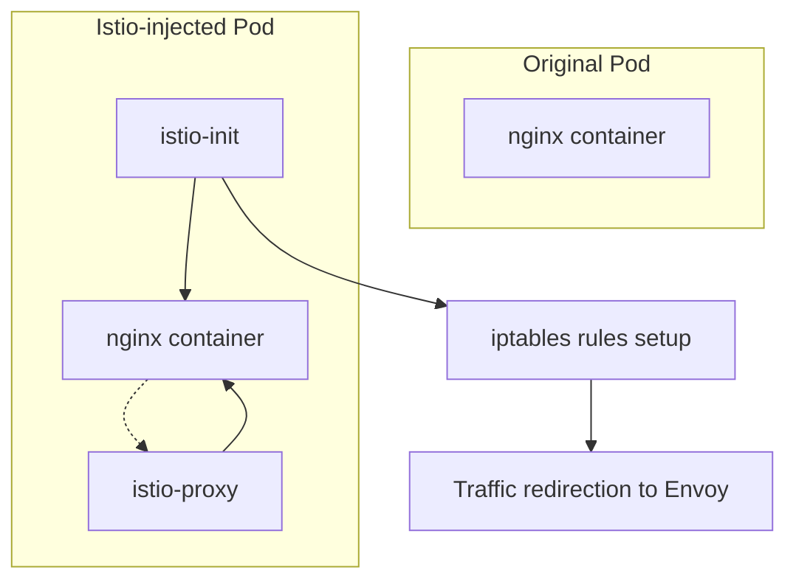

---
tags:
  - Istio
  - Service-Mesh
  - Kubernetes
  - Network
  - iptables
  - Envoy
  - Sidecar
---

# Istio Traffic Interception: Pod 네트워크 트래픽 가로채기 완벽 분석

## 들어가며

"Istio를 설치했는데 자동으로 모든 트래픽이 sidecar를 지나간다는거야?" Production에서 Service Mesh를 운영하다 보면 이런 궁금증이 생깁니다.**도대체 어떻게 Pod 내부의 모든 네트워크 트래픽을 Envoy 프록시로 투명하게 라우팅할 수 있을까?**

답은 Linux의 netfilter/iptables와 투명 프록시(transparent proxy) 기술에 있습니다. Istio의 마법 같은 트래픽 interception을 kernel 수준에서 완전히 땀어보겠습니다.

## Istio Sidecar Injection 메커니즘

### 단순한 Pod에서 복잡한 Service Mesh Pod으로

가장 간단한 nginx Pod부터 시작해보겠습니다:

```yaml
apiVersion: v1
kind: Pod
metadata:
  name: nginx-simple
spec:
  containers:
  - name: nginx
    image: nginx:1.21
    ports:
    - containerPort: 80
    readinessProbe:
      httpGet:
        path: /
        port: 80
```

하지만 `istioctl kube-inject`를 적용하면:

```bash
# Istio injection 적용
kubectl apply -f <(istioctl kube-inject -f nginx-simple.yaml)
```

Pod이 완전히 변신합니다. 핵심 변화는 다음과 같습니다:



## istio-init: iptables 마법사

### 핵심 동작 원리

istio-init 컨테이너가 실행하는 명령어를 분석해보겠습니다:

```yaml
initContainers:
- name: istio-init
  image: docker.io/istio/proxyv2:1.16.0
  args:
  - istio-iptables
  - -p
  - "15001"    # Envoy outbound port
  - -z
  - "15006"    # Envoy inbound port
  - -u
  - "1337"     # Envoy user ID (bypass proxy)
  - -m
  - REDIRECT   # iptables target
  - -i
  - '*'        # Include all IPs
  - -x
  - ""         # Exclude IPs (none)
  - -b
  - '*'        # Include all ports
  - -d
  - 15090,15021,15020  # Exclude ports (Envoy admin)
  securityContext:
    allowPrivilegeEscalation: false
    capabilities:
      add:
      - NET_ADMIN    # iptables 수정 권한
      - NET_RAW      # raw socket 권한
      drop:
      - ALL
    runAsUser: 0     # root 권한 필요
```

### iptables Rules 상세 분석

실제 Pod에서 iptables 규칙을 확인해보겠습니다:

```bash
# Pod 내부에서 iptables 확인
kubectl exec -it nginx-istio -c istio-proxy -- iptables -t nat -L -v

# 또는 netshoot으로 디버깅
kubectl run netshoot --rm -it --image=nicolaka/netshoot -- bash
```

#### 1. Inbound Traffic Interception

```bash
Chain PREROUTING (policy ACCEPT)
pkts bytes target          prot opt in    out    source       destination
282  16920 ISTIO_INBOUND   tcp  --  any   any    anywhere     anywhere

Chain ISTIO_INBOUND (1 references)
pkts bytes target              prot opt in    out    source       destination
  0     0  RETURN              tcp  --  any   any    anywhere     anywhere     tcp dpt:15008
  0     0  RETURN              tcp  --  any   any    anywhere     anywhere     tcp dpt:ssh
  0     0  RETURN              tcp  --  any   any    anywhere     anywhere     tcp dpt:15090
234 14040  RETURN              tcp  --  any   any    anywhere     anywhere     tcp dpt:15021
 48  2880  RETURN              tcp  --  any   any    anywhere     anywhere     tcp dpt:15020
  0     0  ISTIO_IN_REDIRECT  tcp  --  any   any    anywhere     anywhere

Chain ISTIO_IN_REDIRECT (3 references)
pkts bytes target     prot opt in    out    source       destination
  0     0  REDIRECT   tcp  --  any   any    anywhere     anywhere     redir ports 15006
```

**분석:**

- 모든 inbound TCP 트래픽 → `ISTIO_INBOUND`
- Envoy 관리 포트들(15008, 15090, 15021, 15020) → `RETURN` (bypass)
- 나머지 모든 트래픽 → port 15006으로 redirect

#### 2. Outbound Traffic Interception

```bash
Chain OUTPUT (policy ACCEPT)
pkts bytes target         prot opt in    out    source       destination
 54  3240  ISTIO_OUTPUT   tcp  --  any   any    anywhere     anywhere

Chain ISTIO_OUTPUT (1 references)
pkts bytes target              prot opt in    out    source       destination
  0     0  RETURN              all  --  any   lo     127.0.0.6    anywhere
  0     0  ISTIO_IN_REDIRECT   all  --  any   lo     anywhere     !localhost    owner UID match 1337
  0     0  RETURN              all  --  any   lo     anywhere     anywhere      !owner UID match 1337
 54  3240  RETURN              all  --  any   any    anywhere     anywhere      owner UID match 1337
  0     0  RETURN              all  --  any   any    anywhere     localhost
  0     0  ISTIO_REDIRECT      all  --  any   any    anywhere     anywhere

Chain ISTIO_REDIRECT (1 references)
pkts bytes target     prot opt in    out    source       destination
  0     0  REDIRECT   tcp  --  any   any    anywhere     anywhere     redir ports 15001
```

**분석:**

- UID 1337(Envoy)가 생성한 패킷 → `RETURN` (무한 루프 방지)
- localhost 트래픽 → `RETURN` (성능상 이유로 bypass)
- 나머지 모든 outbound → port 15001로 redirect

### 트래픽 플로우 시각화

```text
┌─────────────────────────────────────────────────────────────────┐
│                        Pod Network Namespace                     │
├─────────────────────────────────────────────────────────────────┤
│  App Container (nginx)           Istio-proxy Container           │
│  ┌─────────────────┐            ┌─────────────────────────────┐  │
│  │ :80 (nginx)     │            │ :15001 (outbound listener)  │  │
│  │                 │    ┌───────│ :15006 (inbound listener)   │  │
│  └─────────────────┘    │       │ :15090 (admin/metrics)      │  │
│                          │       │ :15021 (health check)      │  │
│  iptables nat rules:     │       └─────────────────────────────┘  │
│  ┌─────────────────┐     │                                        │
│  │ PREROUTING      │─────┘                                        │
│  │ :80 → :15006   │              Traffic Flow:                   │
│  │                 │              1. Client → :80                 │
│  │ OUTPUT          │              2. iptables → :15006            │
│  │ outbound→:15001 │              3. Envoy processes & forwards   │
│  └─────────────────┘              4. Envoy → nginx :80           │
└─────────────────────────────────────────────────────────────────┘
```

## Envoy Transparent Proxy 구현

### SO_ORIGINAL_DST의 마법

Envoy는 어떻게 원래 목적지 주소를 알아낼까요?

```c
#include <netinet/in.h>
#include <sys/socket.h>
#include <linux/netfilter_ipv4.h>

// Envoy 내부 코드 (simplified)
struct sockaddr_in original_dest;
socklen_t socklen = sizeof(original_dest);

// SO_ORIGINAL_DST로 원본 주소 획득
if (getsockopt(fd, SOL_IP, SO_ORIGINAL_DST,
               &original_dest, &socklen) == 0) {
    // 원본 목적지: 10.96.0.1:80
    // 현재 수신: 15006
    // → Envoy가 올바른 upstream으로 포워딩 가능
}
```

### Listener Configuration

Envoy의 투명 프록시 리스너 설정:

```json
{
  "name": "virtualInbound",
  "address": {
    "socket_address": {
      "protocol": "TCP",
      "address": "0.0.0.0",
      "port_value": 15006
    }
  },
  "listener_filters": [
    {
      "name": "envoy.filters.listener.original_dst",
      "typed_config": {
        "@type": "type.googleapis.com/envoy.extensions.filters.listener.original_dst.v3.OriginalDst"
      }
    }
  ],
  "transparent": true,  // 투명 프록시 활성화
  "use_original_dst": true
}
```

## Health Check 우회 메커니즘

### Kubelet Probe Redirection

원래 Pod 설정:

```yaml
readinessProbe:
  httpGet:
    path: /
    port: 80
```

Istio injection 후:

```yaml
readinessProbe:
  httpGet:
    path: /app-health/nginx/readyz  # 변경됨
    port: 15020                     # Envoy health port
```

### 프로브 처리 로직

Envoy는 특별한 health check handler를 구성합니다:

```json
{
  "routes": [
    {
      "match": {
        "path": "/app-health/nginx/readyz"
      },
      "route": {
        "cluster": "inbound|80||",
        "timeout": "0s"
      }
    }
  ]
}
```

**왜 별도 포트를 사용하나?**

1.**메트릭 오염 방지**: kubelet probe가 서비스 메트릭에 영향
2.**Circuit Breaker 우회**: health check는 서킷 브레이커 대상이 아님
3.**보안**: 실제 애플리케이션과 분리된 health check 경로

## Production 시나리오와 최적화

### Network Policy와 Istio

```yaml
apiVersion: networking.k8s.io/v1
kind: NetworkPolicy
metadata:
  name: deny-all-except-istio
spec:
  podSelector:
    matchLabels:
      app: myapp
  policyTypes:
  - Ingress
  - Egress
  ingress:
  - from:
    - namespaceSelector:
        matchLabels:
          name: istio-system  # istiod 통신 허용
    ports:
    - protocol: TCP
      port: 15010  # pilot discovery
```

### 성능 최적화 실전 팁

#### 1. CPU 및 Memory 튜닝

```yaml
resources:
  requests:
    cpu: 100m      # 기본값이 너무 낮음
    memory: 128Mi  # 실제 워크로드에 따라 조정
  limits:
    cpu: 1000m     # burst 처리를 위한 충분한 CPU
    memory: 1Gi    # connection pool 크기에 따라
```

#### 2. Connection Pool 최적화

```yaml
apiVersion: networking.istio.io/v1beta1
kind: DestinationRule
metadata:
  name: myapp-destination
spec:
  host: myapp.default.svc.cluster.local
  trafficPolicy:
    connectionPool:
      tcp:
        maxConnections: 100
        connectTimeout: 30s
        tcpKeepalive:
          time: 7200s
          interval: 75s
      http:
        http1MaxPendingRequests: 64
        maxRequestsPerConnection: 10
        maxRetries: 3
        consecutiveGatewayErrors: 5
```

#### 3. Envoy 메모리 사용량 모니터링

```bash
# Envoy 메모리 사용량 확인
kubectl exec -it pod-name -c istio-proxy -- \
  curl -s localhost:15000/memory

# 상세 통계
kubectl exec -it pod-name -c istio-proxy -- \
  curl -s localhost:15000/stats | grep memory
```

## 트러블슈팅 가이드

### 1. 트래픽이 Envoy를 우회하는 경우

```bash
# iptables 규칙 확인
kubectl exec -it pod-name -c istio-proxy -- iptables -t nat -L -n

# 누락된 규칙이 있다면 istio-init 로그 확인
kubectl logs pod-name -c istio-init
```

### 2. Connection Timeout 이슈

```bash
# Envoy 클러스터 상태 확인
kubectl exec -it pod-name -c istio-proxy -- \
  curl -s localhost:15000/clusters | grep myservice

# Health check 상태
kubectl exec -it pod-name -c istio-proxy -- \
  curl -s localhost:15000/clusters | grep "health_flags::"
```

### 3. DNS Resolution 문제

```bash
# Envoy DNS cache 확인
kubectl exec -it pod-name -c istio-proxy -- \
  curl -s localhost:15000/stats | grep dns

# DNS 설정 확인
kubectl exec -it pod-name -c istio-proxy -- cat /etc/resolv.conf
```

## 보안 고려사항

### 1. mTLS 자동 설정

Istio는 자동으로 pod 간 mTLS를 설정합니다:

```bash
# mTLS 상태 확인
istioctl authn tls-check pod-name.namespace.svc.cluster.local

# 인증서 정보
kubectl exec -it pod-name -c istio-proxy -- \
  openssl s_client -connect localhost:15000 \
  -cert /etc/ssl/certs/cert-chain.pem \
  -key /etc/ssl/private/key.pem
```

### 2. RBAC 설정

```yaml
apiVersion: security.istio.io/v1beta1
kind: AuthorizationPolicy
metadata:
  name: myapp-authz
spec:
  selector:
    matchLabels:
      app: myapp
  rules:
  - from:
    - source:
        principals: ["cluster.local/ns/frontend/sa/default"]
    to:
    - operation:
        methods: ["GET", "POST"]
```

## 네트워크 성능 측정

### Latency 오버헤드 측정

```bash
# 직접 연결 vs Envoy를 통한 연결 비교
kubectl exec -it client-pod -- \
  curl -w "@curl-format.txt" -o /dev/null -s http://service-direct:8080/

kubectl exec -it client-pod -- \
  curl -w "@curl-format.txt" -o /dev/null -s http://service-istio:8080/
```

curl-format.txt:

```text
     time_namelookup:  %{time_namelookup},
        time_connect:  %{time_connect},
     time_appconnect:  %{time_appconnect},
    time_pretransfer:  %{time_pretransfer},
       time_redirect:  %{time_redirect},
  time_starttransfer:  %{time_starttransfer},
                     ----------,
          time_total:  %{time_total},
```

## 정리

Istio의 투명한 트래픽 인터셉션은 다음 핵심 기술들의 조합입니다

1.**iptables REDIRECT**: netfilter hooks를 이용한 패킷 리다이렉션
2.**SO_ORIGINAL_DST**: 원본 목적지 주소 복원
3.**Transparent Proxy**: 애플리케이션 무수정으로 프록시 삽입
4.**Init Container**: 특권 권한으로 네트워크 설정 변경

이 이해를 바탕으로 Service Mesh의 동작 원리를 정확히 파악하고 성능 최적화와 트러블슈팅에 활용할 수 있습니다.

**Production에서 주의할 점:**

- Envoy 리소스 사용량 모니터링 필수
- Network Policy와 Istio 보안 정책의 상호작용 이해
- DNS 및 서비스 디스커버리 설정 점검
- mTLS 인증서 만료 모니터링

## 관련 문서

- [Dockerfile Best Practices](dockerfile-best-practices.md)
- [Kubernetes Network Policy 심화](../cs/process/linux-scheduling-1.md)
- [Container Memory Management](../cs/memory/cgroup-container-memory.md)
